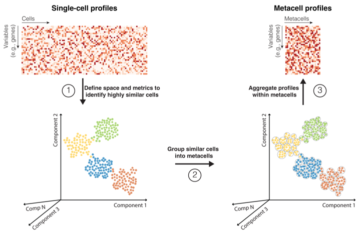

# The metacell concept

Metacells correspond to partitions of single-cell data into disjoint homogeneous groups of highly similar cells followed by aggregation of their profiles. 
This concept relies on the assumption that most of the variability within metacells corresponds to technical noise and not to biologically relevant heterogeneity. 

Using metacells enables users to: (i) removing the noise while preserving and enhancing biological signal in sparse single-cell genomics data and,
(ii) address computational challenges due to the large size of these data. 

Several studies have been built upon the metacell concept. In this tutorial, we consider three tools providing standalone metacell construction frameworks and
describe the different steps that should be followed to build metacells using these tools: 
(i) SuperCell (tutorial in \@ref(SuperCell-construction)), (ii) Metacells version 2 (MC2) (tutorial in \@ref(MC2-construction)), and (iii) SEACells (tutorial in \@ref(SEACells-construction)).

