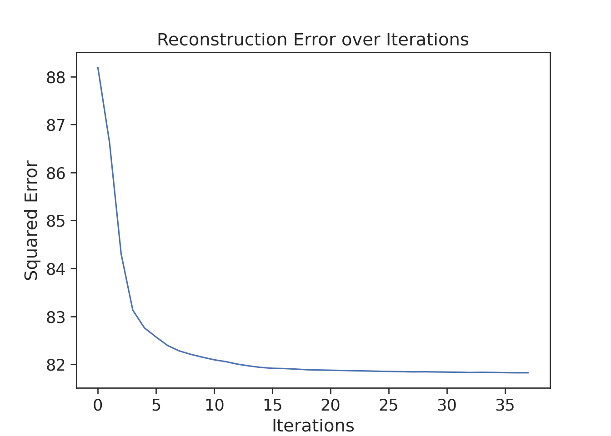

# Constructing metacells (for a 'discrete' data)

In this chapter, we will demonstrate metacell construction using three different methods. MetaCell-2 (MC2) and SEACells in Pyhton and SuperCell in R. 

For this, we will use a dataset of PBMCs from study. This dataset contains 30K cells and ... This is an example of a complex dataset with well defined cells types. For an example of more continuous data, see chapter \@ref(MC-continuous)


```
#> findfont: Font family ['Raleway'] not found. Falling back to DejaVu Sans.
#> findfont: Font family ['Lato'] not found. Falling back to DejaVu Sans.
```


## MC2 (Python)


[//]: # (Chunk to run MC-2 metacell construction for a discrete -pbmcs- dataset)


Here we construct metacells using [Metacell-2 (MC2)](https://github.com/tanaylab/metacells). The code is adapted from the [author's tutorial](https://metacells.readthedocs.io/en/latest/Metacells_Vignette.html).

#### Imports {-}

```python
import os
import numpy as np
import pandas as pd
import anndata as ad
import scanpy as sc
import matplotlib.pyplot as plt
import seaborn as sns
import metacells as mc

import sys
sys.path.append('./mc_QC/') 
import mc_QC
```


#### Parameters {-}

```python

MC_tool = "MC2"
gamma   = 50 # graining level

# Here we can modify dataset 
proj_name = ["cell_lines", "3k_pbmc"][1]

annotation_label = {'cell_lines':'cell_line',
                   '3k_pbmc':'louvain'}[proj_name] # name of annotation field (obs)
```

#### Load data {-}


```bash
## here code to download dataset and store it at f'Metacell_tutorial/data/{proj_name}/singlecell_anndata_filtered.h5ad'
```


```python
# Load pre-filtered data
data_folder = os.path.join("./data/", proj_name) # here path to folder with adata
ad = sc.read(os.path.join(data_folder, "singlecell_anndata_filtered.h5ad"))
```


**Setup MC object**

```python
mc.ut.set_name(ad, proj_name)
```


#### Gene filtering according to MC2 {-}


```python
excluded_gene_names = [] # for example, ['IGHMBP2', 'IGLL1', 'IGLL5', 'IGLON5', 'NEAT1', 'TMSB10', 'TMSB4X']
excluded_gene_patterns = ['MT-.*']
mc.pl.analyze_clean_genes(ad,
                          excluded_gene_names=excluded_gene_names,
                          excluded_gene_patterns=excluded_gene_patterns,
                          random_seed=123456)
#> set 3k_pbmc.var[properly_sampled_gene]: 16579 true (50.64%) out of 32738 bools
#> set 3k_pbmc.var[excluded_gene]: 13 true (0.03971%) out of 32738 bools
#> set 3k_pbmc.var[noisy_lonely_gene]: 0 true (0%) out of 32738 bools

mc.pl.pick_clean_genes(ad)
#> set 3k_pbmc.var[clean_gene]: 16566 true (50.6%) out of 32738 bools
```

#### Cell fintering {-}
Since our data is pre-processed and low-quality cells have been already filtered out, this step is not applicable to our data, but we keep this chunk so that you can apply cell filtering to a newly generated dataset.

The first round of cell cleaning usually implies filltering out cell with very low and very hight UMI content. The second round includes cell filtering based on mitochondrial and/or ribosomal content. We will skip both steps as our data have been pre-filtered and will use very lenient cutoffs (`properly_sampled_min_cell_total`, `properly_sampled_max_cell_total` and `properly_sampled_max_excluded_genes_fraction`) such that all the cells are kept for the metacell construction.


```python
### The first round (high/low UMIs)
properly_sampled_min_cell_total = {'cell_lines' : 5000, '3k_pbmc': 200}[proj_name] # setup for the dataset that will be used 
properly_sampled_max_cell_total = {'cell_lines' : 110000, '3k_pbmc': 10000}[proj_name] # setup for the dataset that will be used 
```


[//]: # (MC filter cell first)


```python
total_umis_of_cells = mc.ut.get_o_numpy(ad, name='__x__', sum=True)
df_umis = pd.DataFrame(total_umis_of_cells, columns = ['total_UMIs'])

plt.figure()
sns.histplot(data=df_umis, x="total_UMIs")
plt.xlabel('UMIs')
plt.ylabel('Density')
plt.axvline(x=properly_sampled_min_cell_total, color='darkgreen')
plt.axvline(x=properly_sampled_max_cell_total, color='crimson')
plt.show()
```


```python


too_small_cells_count = sum(total_umis_of_cells < properly_sampled_min_cell_total)
too_large_cells_count = sum(total_umis_of_cells > properly_sampled_max_cell_total)

too_small_cells_percent = 100.0 * too_small_cells_count / len(total_umis_of_cells)
too_large_cells_percent = 100.0 * too_large_cells_count / len(total_umis_of_cells)

print(f"Will exclude %s (%.2f%%) cells with less than %s UMIs"
      % (too_small_cells_count,
         too_small_cells_percent,
         properly_sampled_min_cell_total))
#> Will exclude 0 (0.00%) cells with less than 200 UMIs
print(f"Will exclude %s (%.2f%%) cells with more than %s UMIs"
      % (too_large_cells_count,
         too_large_cells_percent,
         properly_sampled_max_cell_total))
#> Will exclude 0 (0.00%) cells with more than 10000 UMIs
```


```python
## The second round (content of non-clean genes, e.g., mito-genes)
properly_sampled_max_excluded_genes_fraction = 0.25
```


[//]: # (MC filter cell second)


```python
excluded_genes_data = mc.tl.filter_data(ad, var_masks=['~clean_gene'])[0]
excluded_umis_of_cells = mc.ut.get_o_numpy(excluded_genes_data, name='__x__', sum=True)
excluded_fraction_of_umis_of_cells = excluded_umis_of_cells / total_umis_of_cells
df_umis = pd.DataFrame(excluded_fraction_of_umis_of_cells, columns = ['frac_excl_genes_UMIs'])


plt.figure()
sns.histplot(df_umis, x = 'frac_excl_genes_UMIs')
plt.xlabel('Fraction of excluded gene UMIs')
plt.ylabel('Density')
plt.axvline(x=properly_sampled_max_excluded_genes_fraction, color='crimson')
plt.show()
```


```python


too_excluded_cells_count = sum(excluded_fraction_of_umis_of_cells > properly_sampled_max_excluded_genes_fraction)

too_excluded_cells_percent = 100.0 * too_excluded_cells_count / len(total_umis_of_cells)

print(f"Will exclude %s (%.2f%%) cells with more than %.2f%% excluded gene UMIs"
      % (too_excluded_cells_count,
         too_excluded_cells_percent,
         100.0 * properly_sampled_max_excluded_genes_fraction))
#> Will exclude 0 (0.00%) cells with more than 25.00% excluded gene UMIs
```


[//]: # (MC2 extract clean data)


```python
mc.pl.analyze_clean_cells(
    ad,
    properly_sampled_min_cell_total=properly_sampled_min_cell_total,
    properly_sampled_max_cell_total=properly_sampled_max_cell_total,
    properly_sampled_max_excluded_genes_fraction=properly_sampled_max_excluded_genes_fraction
)
#> set 3k_pbmc.obs[properly_sampled_cell]: 2638 true (100%) out of 2638 bools
mc.pl.pick_clean_cells(ad)
#> set 3k_pbmc.obs[clean_cell]: 2638 true (100%) out of 2638 bools

# Extract clean dataset (with filtered cells and genes)
ad = mc.pl.extract_clean_data(ad)
#> set 3k_pbmc.clean.obs[full_cell_index]: 2638 int64s
#> set 3k_pbmc.clean.var[full_gene_index]: 16566 int64s
```


### Running MC2 {-}

Metacell-2 uses its own feature selection approach (i.e., selection of genes used to build metacells). Additionally, we can explicitly specify which features to use by providing two arguments:  feature_gene_names - genes that have to be used  forbidden_gene_names - genes to exclude.
In contrast to the SuperCell and SEACells, Metacell-2 does not allow to explicitly obtain metacell data at a user-defined graining level. Instead, to vary graining level, we have to vary a `target_metacell_size` parameter, that is `160000` by default. Here we provide a chunk to calibrate this value to get a desired graining level. Please, increase or decrease scale if the obtained graining level `gamma_obtained` is lower or larger than the requested one (gamma).

**Estimate target_metacell_size (gamma)**

```python
print(f'The requested graining level is {gamma}, lets estimate the target_metacell_size that should result in such graining level.')
#> The requested graining level is 50, lets estimate the target_metacell_size that should result in such graining level.

scale = 2 # increase or decrease if the obtained graining level (`gamma_obtained`) is significantly > or < then the requested one `gamma`

N_c = ad.shape[0]

# estimated mean UMI content in downsampled data
est_downsample_UMI = np.quantile(np.array(total_umis_of_cells), 0.05)

target_metacell_size = int(est_downsample_UMI * gamma * scale)
target_metacell_size
#> 101455
```

#### Aggregate metacells {.unnumbered #aggregate-mc2}

```python
mc.pl.divide_and_conquer_pipeline(
    ad,
    #feature_gene_names   = feature_gene_names, # comment this line to allow Metacell2 selecting features
    #forbidden_gene_names = forbidden_gene_names, # comment this line to allow Metacell2 selecting features
    target_metacell_size = target_metacell_size,
    random_seed = 123456)
#> set 3k_pbmc.clean.var[rare_gene]: 0 true (0%) out of 16566 bools
#> set 3k_pbmc.clean.var[rare_gene_module]: 16566 int32 elements with all outliers (100%)
#> set 3k_pbmc.clean.obs[cells_rare_gene_module]: 2638 int32 elements with all outliers (100%)
#> set 3k_pbmc.clean.obs[rare_cell]: 0 true (0%) out of 2638 bools
#> set 3k_pbmc.clean.layers[downsampled]: csr_matrix 2638 X 16566 float32s (1218892 > 0)
#> set 3k_pbmc.clean.uns[downsample_samples]: 989
#> set 3k_pbmc.clean.var[high_top3_gene]: 552 true (3.332%) out of 16566 bools
#> set 3k_pbmc.clean.var[high_total_gene]: 4519 true (27.28%) out of 16566 bools
#> set 3k_pbmc.clean.var[high_relative_variance_gene]: 3027 true (18.27%) out of 16566 bools
#> set 3k_pbmc.clean.var[feature_gene]: 293 true (1.769%) out of 16566 bools
#> set 3k_pbmc.clean.obsp[obs_similarity]: ndarray 2638 X 2638 float32s
#> set 3k_pbmc.clean.obsp[obs_outgoing_weights]: csr_matrix 2638 X 2638 float32s (119842 > 0)
#> set 3k_pbmc.clean.obs[seed]: 491 outliers (18.61%) out of 2638 int32 elements with 60 groups with mean size 35.78
#> set 3k_pbmc.clean.obs[candidate]: 0 outliers (0%) out of 2638 int32 elements with 63 groups with mean size 41.87
#> set 3k_pbmc.clean.var[gene_deviant_votes]: 936 positive (5.65%) out of 16566 int32s
#> set 3k_pbmc.clean.obs[cell_deviant_votes]: 899 positive (34.08%) out of 2638 int32s
#> set 3k_pbmc.clean.obs[dissolved]: 10 true (0.3791%) out of 2638 bools
#> set 3k_pbmc.clean.obs[metacell]: 909 outliers (34.46%) out of 2638 int64 elements with 62 groups with mean size 27.89
#> set 3k_pbmc.clean.obs[outlier]: 909 true (34.46%) out of 2638 bools
#> set 3k_pbmc.clean.uns[pre_directs]: 0
#> set 3k_pbmc.clean.uns[directs]: 1
#> set 3k_pbmc.clean.var[pre_high_total_gene]: * <- 0
#> set 3k_pbmc.clean.var[high_total_gene]: 4519 positive (27.28%) out of 16566 int32s
#> set 3k_pbmc.clean.var[pre_high_relative_variance_gene]: * <- 0
#> set 3k_pbmc.clean.var[high_relative_variance_gene]: 3027 positive (18.27%) out of 16566 int32s
#> set 3k_pbmc.clean.var[forbidden_gene]: * <- False
#> set 3k_pbmc.clean.var[pre_feature_gene]: * <- 0
#> set 3k_pbmc.clean.var[feature_gene]: 293 positive (1.769%) out of 16566 int32s
#> set 3k_pbmc.clean.var[pre_gene_deviant_votes]: * <- 0
#> set 3k_pbmc.clean.obs[pre_cell_directs]: * <- 0
#> set 3k_pbmc.clean.obs[cell_directs]: * <- 0
#> set 3k_pbmc.clean.obs[pre_pile]: * <- -1
#> set 3k_pbmc.clean.obs[pile]: * <- 0
#> set 3k_pbmc.clean.obs[pre_candidate]: * <- -1
#> set 3k_pbmc.clean.obs[pre_cell_deviant_votes]: * <- 0
#> set 3k_pbmc.clean.obs[pre_dissolved]: * <- False
#> set 3k_pbmc.clean.obs[pre_metacell]: * <- -1

## make anndata of metacells
mc_ad = mc.pl.collect_metacells(ad, name='metacells')
#> set metacells.var[excluded_gene]: 0 true (0%) out of 16566 bools
#> set metacells.var[clean_gene]: 16566 true (100%) out of 16566 bools
#> set metacells.var[forbidden_gene]: 0 true (0%) out of 16566 bools
#> set metacells.var[pre_feature_gene]: 0 positive (0%) out of 16566 int32s
#> set metacells.var[feature_gene]: 293 positive (1.769%) out of 16566 int32s
#> set metacells.obs[pile]: [ 0, 0, 0, 0, 0, 0, 0, 0, 0, 0, 0, 0, 0, 0, 0, 0, 0, 0, 0, 0, 0, 0, 0, 0, 0, 0, 0, 0, 0, 0, 0, 0, 0, 0, 0, 0, 0, 0, 0, 0, 0, 0, 0, 0, 0, 0, 0, 0, 0, 0, 0, 0, 0, 0, 0, 0, 0, 0, 0, 0, 0, 0 ]
#> set metacells.obs[candidate]: [ 0, 1, 2, 3, 4, 5, 6, 7, 8, 9, 10, 11, 12, 13, 14, 15, 16, 17, 18, 19, 20, 21, 22, 23, 24, 25, 26, 27, 28, 29, 30, 31, 32, 34, 35, 36, 37, 38, 39, 40, 41, 42, 43, 44, 45, 46, 47, 48, 49, 50, 51, 52, 53, 54, 55, 56, 57, 58, 59, 60, 61, 15 ]
```

Here we estimate whether a deviation of the obtained gamma is acceptable, and if not, suggest to increase or decrease `scale` parameter to get better graining level.

[//]: # (mc2 estimate deviation of obtained graining level)


```python
gamma_obtained = ad.shape[0]/mc_ad.shape[0]
print(gamma_obtained)
#> 42.54838709677419

gamma_dev = (gamma_obtained - gamma)/gamma
if abs(gamma_dev) < 0.3: 
    gamma_dev = 0

if gamma_dev < 0:
    print("Increase `target_metacell_size` parameter by increasing `scale` and re-run metacell divide_and_conquer_pipeline() to get larger graining level")
elif gamma_dev > 0:
    print("Deacrease `target_metacell_size` parameter by decreasing `scale` and re-run metacell divide_and_conquer_pipeline() to get smaller graining level")
elif gamma_dev == 0:
    print("The obtained graining level is acceptable, no need to re-run the metacell divide_and_conquer_pipeline() with a new `target_metacell_size` ")
#> The obtained graining level is acceptable, no need to re-run the metacell divide_and_conquer_pipeline() with a new `target_metacell_size`
```

If the obtained graining level is not acceptable and you updated `scale` parameter according to suggestion, do not forget to re-run chunk \@ref(chunk:mc2-divide-n-conquer) \@ref(aggregate-mc2)


#### Visualize metacells {-}

```python
mc.pl.compute_umap_by_features(mc_ad, max_top_feature_genes=1000,
                               min_dist=2.0, random_seed=123456)
#> set metacells.var[top_feature_gene]: 293 true (1.769%) out of 16566 bools
#> set metacells.obsp[obs_balanced_ranks]: 762 nonzero (19.82%) out of 3844 elements
#> set metacells.obsp[obs_pruned_ranks]: 257 nonzero (6.686%) out of 3844 elements
#> set metacells.obsp[obs_outgoing_weights]: 257 nonzero (6.686%) out of 3844 elements
#> set metacells.obsp[umap_distances]: csr_matrix 62 X 62 float32s (3782 > 0)
#> /Users/mariiabilous/Documents/PhD/UNIL/R/Metacell_tutorial/my_env_mc2/lib/python3.8/site-packages/umap/umap_.py:1356: RuntimeWarning: divide by zero encountered in power
#>   return 1.0 / (1.0 + a * x ** (2 * b))
#> /Users/mariiabilous/Documents/PhD/UNIL/R/Metacell_tutorial/my_env_mc2/lib/python3.8/site-packages/umap/umap_.py:1780: UserWarning: using precomputed metric; inverse_transform will be unavailable
#>   warn("using precomputed metric; inverse_transform will be unavailable")
#> set metacells.obs[umap_x]: [ 1.6564819, 10.523616, 0.29960603, 12.346935, -18.181883, 10.824747, 9.3235655, 11.606001, 8.378801, 11.439771, -18.370312, 13.707805, -16.662771, 13.427194, 10.35691, 0.69431365, -16.371231, 8.772759, 8.827683, -15.460641, 10.793309, 4.4988446, -17.57337, 7.6907706, 14.141677, 8.847828, 10.136032, 8.403874, 9.716653, -19.049778, 3.3346436, 8.916034, -17.734402, -19.183643, 2.4466102, 9.458938, 9.972965, 14.90282, 14.809836, 8.051339, 11.39458, 13.204389, 9.030105, 13.247052, -19.935547, 12.671885, 13.710647, 11.188181, -16.07956, 12.613102, 12.006663, 2.273494, 10.232938, -16.919983, 12.528366, 14.898915, 11.630459, -13.0429125, -15.82163, -14.578497, -14.365959, -13.944745 ]
#> set metacells.obs[umap_y]: [ 7.753808, 5.679683, 8.05517, 3.7745268, 17.191807, 12.818527, 6.2553945, 17.103827, 4.138062, 11.021334, 20.70879, 13.585729, 20.566952, 12.627911, 18.061642, 6.2272234, 15.916855, 18.031816, 7.2213125, 19.455956, 14.636021, 8.450331, 15.314596, 6.2872787, 6.581571, 14.994367, 3.1421099, 8.773476, 4.545281, 15.859472, 7.0959816, 13.212819, 19.351728, 18.600061, 6.080823, 10.117547, 16.1381, 11.50319, 7.828978, 16.442448, 6.698089, 11.034152, 11.458855, 5.4966006, 17.60186, 14.4407425, 8.617028, 8.6199465, 18.102512, 9.883782, 12.338453, 9.131331, 8.351595, 17.561296, 7.718665, 10.21264, 4.989835, 14.793287, 13.923492, 15.697431, 13.76865, 16.49492 ]
                               
umap_x = mc.ut.get_o_numpy(mc_ad, 'umap_x')
umap_y = mc.ut.get_o_numpy(mc_ad, 'umap_y')
```


```python
plt.figure()
sns.scatterplot(x=umap_x, y=umap_y)
plt.show()
```


```python
# make a membership -- index of metacell single cell belongs to 
ad.obs['membership'] = [int(i)+1 if i >= 0 else np.nan for i in ad.obs.metacell] 

## Save single-cell metadata (i.e., `raw.obs` dataframe) in the metacell adata object
mc_ad.uns = ad.uns.copy()
mc_ad.uns['sc.obs'] = ad.obs.copy()

# save the requested gamma
mc_ad.uns['gamma'] = gamma
```

### Compute latent space for metacell QC {-}


[//]: # (MC2 compute PCA for computation of compactness and separation)

MC2 builds metacells from gene expression data, not from latent space. Some of QC metrics (e.g., **compactness** and **separation**) are computed from the latent space. Thus, to compute those metrics, we need to compute latent space. 

```python
# Save count as a separate layer
ad.layers['counts'] = ad.X

# Copy the counts to ".raw" attribute of the anndata since it is necessary for downstream analysis
# This step should be performed after filtering 
raw_ad = sc.AnnData(ad.layers['counts'])
raw_ad.obs_names, raw_ad.var_names = ad.obs_names, ad.var_names
ad.raw = raw_ad


# Normalize cells, log transform and compute highly variable genes
sc.pp.normalize_per_cell(ad)
sc.pp.log1p(ad)
sc.pp.highly_variable_genes(ad, n_top_genes=1000)

# Compute principal components - 

n_comp    = 10
sc.tl.pca(ad, n_comps=n_comp, use_highly_variable=True)


# Compute UMAP for visualization 
sc.pp.neighbors(ad, n_neighbors=10, n_pcs=n_comp)
sc.tl.umap(ad)
```


### Metacell QC {-}


## SuperCell (R)


[//]: # (Code to run mc construction with SuperCell for a discrete dataset)

Under construction...


## SEACells (Python)


[//]: # (Code to run mc construction with SEACells for a discrete dataset)

Under construction...

Replace the following code with `./sub_pages/21-seacells.Rmd`

Constructing metacells with [SEACells](https://github.com/dpeerlab/SEACells). The code is adapted from [the authors' tutorial](https://github.com/dpeerlab/SEACells/blob/main/notebooks/SEACell_computation.ipynb).

SEACells work with [Anndata](https://anndata.readthedocs.io/en/latest/#) objects and used [Scanpy](https://scanpy.readthedocs.io/en/stable/) for pre-processing single-cell data and for the analysis of data at the metacell level (for the analysis, see section \@ref(standard-analysis-Py)).


#### Imports {-}

```python
import os
import pandas as pd
import scanpy as sc
import SEACells
import random 

import sys
sys.path.append('./mc_QC/') 
import mc_QC
```

#### Global parameters {-}

```python
## Parameters
MC_tool = "SEACell"
gamma = 50   # the requested graining level

## Here we can modify dataset 
proj_name = ["cell_lines", "3k_pbmc"][1]

annotation_label = {'cell_lines':'cell_line',
                   '3k_pbmc':'louvain'}[proj_name]
```

#### Load data {-}


```bash
## here code to download dataset and store it at f'Metacell_tutorial/data/{proj_name}/singlecell_anndata_filtered.h5ad'
```

```python
# Load pre-filtered data
data_folder = os.path.join("./data/", proj_name) # here path to folder with adata
ad = sc.read(os.path.join(data_folder, "singlecell_anndata_filtered.h5ad"))
```

Saving count layers to a raw attribute as raw counts will be used for metacell aggregation.

```python
# Save count as a separate layer
ad.layers['counts'] = ad.X

# Copy the counts to ".raw" attribute of the anndata since it is necessary for downstream analysis
# This step should be performed after filtering 
raw_ad = sc.AnnData(ad.layers['counts'])
raw_ad.obs_names, raw_ad.var_names = ad.obs_names, ad.var_names
ad.raw = raw_ad
```


[//]: # (This file runs standard preprocessing steps with scanpy)


Standard pre-processing for single-cell RNA-seq data with Scanpy, for more information, see [the Scanpy tutorial](https://scanpy-tutorials.readthedocs.io/en/latest/pbmc3k.html).

```python
# Normalize cells, log transform and compute highly variable genes
sc.pp.normalize_per_cell(ad)
sc.pp.log1p(ad)
sc.pp.highly_variable_genes(ad, n_top_genes=1000)
```

```python
# Compute principal components - 
# Here we use 10 components to be consistent with out main tutorial, but fill free to explore other number of principal components to use 

n_comp    = 10
sc.tl.pca(ad, n_comps=n_comp, use_highly_variable=True)

# Compute UMAP for visualization 
sc.pp.neighbors(ad, n_neighbors=10, n_pcs=n_comp)
sc.tl.umap(ad)
```

### Running SEACells {-}

[//]: # (This file runs standard SEACell pipeline, make sure that the following object exist: ad, gamma )


#### Setting up SEACells parameters {-}

```python
## User defined parameters
build_kernel_on = 'X_pca' # key in ad.obsm to use for computing metacells
                          # This would be replaced by 'X_svd' for ATAC data
## Additional parameters
n_waypoint_eigs = 10      # Number of eigenvalues to consider when initializing metacells
n_iter = 50
```

#### Initialize the SEACell model {-}

```python
# set seed for reproducibility 
random.seed(123)

# The number of SEACells is computed as a ratio between the number of single cells and the desired graining level

n_SEACells = int(ad.shape[0]/gamma) 

model = SEACells.core.SEACells(ad, 
                  build_kernel_on=build_kernel_on, 
                  n_SEACells=n_SEACells, 
                  n_waypoint_eigs=n_waypoint_eigs,
                  convergence_epsilon = 1e-5,
                  verbose = True)
#> Welcome to SEACells!
```

```python
model.construct_kernel_matrix()
M = model.kernel_matrix
```

```python
# Initialize archetypes
model.initialize_archetypes()
#> Building kernel on X_pca
#> Computing diffusion components from X_pca for waypoint initialization ... 
#> Determing nearest neighbor graph...
#> Done.
#> Sampling waypoints ...
#> Done.
#> Selecting 42 cells from waypoint initialization.
#> Initializing residual matrix using greedy column selection
#> Initializing f and g...
#> Selecting 10 cells from greedy initialization.
#> 
#> 
  0%|          | 0/20 [00:00<?, ?it/s]
100%|##########| 20/20 [00:00<00:00, 460.83it/s]
    
# Plot the initialization to ensure they are evenly spread
SEACells.plot.plot_initialization(ad, model, plot_basis='X_umap') ## error, mb missing some modules
```


#### Fitting model {-}

```python
## fit model
model.fit(min_iter = 10, max_iter = n_iter)
#> Randomly initialized A matrix.
#> Setting convergence threshold at 0.00088
#> Starting iteration 1.
#> Completed iteration 1.
#> Starting iteration 10.
#> Completed iteration 10.
#> Starting iteration 20.
#> Completed iteration 20.
#> Starting iteration 30.
#> Completed iteration 30.
#> Converged after 37 iterations.
```
#### Check model convergence {-}

```python
# Check for convergence 
model.plot_convergence()
```




#### Aggregate metacells {-}
`membership` 

```python
membership = model.get_hard_assignments()

# aggregate metacells    
mc_ad = SEACells.core.summarize_by_SEACell(ad, SEACells_label='SEACell', summarize_layer='raw')
#> 
  0%|          | 0/52 [00:00<?, ?it/s]
 81%|########  | 42/52 [00:00<00:00, 419.01it/s]
100%|##########| 52/52 [00:00<00:00, 431.98it/s]

# make `membership` numeric
d = {x: int(i)+1 for i, x in enumerate(mc_ad.obs_names)}
ad.obs.merge(membership)
#>         n_genes  percent_mito  n_counts          louvain     SEACell
#> 0           781      0.030178    2421.0      CD4 T cells  SEACell-15
#> 1           781      0.030178    2421.0      CD4 T cells  SEACell-15
#> 2           781      0.030178    2421.0      CD4 T cells  SEACell-15
#> 3           781      0.030178    2421.0      CD4 T cells  SEACell-15
#> 4           781      0.030178    2421.0      CD4 T cells  SEACell-15
#> ...         ...           ...       ...              ...         ...
#> 189387     1567      0.021160    5678.0  Dendritic cells  SEACell-48
#> 189388     1567      0.021160    5678.0  Dendritic cells  SEACell-48
#> 189389     1567      0.021160    5678.0  Dendritic cells  SEACell-48
#> 189390     1567      0.021160    5678.0  Dendritic cells  SEACell-48
#> 189391     1567      0.021160    5678.0  Dendritic cells  SEACell-48
#> 
#> [189392 rows x 5 columns]
ad.obs['membership'] = [d[x] for x in membership.SEACell]
```

#### Project metacells on the single-cell umap {-}

```python
SEACells.plot.plot_2D(ad, key='X_umap', colour_metacells=True)
```


### Metacell QC {-}

**Size distribution**

```python
#mc_size = SEACells.plot.plot_SEACell_sizes(ad, bins=20)

#mc_ad.obs = pd.merge(mc_ad.obs, mc_size, left_index=True, right_index=True)
#mc_ad.obs
```

**Purity** of metacells is a proportion of the most abundant cell type within metacell  [ref SuperCell]

```python
mc_purity = mc_QC.purity(ad, annotation_label, MC_label = 'membership')
mc_purity.head()
#>                     louvain  louvain_purity
#> membership                                 
#> 1               CD4 T cells        0.553571
#> 2                   B cells        0.977778
#> 3               CD4 T cells        0.955882
#> 4           CD14+ Monocytes        0.943396
#> 5                  NK cells        1.000000
```

**Compactness** of metacells is variance of components within metacells  [ref SEACells]

```python
compactness = mc_QC.compactness(ad, 'X_pca', MC_label = 'membership', DO_DC = False, name = 'Compactness_PCA', n_comp=n_comp)['Compactness_PCA']
# add compactness to metadata
mc_ad.obs = mc_ad.obs.join(compactness)
```


**Separation** of metacells is a distance to a closest metacell [ref SEACells]

```python
separation = mc_QC.separation(ad, 'X_pca', MC_label = 'membership', DO_DC = False, name = 'Separation_PCA', n_comp=n_comp)['Separation_PCA']
# add separation to metadata
mc_ad.obs = mc_ad.obs.join(separation)
```


**Inner normalized variance (INV)** of metacells is mean-normalized variance of gene expression within metacells [ref MC-2]

```python
mc_INV = mc_QC.mc_inner_normalized_var(ad, MC_label = 'membership')

mc_INV_val = mc_INV.quantile(0.95, axis=1, numeric_only=True)
mc_INV_val = pd.DataFrame(mc_INV_val.transpose()).set_axis(['INV'], axis=1, inplace=False)
# add INV to metadata
mc_ad.obs = mc_ad.obs.join(mc_INV_val)
```

### Save metacell object for further analysis {-}

```python
mc_ad.write_h5ad(os.path.join('..', 'data', proj_name, f'metacell_{MC_tool}.h5ad'))
```


