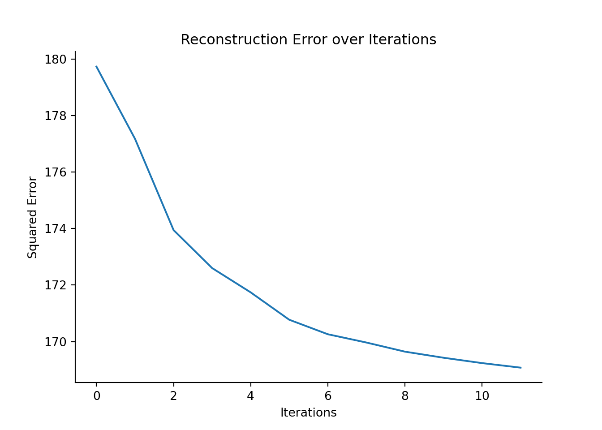

# Constructing metacells (for 'discrete' data)

In this chapter, we will demonstrate metacell construction using three different methods. MetaCell-2 (MC2) and SEACells in Pyhton and SuperCell in R. 

For this, we will use a dataset of PBMCs from study. This dataset contains 30K cells and ... This is an example of a complex dataset with well defined cells types. For an example of more continuous data, see chapter \@ref(MC-continuous)


```
#> findfont: Font family ['Raleway'] not found. Falling back to DejaVu Sans.
#> findfont: Font family ['Lato'] not found. Falling back to DejaVu Sans.
```


## MC2 (Python)


[//]: # (Chunk to run MC-2 metacell construction for a discrete -pbmcs- dataset)


In this section, we construct metacells using [Metacell-2 (MC2)](https://github.com/tanaylab/metacells). The code is adapted from the [author's tutorial](https://metacells.readthedocs.io/en/latest/Metacells_Vignette.html). For more information on the method, please refer to the section 1 of chapter 2. 

#### Importing python packages {-}

To run Metacell-2, the following python packages need to be imported: 


```python
import os
import numpy as np
import pandas as pd
import anndata as ad
import scanpy as sc
import matplotlib.pyplot as plt
import seaborn as sns
import metacells as mc
```


```python
import sys
sys.path.append('./mc_QC/')
import mc_QC
```
If you don't have these packages installed, please refer to the section 2 of chapter 1.


### Data loading 
We will run Metacell-2 on a single-cell dataset composed of XX peripheral blood mononuclear cells (PBMCs). Please follow the section 4 from Chapter 1 to retrieve these data from the scanpy package and save the data in the following file: "data/3k_pbmc/singlecell_anndata_filtered.h5ad".


```python
MC_tool = "MC2"
proj_name = "3k_pbmc"
ad = sc.read(os.path.join("data", proj_name, "singlecell_anndata_filtered.h5ad"))
```

We initialize the name of the anndata (in the unstructured annotations) object using the `ut.set_name` function from the Metacells package.


```python
mc.ut.set_name(ad, proj_name)
```

### Filtering steps 

Before building the metacells the Metacell-2 authors recommend to filter the single-cell data in two-steps (See [original vignette](https://metacells.readthedocs.io/en/latest/Metacells_Vignette.html)). 
A first filtering step consists in filtering genes based on biological knowledge (*e.g.* mitochrondrial genes) or based on their expression levels. The latter genes include genes with zero expression or low expression levels, "noisy lonely genes" (*i.e.*, genes with high expression levels but no correlation with any other gene). 
A second filtering step consists in filtering cells based on their UMI counts.

#### Gene filtering {-}

In section XX form Chapter XX, we pre-processed the raw scRNA-Seq data and excluded genes with low expression as well as mitochondrial genes. In the following code chunk, we identify additional genes to filter using the `analyze_clean_genes` and `pick_clean_genes` functions from the Metacells package, which returns three sets of genes: i) the known-to-be-excluded genes defined by the user as an array of gene names or gene names patterns, ii) the properly sampled genes, and iii) the "noisy lonely genes". 


```python
excluded_gene_names = [] # for example, ['IGHMBP2', 'IGLL1', 'IGLL5', 'IGLON5', 'NEAT1', 'TMSB10', 'TMSB4X']
excluded_gene_patterns = ['MT-.*']
mc.pl.analyze_clean_genes(ad,
                          excluded_gene_names=excluded_gene_names,
                          excluded_gene_patterns=excluded_gene_patterns,
                          random_seed=123456)
#> set 3k_pbmc.var[properly_sampled_gene]: 16579 true (50.64%) out of 32738 bools
#> set 3k_pbmc.var[excluded_gene]: 13 true (0.03971%) out of 32738 bools
#> set 3k_pbmc.var[noisy_lonely_gene]: 0 true (0%) out of 32738 bools

mc.pl.pick_clean_genes(ad)
#> set 3k_pbmc.var[clean_gene]: 16566 true (50.6%) out of 32738 bools
```

#### Cell filtering {-}

The first round of cell cleaning implies filtering out cell with very low and very hight UMI content (`properly_sampled_min_cell_total`, `properly_sampled_max_cell_total` parameters).  
The second round includes cell filtering based on UMI counts in excluded genes (`properly_sampled_max_excluded_genes_fraction` parameter). 
Since our dataset have been pre-filtered, very lenient cutoffs will be used in this tutorial (`properly_sampled_min_cell_total`, `properly_sampled_max_cell_total` and `properly_sampled_max_excluded_genes_fraction`) such that all the cells are kept for the metacell construction. 
The following code chunk defines these parameters. To adapt them to your datasets, we advise you to explore the distributions of total UMI counts and UMI counts in excluded genes, as recommended and descrided in the Metacell-2 [original vignette](https://metacells.readthedocs.io/en/latest/Metacells_Vignette.html).


```python
### The first round of cell cleaning (high/low UMIs)
properly_sampled_min_cell_total = 200 
properly_sampled_max_cell_total = 10000 
## The second round of cell cleaning (content of excluded genes, e.g., mito-genes)
properly_sampled_max_excluded_genes_fraction = 0.25
```

The set of cells to be filtered is defined using the `analyze_clean_cells` and `pick_clean_cells` functions from the Metacell-2 package.


```python
mc.pl.analyze_clean_cells(
    ad,
    properly_sampled_min_cell_total = properly_sampled_min_cell_total,
    properly_sampled_max_cell_total = properly_sampled_max_cell_total,
    properly_sampled_max_excluded_genes_fraction = properly_sampled_max_excluded_genes_fraction
)
#> set 3k_pbmc.obs[properly_sampled_cell]: 2638 true (100%) out of 2638 bools
mc.pl.pick_clean_cells(ad)
#> set 3k_pbmc.obs[clean_cell]: 2638 true (100%) out of 2638 bools
```

After performing the two-step filtering (genes and cells), the "cleaned" data can be extracted using the `pl.extract_clean_data` prior to metacells construction.


```python
# Extract clean dataset (with filtered cells and genes)
ad = mc.pl.extract_clean_data(ad)
#> set 3k_pbmc.clean.obs[full_cell_index]: 2638 int64s
#> set 3k_pbmc.clean.var[full_gene_index]: 16566 int64s
```

### Building metacells

#### Estimate target_metacell_size (gamma) {-}

In contrast to the SuperCell and SEACells, Metacell-2 does not allow to explicitly obtain metacell data at a user-defined graining level. 
Instead, to vary the graining level, we have to vary the `target_metacell_size` parameter, that is `160000` by default. Here we provide a chunk to calibrate this value to reach a desired graining level. 
Please, increase or decrease the `scale` parameter if the obtained graining level (`gamma_obtained`) is lower or larger than the requested one (`gamma`).


```python
gamma   = 50 # graining level
print(f'The requested graining level is {gamma}, lets estimate the target_metacell_size that should result in such graining level.')
#> The requested graining level is 50, lets estimate the target_metacell_size that should result in such graining level.

scale = 2 # increase or decrease if the obtained graining level (`gamma_obtained`) is significantly > or < then the requested one `gamma`

# estimated mean UMI content in downsampled data
total_umis_of_cells = mc.ut.get_o_numpy(ad, name='__x__', sum=True)
est_downsample_UMI = np.quantile(np.array(total_umis_of_cells), 0.05)

target_metacell_size = int(est_downsample_UMI * gamma * scale)
target_metacell_size
#> 98900
```

#### Metacells identification using the divide and conquer approach {-}

Metacell-2 uses its own feature selection approach (*i.e.*, selection of genes used to build metacells). 
Additionally, users can explicitly specify which features should be used by providing two arguments:  
i) `feature_gene_names`, *i.e.*, genes that have to be included and, ii) `forbidden_gene_names`, *i.e.*, genes that have to be excluded. 
Examples of forbidden are cell cycle genes which reflect true biological signal but could bias the metacells construction. The Metacell-2 [original vignette](https://metacells.readthedocs.io/en/latest/Metacells_Vignette.html) provides additional information to identify forbidden genes.
The previous arguments for feature selection are taken as input by the `pl.divide_and_conquer_pipeline` function which builds the metacells. 
Note that by default all cores of the system will be used for the metacells construction. More information are available on the [original vignette](https://metacells.readthedocs.io/en/latest/Metacells_Vignette.html) to change this behavior and adapt the number of cores (see `ut.set_processors_count`) or the number processed in parallel (see `pl.set_max_parallel_piles`).


```python
mc.pl.divide_and_conquer_pipeline(
    ad,
    #feature_gene_names   = feature_gene_names, # comment this line to allow Metacell2 selecting features
    #forbidden_gene_names = forbidden_gene_names, # comment this line to allow Metacell2 selecting features
    target_metacell_size = target_metacell_size,
    random_seed = 123456)
#> set 3k_pbmc.clean.var[rare_gene]: 0 true (0%) out of 16566 bools
#> set 3k_pbmc.clean.var[rare_gene_module]: 16566 int32 elements with all outliers (100%)
#> set 3k_pbmc.clean.obs[cells_rare_gene_module]: 2638 int32 elements with all outliers (100%)
#> set 3k_pbmc.clean.obs[rare_cell]: 0 true (0%) out of 2638 bools
#> set 3k_pbmc.clean.layers[downsampled]: csr_matrix 2638 X 16566 float32s (1218892 > 0)
#> set 3k_pbmc.clean.uns[downsample_samples]: 989
#> set 3k_pbmc.clean.var[high_top3_gene]: 552 true (3.332%) out of 16566 bools
#> set 3k_pbmc.clean.var[high_total_gene]: 4519 true (27.28%) out of 16566 bools
#> set 3k_pbmc.clean.var[high_relative_variance_gene]: 3027 true (18.27%) out of 16566 bools
#> set 3k_pbmc.clean.var[feature_gene]: 293 true (1.769%) out of 16566 bools
#> set 3k_pbmc.clean.obsp[obs_similarity]: ndarray 2638 X 2638 float32s
#> set 3k_pbmc.clean.obsp[obs_outgoing_weights]: csr_matrix 2638 X 2638 float32s (117211 > 0)
#> set 3k_pbmc.clean.obs[seed]: 496 outliers (18.8%) out of 2638 int32 elements with 61 groups with mean size 35.11
#> set 3k_pbmc.clean.obs[candidate]: 6 outliers (0.2274%) out of 2638 int32 elements with 67 groups with mean size 39.28
#> set 3k_pbmc.clean.var[gene_deviant_votes]: 942 positive (5.686%) out of 16566 int32s
#> set 3k_pbmc.clean.obs[cell_deviant_votes]: 889 positive (33.7%) out of 2638 int32s
#> set 3k_pbmc.clean.obs[dissolved]: 10 true (0.3791%) out of 2638 bools
#> set 3k_pbmc.clean.obs[metacell]: 905 outliers (34.31%) out of 2638 int64 elements with 66 groups with mean size 26.26
#> set 3k_pbmc.clean.obs[outlier]: 905 true (34.31%) out of 2638 bools
#> set 3k_pbmc.clean.uns[pre_directs]: 0
#> set 3k_pbmc.clean.uns[directs]: 1
#> set 3k_pbmc.clean.var[pre_high_total_gene]: * <- 0
#> set 3k_pbmc.clean.var[high_total_gene]: 4519 positive (27.28%) out of 16566 int32s
#> set 3k_pbmc.clean.var[pre_high_relative_variance_gene]: * <- 0
#> set 3k_pbmc.clean.var[high_relative_variance_gene]: 3027 positive (18.27%) out of 16566 int32s
#> set 3k_pbmc.clean.var[forbidden_gene]: * <- False
#> set 3k_pbmc.clean.var[pre_feature_gene]: * <- 0
#> set 3k_pbmc.clean.var[feature_gene]: 293 positive (1.769%) out of 16566 int32s
#> set 3k_pbmc.clean.var[pre_gene_deviant_votes]: * <- 0
#> set 3k_pbmc.clean.obs[pre_cell_directs]: * <- 0
#> set 3k_pbmc.clean.obs[cell_directs]: * <- 0
#> set 3k_pbmc.clean.obs[pre_pile]: * <- -1
#> set 3k_pbmc.clean.obs[pile]: * <- 0
#> set 3k_pbmc.clean.obs[pre_candidate]: * <- -1
#> set 3k_pbmc.clean.obs[pre_cell_deviant_votes]: * <- 0
#> set 3k_pbmc.clean.obs[pre_dissolved]: * <- False
#> set 3k_pbmc.clean.obs[pre_metacell]: * <- -1

ad.obs.metacell.head
#> <bound method NDFrame.head of index
#> AAACATACAACCAC-1    36
#> AAACATTGAGCTAC-1    14
#> AAACATTGATCAGC-1    26
#> AAACCGTGCTTCCG-1    62
#> AAACCGTGTATGCG-1    -1
#>                     ..
#> TTTCGAACTCTCAT-1    62
#> TTTCTACTGAGGCA-1    14
#> TTTCTACTTCCTCG-1    -1
#> TTTGCATGAGAGGC-1    28
#> TTTGCATGCCTCAC-1    27
#> Name: metacell, Length: 2638, dtype: int64>
```

#### Retrieve aggregated metacell data {-}

The `pl.divide_and_conquer_pipeline` function associate each cell to a metacell or defines the cell as outlier. These assignments are found in the `obs` layer of the anndata object
The function `pl.collect_metacells` should be used to subsequently retrieve an anndata object containing the data at the metacells level instead of the single-cell level. 


```python

mc_ad = mc.pl.collect_metacells(ad, name='metacells')
#> set metacells.var[excluded_gene]: 0 true (0%) out of 16566 bools
#> set metacells.var[clean_gene]: 16566 true (100%) out of 16566 bools
#> set metacells.var[forbidden_gene]: 0 true (0%) out of 16566 bools
#> set metacells.var[pre_feature_gene]: 0 positive (0%) out of 16566 int32s
#> set metacells.var[feature_gene]: 293 positive (1.769%) out of 16566 int32s
#> set metacells.obs[pile]: [ 0, 0, 0, 0, 0, 0, 0, 0, 0, 0, 0, 0, 0, 0, 0, 0, 0, 0, 0, 0, 0, 0, 0, 0, 0, 0, 0, 0, 0, 0, 0, 0, 0, 0, 0, 0, 0, 0, 0, 0, 0, 0, 0, 0, 0, 0, 0, 0, 0, 0, 0, 0, 0, 0, 0, 0, 0, 0, 0, 0, 0, 0, 0, 0, 0, 0 ]
#> set metacells.obs[candidate]: [ 1, 2, 3, 4, 5, 6, 7, 8, 9, 10, 11, 12, 13, 14, 15, 16, 17, 18, 19, 20, 21, 22, 23, 24, 25, 26, 27, 28, 29, 30, 31, 32, 33, 34, 35, 36, 37, 38, 39, 40, 41, 42, 43, 44, 45, 46, 47, 48, 49, 50, 51, 52, 53, 54, 55, 56, 57, 58, 59, 60, 61, 62, 63, 64, -2, 35 ]
mc_ad.shape
#> (66, 16566)
```

**Comparing the obtained and requested graining level**

In the following code chunk, we estimate whether a deviation of the obtained gamma from the requested gamma is acceptable. If not, we suggest to increase or decrease the `scale` parameter to approach the desired graining level.


[//]: # (mc2 estimate deviation of obtained graining level)


```python
gamma_obtained = ad.shape[0]/mc_ad.shape[0]
print(gamma_obtained)
#> 39.96969696969697

gamma_dev = (gamma_obtained - gamma)/gamma
if abs(gamma_dev) < 0.3: 
    gamma_dev = 0

if gamma_dev < 0:
    print("Increase `target_metacell_size` parameter by increasing `scale` and re-run metacell divide_and_conquer_pipeline() to get larger graining level")
elif gamma_dev > 0:
    print("Deacrease `target_metacell_size` parameter by decreasing `scale` and re-run metacell divide_and_conquer_pipeline() to get smaller graining level")
elif gamma_dev == 0:
    print("The obtained graining level is acceptable, no need to re-run the metacell divide_and_conquer_pipeline() with a new `target_metacell_size` ")
#> The obtained graining level is acceptable, no need to re-run the metacell divide_and_conquer_pipeline() with a new `target_metacell_size`
```

If the obtained graining level is not acceptable and you updated `scale` parameter according to the suggestion, do not forget to re-run chunk \@ref(chunk:mc2-divide-n-conquer) \@ref(aggregate-mc2).

### Visualize metacells

The following code chunk adds a columns named `membership` and containing the single_cell assignments to the obs attribute in the anndata object containing the raw data. 
This annotation will be used in the mc_QC package to compute metacells quality metrics. We also save the single-cell metadata in the metacell anndata object.


```python
# make a membership -- index of metacells to which single cells belong to 
ad.obs['membership'] = [int(i)+1 if i >= 0 else np.nan for i in ad.obs.metacell] 

## Save single-cell metadata (i.e., `raw.obs` dataframe) in the metacell adata object
mc_ad.uns = ad.uns.copy()
mc_ad.uns['sc.obs'] = ad.obs.copy()

# save the requested gamma
mc_ad.uns['gamma'] = gamma
```

####  Compute latent space for metacell QC {-}
To visualize the metacells, we can project the metacells on the single-cell UMAP representation. To run UMAP, we will generate in the next code chunk a lower-dimentional embedding of the data, so far not needed since the MC2 methods builds metacells from gene expression data and not from latent space. 
Also, note that some of the QC metrics (e.g., **compactness** and **separation**), that we will compute in the next section of this tutorial, are computed from this latent space. 


[//]: # (MC2 compute PCA for computation of compactness and separation)


```python
# Save count as a separate layer
ad.layers['counts'] = ad.X

# Copy the counts to ".raw" attribute of the anndata since it is necessary for downstream analysis
# This step should be performed after filtering 
raw_ad = sc.AnnData(ad.layers['counts'])
raw_ad.obs_names, raw_ad.var_names = ad.obs_names, ad.var_names
ad.raw = raw_ad


# Normalize cells, log transform and compute highly variable genes
sc.pp.normalize_per_cell(ad)
sc.pp.log1p(ad)
sc.pp.highly_variable_genes(ad, n_top_genes=1000)

# Compute principal components - 

n_comp    = 10
sc.tl.pca(ad, n_comps=n_comp, use_highly_variable=True)


# Compute UMAP for visualization 
sc.pp.neighbors(ad, n_neighbors=10, n_pcs=n_comp)
sc.tl.umap(ad)
```
To visualize the metacell projection on the single-cell UMAP, we use the `mc_visualize` function from the `mc_QC`, this function was adapted from the `plot.plot_2D` included in the SEACells package.


```python
mc_proj = mc_QC.mc_visualize(ad, key='X_umap', group_by_name='membership', colour_sc_name='louvain',  colour_mc_name='membership', colour_metacells=True, legend_sc=None, legend_mc=None)
#> No artists with labels found to put in legend.  Note that artists whose label start with an underscore are ignored when legend() is called with no argument.
mc_proj.show()
#> findfont: Font family 'Bitstream Vera Sans' not found.
#> findfont: Font family 'Bitstream Vera Sans' not found.
#> findfont: Font family 'Bitstream Vera Sans' not found.
#> findfont: Font family 'Bitstream Vera Sans' not found.
#> findfont: Font family 'Bitstream Vera Sans' not found.
#> findfont: Font family 'Bitstream Vera Sans' not found.
#> findfont: Font family 'Bitstream Vera Sans' not found.
#> findfont: Font family 'Bitstream Vera Sans' not found.
#> findfont: Font family 'Bitstream Vera Sans' not found.
```


### Metacell QC

####  Compute purity, compactness and separation metrics {-}


**Size distribution**

```python
#mc_size = SEACells.plot.plot_SEACell_sizes(ad, bins=20)

#mc_ad.obs = pd.merge(mc_ad.obs, mc_size, left_index=True, right_index=True)
#mc_ad.obs
```

When available, we can use cell annotation to annotate each metacell to the most abundant cell category (*e.g.* cell type) composing the metacell. 
This also allows us to compute metacell purity. If the annotation considered is the cell type, the **purity** of a metacell is the proportion of the most abundant cell type within the metacell [ref SuperCell]

```python
mc_purity = mc_QC.purity(ad, annotation_label, MC_label = 'membership')
mc_purity.head()
#>                 louvain  louvain_purity
#> membership                             
#> 1.0         CD8 T cells        0.857143
#> 2.0         CD4 T cells        0.869565
#> 3.0         CD4 T cells        0.961538
#> 4.0             B cells        1.000000
#> 5.0         CD4 T cells        0.782609
# add purity to metadata
mc_ad.obs['purity'] = list(mc_purity[annotation_label + "_purity"])
```

The **compactness** of a metacell is the variance of the components within the metacell [ref SEACells]

```python
compactness = mc_QC.compactness(ad, 'X_pca', MC_label = 'membership', DO_DC = False, name = 'Compactness_PCA', n_comp=10)['Compactness_PCA']
# add compactness to metadata
mc_ad.obs['Compactness_PCA'] = list(compactness)
```


The **separation** of a metacell is the distance to the closest metacell [ref SEACells]

```python
separation = mc_QC.separation(ad, 'X_pca', MC_label = 'membership', DO_DC = False, name = 'Separation_PCA', n_comp=10)['Separation_PCA']
# add separation to metadata
mc_ad.obs['Separation_PCA'] = list(separation)
```


<!-- The **inner normalized variance (INV)** of a metacell is the mean-normalized variance of gene expression within the metacell [ref MC-2] -->
<!-- ```{python, warning = FALSE, message = FALSE, result = FALSE, eval = FALSE} -->
<!-- mc_INV = mc_QC.mc_inner_normalized_var(ad, MC_label = 'membership') -->

<!-- mc_INV_val = mc_INV.quantile(0.95, axis=1, numeric_only=True) -->
<!-- mc_INV_val = pd.DataFrame(mc_INV_val.transpose()).set_axis(['INV'], axis=1, inplace=False) -->
<!-- # add INV to metadata -->
<!-- mc_ad.obs['INV'] = list(mc_INV_val["INV"]) -->
<!-- ``` -->


```python
ad.uns['mc_obs'] = mc_ad.obs
mc_QC.mc_visualize_continuous(ad, key='X_umap', group_by_name='membership', 
             colour_sc_name='louvain',  colour_mc_name='purity', colour_metacells=True,
             legend_sc=None, legend_mc='auto', metacell_size=30)
#> findfont: Font family 'Bitstream Vera Sans' not found.
#> findfont: Font family 'Bitstream Vera Sans' not found.
#> findfont: Font family 'Bitstream Vera Sans' not found.
#> findfont: Font family 'Bitstream Vera Sans' not found.
#> findfont: Font family 'Bitstream Vera Sans' not found.
#> findfont: Font family 'Bitstream Vera Sans' not found.
#> findfont: Font family 'Bitstream Vera Sans' not found.
#> findfont: Font family 'Bitstream Vera Sans' not found.
#> findfont: Font family 'Bitstream Vera Sans' not found.
#> findfont: Font family 'Bitstream Vera Sans' not found.
#> findfont: Font family 'Bitstream Vera Sans' not found.
#> findfont: Font family 'Bitstream Vera Sans' not found.
#> findfont: Font family 'Bitstream Vera Sans' not found.
#> findfont: Font family 'Bitstream Vera Sans' not found.
#> findfont: Font family 'Bitstream Vera Sans' not found.
#> findfont: Font family 'Bitstream Vera Sans' not found.
#> findfont: Font family 'Bitstream Vera Sans' not found.
#> findfont: Font family 'Bitstream Vera Sans' not found.
#> findfont: Font family 'Bitstream Vera Sans' not found.
#> findfont: Font family 'Bitstream Vera Sans' not found.
#> findfont: Font family 'Bitstream Vera Sans' not found.
#> findfont: Font family 'Bitstream Vera Sans' not found.
#> findfont: Font family 'Bitstream Vera Sans' not found.
#> findfont: Font family 'Bitstream Vera Sans' not found.
```


```python
             
mc_QC.mc_visualize_continuous(ad, key='X_umap', group_by_name='membership', 
             colour_sc_name='louvain',  colour_mc_name='Compactness_PCA', colour_metacells=True, 
             legend_sc=None, legend_mc='auto', metacell_size=30)   
```


```python
             
mc_QC.mc_visualize_continuous(ad, key='X_umap', group_by_name='membership', 
             colour_sc_name='louvain',  colour_mc_name='Separation_PCA', colour_metacells=True, 
             legend_sc=None, legend_mc='auto', metacell_size=30)   
```


##### Save output {-}


```python
mc_ad.write_h5ad(os.path.join('./data', proj_name, f'metacell_{MC_tool}.h5ad'))
```


## SEACells (Python)


[//]: # (Code to run mc construction with SEACells for a discrete dataset)


In this section, we construct metacells using [SEACells](https://github.com/dpeerlab/SEACells). The code is adapted from the [author's jupyter notebook](https://github.com/dpeerlab/SEACells/blob/main/notebooks/SEACell_computation.ipynb). 
For more information on the method, please refer to the section 3 of chapter 2. 

#### Importing python packages {-}

To run the SEACells, the following python packages need to be imported: 


```python
import os
import pandas as pd
import scanpy as sc
import SEACells
import random
```


```python
import sys
sys.path.append('./mc_QC/')
import mc_QC
```

If you don't have these packages installed, please refer to the section 2 of chapter 1.


### Data loading 
Similarly to Metacell-2, we will run SEACells on the single-cell dataset composed of XX peripheral blood mononuclear cells (PBMCs). 
Please follow the section 4 from Chapter 1 to retrieve these data from the scanpy package and save the data in the following file: "data/3k_pbmc/singlecell_anndata_filtered.h5ad".


```python
MC_tool = "SEACells"
proj_name = "3k_pbmc"
ad = sc.read(os.path.join("data", proj_name, "singlecell_anndata_filtered.h5ad"))
```

### Filtering steps 
In this tutorial, the data have been pre-filterd in the section XX of chapter XX.

### Building metacells

Metacells construction using SEACells requires 2 main inputs: i) an anndata object (`build_kernel_on` parameter), and
ii) a key indicating which matrix in the `obsm` attribute of the anndata object should be considered to compute the kernel needed for archetypal analysis (`build_kernel_on` parameter).
Important optional inputs are: the number of metacells to identify (`n_SEACells` parameter), which is used as input of the archetypal analysis, 
ii) the number of neighbors to consider for the knn graph (`n_neighbors` parameter).

#### Data pre-processing {-}

The following code chunk saves the raw counts of the filtered data in the raw attribute of the anndata object.
The raw counts will be used later for metacells aggregation.


```python
raw_ad = sc.AnnData(ad.X)
raw_ad.obs_names, raw_ad.var_names = ad.obs_names, ad.var_names
ad.raw = raw_ad
```

To build the kernel for archetypal analysis, SEACells requires a lower-dimensionnal embedding of the data (for example using PCA for scRNA-Seq data or SVD for scATAC-Seq data). 
In the next code chunk, we follow standard pre-processing steps prior to PCA computation, *i.e.*, data normalization, log transformation, identification of highly variable genes.
PCA components are saved in the `obsm` attribute of the anndata object.

[//]: # (This file runs standard preprocessing steps with scanpy)


To pre-process the single-cell data, we are using standard pre-processing for single-cell RNA-seq data using Scanpy. For more information, see [the Scanpy tutorial](https://scanpy-tutorials.readthedocs.io/en/latest/pbmc3k.html).


```python
# Normalize cells, log transform and compute highly variable genes
sc.pp.normalize_per_cell(ad)
sc.pp.log1p(ad)
sc.pp.highly_variable_genes(ad, n_top_genes=1000)
```


```python
# Compute principal components - 
# Here we use 10 components to be consistent with our main tutorial, but fill free to explore other number of principal components to use 

n_comp    = 10
sc.tl.pca(ad, n_comps=n_comp, use_highly_variable=True)

# Compute UMAP for visualization
sc.pp.neighbors(ad, n_neighbors=10, n_pcs=n_comp)
sc.tl.umap(ad)
```

#### Setting up SEACells parameters {-}

In this tutorial, we will use in the SEACells model the 10 first principal components resulting from the PCA to build the knn graph which will be used to compute the kernel. 
The number of neighbors to considered for the knn graph can be fixed using the `n_neighbors` parameter (here 15).  
As mentioned previously, users should provide as input the number of metacells required (`n_SEACells` parameter). This number can be defined as the ratio between the number of single cells and the desired graining level (`gamma` parameter in the following code chunk). 
In this example, we choose a graining level of 50.  


```python
build_kernel_on = 'X_pca' # key in ad.obsm to use for computing metacells
n_waypoint_eigs = 10      # Number of eigenvalues to consider when initializing metacells
n_neighbors = 15 # Number of neighbors used for graph construction 
gamma = 50   # the requested graining level
n_SEACells = int(ad.shape[0]/gamma) # the requested number of metacells  
```

#### Initializing the SEACells model {-}

The SEACells model is initialized with the previously defined parameters using the `SEACells.core.SEACells` function.


```python
model = SEACells.core.SEACells(ad,
                  build_kernel_on = build_kernel_on,
                  n_SEACells = n_SEACells,
                  n_waypoint_eigs = n_waypoint_eigs,
                  n_neighbors = n_neighbors,
                  convergence_epsilon = 1e-5,
                  verbose = True)
#> Welcome to SEACells!
```

Kernel computation is performed using the `mconstruct_kernel_matrix` function.


```python
model.construct_kernel_matrix()
M = model.kernel_matrix
```

Metacells are initialized using the `initialize_archetypes` function.  
The SEACells archetypes initialization is based on cells sampling and thus is stochastic. User can fix a seed for reproducible results.
To check that the archetypes are evenly spread, users can visualize them using the `plot.plot_initialization` function.   


```python
# set seed for reproducibility
random.seed(123)

# Initialize archetypes
model.initialize_archetypes()
#> Building kernel on X_pca
#> Computing diffusion components from X_pca for waypoint initialization ... 
#> Determing nearest neighbor graph...
#> Done.
#> Sampling waypoints ...
#> Done.
#> Selecting 39 cells from waypoint initialization.
#> Initializing residual matrix using greedy column selection
#> Initializing f and g...
#> Selecting 13 cells from greedy initialization.
#> 
#> 
  0%|          | 0/23 [00:00<?, ?it/s]
100%|##########| 23/23 [00:00<00:00, 441.29it/s]
# Visualize the initialization 
SEACells.plot.plot_initialization(ad, model, plot_basis='X_umap') 
```


#### Fitting the SEACells model to identify metacells {-}

The identification of the archetypes is an iterative process. In this example, we fixed the minimum and maximum number of iteration to 10 and 50 respectively. 
We then check the model convergence using the `plot_convergence` function.  


```python
model.fit(min_iter = 10, max_iter = 50)
#> Randomly initialized A matrix.
#> Setting convergence threshold at 0.00088
#> Starting iteration 1.
#> Completed iteration 1.
#> Starting iteration 10.
#> Completed iteration 10.
#> Starting iteration 20.
#> Completed iteration 20.
#> Converged after 25 iterations.
model.plot_convergence()
```



Once the final archetypes have been identified, we can assign each single-cell to one metacell (hard assignments). 
These assignments (`membership`) can be retrieved using the `get_hard_assignments` function or extracted from the anndata object using `ad.obs["SEACell"]`. 
In this tutorial, we will only consider hard assignments. However, the SEACells package also provides the option to retrieve soft assignments (multiple weighted assignments for each cell) using the `get_soft_assignments` function. 
For more details on the soft assignments, please refer to the [SEACell paper](https://www.nature.com/articles/s41587-023-01716-9#Sec11) and the original [author's jupyter notebook](https://github.com/dpeerlab/SEACells/blob/main/notebooks/SEACell_computation.ipynb).


```python
membership = model.get_hard_assignments()
membership.head
#> <bound method NDFrame.head of                      SEACell
#> index                       
#> AAACATACAACCAC-1  SEACell-41
#> AAACATTGAGCTAC-1   SEACell-1
#> AAACATTGATCAGC-1   SEACell-4
#> AAACCGTGCTTCCG-1  SEACell-19
#> AAACCGTGTATGCG-1  SEACell-40
#> ...                      ...
#> TTTCGAACTCTCAT-1  SEACell-50
#> TTTCTACTGAGGCA-1  SEACell-44
#> TTTCTACTTCCTCG-1  SEACell-27
#> TTTGCATGAGAGGC-1  SEACell-51
#> TTTGCATGCCTCAC-1  SEACell-24
#> 
#> [2638 rows x 1 columns]>
ad.obs["SEACell"].head
#> <bound method NDFrame.head of index
#> AAACATACAACCAC-1    SEACell-41
#> AAACATTGAGCTAC-1     SEACell-1
#> AAACATTGATCAGC-1     SEACell-4
#> AAACCGTGCTTCCG-1    SEACell-19
#> AAACCGTGTATGCG-1    SEACell-40
#>                        ...    
#> TTTCGAACTCTCAT-1    SEACell-50
#> TTTCTACTGAGGCA-1    SEACell-44
#> TTTCTACTTCCTCG-1    SEACell-27
#> TTTGCATGAGAGGC-1    SEACell-51
#> TTTGCATGCCTCAC-1    SEACell-24
#> Name: SEACell, Length: 2638, dtype: object>
```

#### Retrieve aggregated metacell data {-}

The `core.summarize_by_SEACell` function can be used to generate a metacell count matrix (aggregation of counts across all cells belonging to each metacell).  


```python
mc_ad = SEACells.core.summarize_by_SEACell(ad, SEACells_label='SEACell', summarize_layer='raw')
#> 
  0%|          | 0/52 [00:00<?, ?it/s]
100%|##########| 52/52 [00:00<00:00, 564.32it/s]
```

### Visualize metacells

To visualize the metacells, we can project the metacells on the single-cell UMAP representation using the `plot.plot_2D` included in the SEACells package.


```python
SEACells.plot.plot_2D(ad, key='X_umap', colour_metacells=True)
```


### Metacell QC
####  Compute purity, compactness and separation metrics {-}

The following code chunk adds a columns named `membership` and containing the single_cell assignments to the obs attribute in the anndata object containing the raw data. 
This annotation will be used in the mc_QC package to compute metacells quality metrics.


```python
# make `membership` numeric
d = {x: int(i)+1 for i, x in enumerate(mc_ad.obs_names)}
ad.obs.merge(membership)
ad.obs['membership'] = [d[x] for x in membership.SEACell]
#mc_QC.mc_visualize(ad, key='X_umap', group_by_name='SEACell', colour_sc_name='louvain',  colour_mc_name='SEACell', colour_metacells=True, legend_sc='full', legend_mc=None)
```


**Size distribution**

```python
#mc_size = SEACells.plot.plot_SEACell_sizes(ad, bins=20)

#mc_ad.obs = pd.merge(mc_ad.obs, mc_size, left_index=True, right_index=True)
#mc_ad.obs
```

When available, we can use cell annotation to annotate each metacell to the most abundant cell category (*e.g.* cell type) composing the metacell. 
This also allows us to compute metacell purity. If the annotation considered is the cell type, the **purity** of a metacell is the proportion of the most abundant cell type within the metacell [ref SuperCell]

```python
mc_purity = mc_QC.purity(ad, annotation_label, MC_label = 'membership')
mc_purity.head()
#>                     louvain  louvain_purity
#> membership                                 
#> 1               CD8 T cells        0.741379
#> 2                   B cells        0.967213
#> 3               CD4 T cells        0.941860
#> 4           CD14+ Monocytes        0.950000
#> 5                  NK cells        1.000000
# add purity to metadata
mc_ad.obs['purity'] = list(mc_purity[annotation_label + "_purity"])
```

The **compactness** of a metacell is the variance of the components within the metacell [ref SEACells]

```python
compactness = mc_QC.compactness(ad, 'X_pca', MC_label = 'membership', DO_DC = False, name = 'Compactness_PCA', n_comp=10)['Compactness_PCA']
# add compactness to metadata
mc_ad.obs['Compactness_PCA'] = list(compactness)
```


The **separation** of a metacell is the distance to the closest metacell [ref SEACells]

```python
separation = mc_QC.separation(ad, 'X_pca', MC_label = 'membership', DO_DC = False, name = 'Separation_PCA', n_comp=10)['Separation_PCA']
# add separation to metadata
mc_ad.obs['Separation_PCA'] = list(separation)
```


<!-- The **inner normalized variance (INV)** of a metacell is the mean-normalized variance of gene expression within the metacell [ref MC-2] -->
<!-- ```{python, warning = FALSE, message = FALSE, result = FALSE, eval = FALSE} -->
<!-- mc_INV = mc_QC.mc_inner_normalized_var(ad, MC_label = 'membership') -->

<!-- mc_INV_val = mc_INV.quantile(0.95, axis=1, numeric_only=True) -->
<!-- mc_INV_val = pd.DataFrame(mc_INV_val.transpose()).set_axis(['INV'], axis=1, inplace=False) -->
<!-- # add INV to metadata -->
<!-- mc_ad.obs['INV'] = list(mc_INV_val["INV"]) -->
<!-- ``` -->


```python
ad.uns['mc_obs'] = mc_ad.obs
mc_QC.mc_visualize_continuous(ad, key='X_umap', group_by_name='membership', 
             colour_sc_name='louvain',  colour_mc_name='purity', colour_metacells=True,
             legend_sc=None, legend_mc='auto', metacell_size=30)
```


```python
             
mc_QC.mc_visualize_continuous(ad, key='X_umap', group_by_name='membership', 
             colour_sc_name='louvain',  colour_mc_name='Compactness_PCA', colour_metacells=True, 
             legend_sc=None, legend_mc='auto', metacell_size=30)   
```


```python
             
mc_QC.mc_visualize_continuous(ad, key='X_umap', group_by_name='membership', 
             colour_sc_name='louvain',  colour_mc_name='Separation_PCA', colour_metacells=True, 
             legend_sc=None, legend_mc='auto', metacell_size=30)   
```


##### Save output {-}


```python
mc_ad.write_h5ad(os.path.join('./data', proj_name, f'metacell_{MC_tool}.h5ad'))
```


## SuperCell (R)


[//]: # (Code to run mc construction with SuperCell for a discrete dataset)


In this section, we construct metacells using [SuperCell](https://github.com/GfellerLab/SuperCell). The code is adapted from the [author's github documentation](https://github.com/GfellerLab/SuperCell/blob/master/README.Rmd).
For more information on the method, please refer to the section \@ref(SuperCell).

#### Importing R packages {-}

To run SuperCell, the following python packages need to be imported:


```r
if(system.file(package='SuperCell') == ""){
  remotes::install_github("GfellerLab/SuperCell", force = TRUE, upgrade = FALSE)
} 
library(SuperCell)
```


```python
import sys
sys.path.append('./mc_QC/')
import mc_QC
import pandas as pd
import scanpy as sc
import SEACells
```

If you don't have these packages installed, please refer to the section 2 of chapter 1.


### Data loading
Similarly to Metacell-2 and SEACells, we will run SuperCell on the single-cell dataset composed of XX peripheral blood mononuclear cells (PBMCs).
Please follow the section 4 from Chapter 1 to retrieve these data from the scanpy package and save the data in the following file: "data/3k_pbmc/singlecell_anndata_filtered.h5ad".


```r
MC_tool = "SuperCell"
proj_name = "3k_pbmc"
sc_data = readRDS(paste0("data/", proj_name, "/singlecell_seurat_filtered.rds"))
```

### Filtering steps
In this tutorial, the data have been pre-filtered in the section XX of chapter XX.

### Building metacells

Metacells construction using SuperCell requires one main inputs, *i.e.* a matrix of log-normalized gene expression data which will be used to compute PCA to build a knn graph for metacells identification.
Important optional inputs are: i) the graining level (`gamma` parameter), 
ii) the number of neighbors to consider for the knn graph (`k.knn` parameter). 

#### Data pre-processing {-}

SuperCell builds a knn graph based on a lower-dimensional embedding of the data. The computation of this embedding is performed internally in the `SCimplify` SuperCell function.  
No pre-processing is thus required from the users.

```r
library(Seurat)
#> Attaching SeuratObject
sc_data <- NormalizeData(sc_data, normalization.method = "LogNormalize")
sc_data <- FindVariableFeatures(sc_data, nfeatures = 1000)
sc_data <- ScaleData(sc_data)
#> Centering and scaling data matrix
sc_data <- RunPCA(sc_data, npcs = 10, features = )
#> PC_ 1 
#> Positive:  LTB, CD2, ACAP1, STK17A, CTSW, CCL5, GIMAP5, AQP3, GZMA, CST7 
#> 	   MAL, HOPX, GZMK, NKG7, KLRG1, LYAR, RIC3, PRF1, FAM107B, CCND3 
#> 	   CD79A, SRSF7, PASK, PTPN4, GZMH, GPR183, FGFBP2, TIGIT, TCL1A, ARID5B 
#> Negative:  CST3, TYROBP, LST1, AIF1, FTL, LYZ, FTH1, FCN1, S100A9, TYMP 
#> 	   FCER1G, CFD, LGALS1, S100A8, LGALS2, CTSS, IFITM3, PSAP, CFP, SAT1 
#> 	   IFI30, COTL1, S100A11, NPC2, LGALS3, GSTP1, NCF2, PYCARD, CDA, GPX1 
#> PC_ 2 
#> Positive:  NKG7, CST7, GZMA, PRF1, GZMB, FGFBP2, CTSW, GNLY, CCL4, GZMH 
#> 	   CCL5, FCGR3A, XCL2, CLIC3, SRGN, HOPX, S100A4, TTC38, IGFBP7, ID2 
#> 	   ANXA1, ACTB, TMSB4X, APOBEC3G, KLRG1, LYAR, CD160, ABI3, HAVCR2, IFITM2 
#> Negative:  CD79A, MS4A1, HLA-DQA1, HLA-DQB1, TCL1A, HLA-DRA, CD79B, CD74, HLA-DRB1, HLA-DPB1 
#> 	   HLA-DMA, HLA-DRB5, HLA-DPA1, FCRLA, LTB, HVCN1, BLNK, P2RX5, IRF8, IGLL5 
#> 	   SMIM14, PPP1R14A, C16orf74, MZB1, RP5-887A10.1, BTK, RP11-428G5.5, IL4R, PHACTR1, IGJ 
#> PC_ 3 
#> Positive:  HLA-DPA1, HLA-DPB1, HLA-DRB5, HLA-DRB1, CD74, HLA-DQB1, HLA-DQA1, CD79B, HLA-DRA, CD79A 
#> 	   MS4A1, RBM3, HLA-DMA, IFITM2, TCL1A, CSNK2B, HVCN1, UBE2L6, YWHAB, IRF8 
#> 	   CTSS, PSMA7, UBXN1, S100A4, C1orf162, PYCARD, APOBEC3G, SMIM14, SRSF7, TYROBP 
#> Negative:  PPBP, PF4, SDPR, SPARC, GNG11, NRGN, HIST1H2AC, GP9, RGS18, TUBB1 
#> 	   CLU, AP001189.4, CD9, ITGA2B, PTCRA, CA2, TMEM40, ACRBP, MMD, TREML1 
#> 	   SEPT5, RUFY1, MYL9, TSC22D1, MPP1, CMTM5, LY6G6F, GP1BA, RP11-367G6.3, CLEC1B 
#> PC_ 4 
#> Positive:  HLA-DQA1, CD79B, CD79A, CD74, HLA-DQB1, HLA-DPB1, MS4A1, HLA-DPA1, HLA-DRB1, HLA-DRA 
#> 	   HLA-DRB5, TCL1A, GZMB, FGFBP2, HLA-DMA, NKG7, PRF1, HVCN1, CST7, GNLY 
#> 	   FCRLA, FCGR3A, GZMH, GZMA, CCL4, IRF8, BLNK, IGLL5, CLIC3, P2RX5 
#> Negative:  FYB, MAL, S100A8, AQP3, TMSB4X, CD2, S100A9, S100A4, GIMAP4, RBP7 
#> 	   GIMAP5, S100A12, LGALS2, ANXA1, FOLR3, LYZ, FCN1, PASK, MS4A6A, S100A11 
#> 	   CORO1B, AIF1, IL8, ATP5H, CRIP2, IL23A, PPA1, LTB, LGALS3BP, ASGR1 
#> PC_ 5 
#> Positive:  S100A8, LGALS2, S100A9, S100A12, RBP7, FGFBP2, FOLR3, MS4A6A, GZMB, CCL4 
#> 	   CCL3, NKG7, GNLY, CST7, GSTP1, GZMA, PRF1, GZMH, ASGR1, CTSW 
#> 	   LYZ, CCL5, CLIC3, XCL2, TYROBP, IL8, FCN1, GPX1, FCGR1A, TTC38 
#> Negative:  LTB, MS4A7, IFITM2, HN1, LILRB2, WARS, CTD-2006K23.1, AQP3, VMO1, GDI2 
#> 	   ADA, ANXA5, NAAA, FCGR3A, CORO1B, ABRACL, CD2, PPM1N, ATP5C1, HSP90AA1 
#> 	   TIMP1, ARL6IP5, ICAM2, COTL1, C1QA, OAS1, PPA1, MAL, ABI3, TNFSF10
sc_data <- RunUMAP(sc_data, reduction = "pca", dims = c(1:10), n.neighbors = 10)
#> Warning: The default method for RunUMAP has changed from calling Python UMAP via reticulate to the R-native UWOT using the cosine metric
#> To use Python UMAP via reticulate, set umap.method to 'umap-learn' and metric to 'correlation'
#> This message will be shown once per session
#> 15:23:33 UMAP embedding parameters a = 0.9922 b = 1.112
#> 15:23:33 Read 2638 rows and found 10 numeric columns
#> 15:23:33 Using Annoy for neighbor search, n_neighbors = 10
#> 15:23:33 Building Annoy index with metric = cosine, n_trees = 50
#> 0%   10   20   30   40   50   60   70   80   90   100%
#> [----|----|----|----|----|----|----|----|----|----|
#> **************************************************|
#> 15:23:33 Writing NN index file to temp file /tmp/RtmpfxPN15/file9ea5737c903
#> 15:23:33 Searching Annoy index using 1 thread, search_k = 1000
#> 15:23:34 Annoy recall = 100%
#> 15:23:34 Commencing smooth kNN distance calibration using 1 thread with target n_neighbors = 10
#> 15:23:34 Initializing from normalized Laplacian + noise (using irlba)
#> 15:23:34 Commencing optimization for 500 epochs, with 34256 positive edges
#> 15:23:36 Optimization finished
UMAPPlot(sc_data, group.by = "louvain")
```


#### Setting up SuperCell parameters {-}

In this tutorial, we will use in the SuperCell method using the 10 first principal components resulting from the PCA.
We chose a graining level of 50 and a number of neighbors of 15 for knn.


```r
gamma = 50   # the requested graining level.
k.knn = 15 # the number of neighbors considered to build the knn network.
nb.var.genes = 1000 # number of the top variable genes to use for dimensionality reduction 
```

#### Metacells idenification {-}


```r
MC <- SuperCell::SCimplify(sc_data@assays$RNA@data,  # single-cell log-normalized gene expression data
                k.knn = k.knn, 
                gamma = gamma, 
                n.var.genes = nb.var.genes 
)
```

SuperCell returns a list containing the following main elements: 
i) the single-cell assignments to metacells (`membership`),
ii)

#### Retrieve aggregated metacell data {-}

The `supercell_GE()` function can be used to generate a metacell count matrix (aggregation of counts across all cells belonging to each metacell). 
Two modes can be used for single-cell aggregation, *i.e.* averaging or summing counts (using the `mode` parameter).    


```r
MC.GE <- supercell_GE(sc_data@assays$RNA@counts, MC$membership, mode = "sum")
dim(MC.GE) 
#> [1] 32738    53
```

### Visualize metacells

We can assign each metacell to a particular annotation using the `supercell_assign()` function. 
By default, this function assigns each metacell to a cluster with the largest Jaccard coefficient to avoid biases towards very rare or very abundant clusters. 
Alternatively, assignment can be performed using `relative` (may cause biases towards very small populations) or `absolute` (may cause biases towards large populations) abundance with `method = "relative"` or `method = "absolute"`, respectively. 


```r
MC$annotation <- supercell_assign(clusters = sc_data@meta.data$louvain, # single-cell annotation
                                  supercell_membership = MC$membership, # single-cell assignment to metacells
                                  method = "jaccard")
```

The SuperCell package provides the `supercell_plot` function to visualize the metacell network, which is stored `MC` object in `graph.supercells`.
The metacells can be colored with respect to a vector of annotation.


```r
supercell_plot(
  MC$graph.supercells, 
  group = MC$annotation, 
  seed = 1, 
  alpha = -pi/2,
  main  = "Metacells colored by cell line assignment"
)
```


To visualize the metacells, we can project the metacells on the single-cell UMAP representation using the `plot.plot_2D` included in the SEACells package.
To use this function we need to create a anndata object as well as to run UMAP on the single cell data.


```r
library(anndata)
# Create anndata object from R 
r_ad <- AnnData(X = Matrix::t(sc_data@assays$RNA@counts),
                obs = sc_data@meta.data,
                obsm = list(X_pca = sc_data@reductions$pca@cell.embeddings,
                            X_umap = sc_data@reductions$umap@cell.embeddings)
                )
r_ad$obs['membership'] <- MC$membership 
```


```python
# save anndata object in python environment 
ad = r.r_ad 
```


```python
mc_proj = mc_QC.mc_visualize(ad, key='X_umap', group_by_name='membership', colour_sc_name='membership', colour_mc_name='membership', colour_metacells=True, legend_sc=None, legend_mc=None)
mc_proj.show()
```


### Metacell QC
####  Compute purity, compactness and separation metrics {-}

The following code chunk adds a columns named `membership` and containing the single_cell assignments to the obs attribute in the anndata object containing the raw data.
This annotation will be used in the mc_QC package to compute metacells quality metrics.


```r
library(anndata)
# Create anndata object from R
r_mc_ad <- AnnData(X = Matrix::t(MC.GE),
                   obs = data.frame(annotation = MC$annotation))
```


```python
# save anndata object in python environment 
mc_ad = r.r_mc_ad 
```


**Size distribution**

```python
#mc_size = SEACells.plot.plot_SEACell_sizes(ad, bins=20)

#mc_ad.obs = pd.merge(mc_ad.obs, mc_size, left_index=True, right_index=True)
#mc_ad.obs
```

When available, we can use cell annotation to annotate each metacell to the most abundant cell category (*e.g.* cell type) composing the metacell. 
This also allows us to compute metacell purity. If the annotation considered is the cell type, the **purity** of a metacell is the proportion of the most abundant cell type within the metacell [ref SuperCell]

```python
mc_purity = mc_QC.purity(ad, annotation_label, MC_label = 'membership')
mc_purity.head()
#>                     louvain  louvain_purity
#> membership                                 
#> 1.0             CD4 T cells        0.973684
#> 2.0             CD4 T cells        0.975610
#> 3.0             CD4 T cells        0.990476
#> 4.0             CD8 T cells        0.871287
#> 5.0         CD14+ Monocytes        0.764706
# add purity to metadata
mc_ad.obs['purity'] = list(mc_purity[annotation_label + "_purity"])
```

The **compactness** of a metacell is the variance of the components within the metacell [ref SEACells]

```python
compactness = mc_QC.compactness(ad, 'X_pca', MC_label = 'membership', DO_DC = False, name = 'Compactness_PCA', n_comp=10)['Compactness_PCA']
# add compactness to metadata
mc_ad.obs['Compactness_PCA'] = list(compactness)
```


The **separation** of a metacell is the distance to the closest metacell [ref SEACells]

```python
separation = mc_QC.separation(ad, 'X_pca', MC_label = 'membership', DO_DC = False, name = 'Separation_PCA', n_comp=10)['Separation_PCA']
# add separation to metadata
mc_ad.obs['Separation_PCA'] = list(separation)
```


<!-- The **inner normalized variance (INV)** of a metacell is the mean-normalized variance of gene expression within the metacell [ref MC-2] -->
<!-- ```{python, warning = FALSE, message = FALSE, result = FALSE, eval = FALSE} -->
<!-- mc_INV = mc_QC.mc_inner_normalized_var(ad, MC_label = 'membership') -->

<!-- mc_INV_val = mc_INV.quantile(0.95, axis=1, numeric_only=True) -->
<!-- mc_INV_val = pd.DataFrame(mc_INV_val.transpose()).set_axis(['INV'], axis=1, inplace=False) -->
<!-- # add INV to metadata -->
<!-- mc_ad.obs['INV'] = list(mc_INV_val["INV"]) -->
<!-- ``` -->


```python
ad.uns['mc_obs'] = mc_ad.obs
mc_QC.mc_visualize_continuous(ad, key='X_umap', group_by_name='membership', 
             colour_sc_name='louvain',  colour_mc_name='purity', colour_metacells=True,
             legend_sc=None, legend_mc='auto', metacell_size=30)
```


```python
             
mc_QC.mc_visualize_continuous(ad, key='X_umap', group_by_name='membership', 
             colour_sc_name='louvain',  colour_mc_name='Compactness_PCA', colour_metacells=True, 
             legend_sc=None, legend_mc='auto', metacell_size=30)   
```


```python
             
mc_QC.mc_visualize_continuous(ad, key='X_umap', group_by_name='membership', 
             colour_sc_name='louvain',  colour_mc_name='Separation_PCA', colour_metacells=True, 
             legend_sc=None, legend_mc='auto', metacell_size=30)   
```


##### Save output {-}


```python
mc_ad.write_h5ad(os.path.join('./data', proj_name, f'metacell_{MC_tool}.h5ad'))
```


