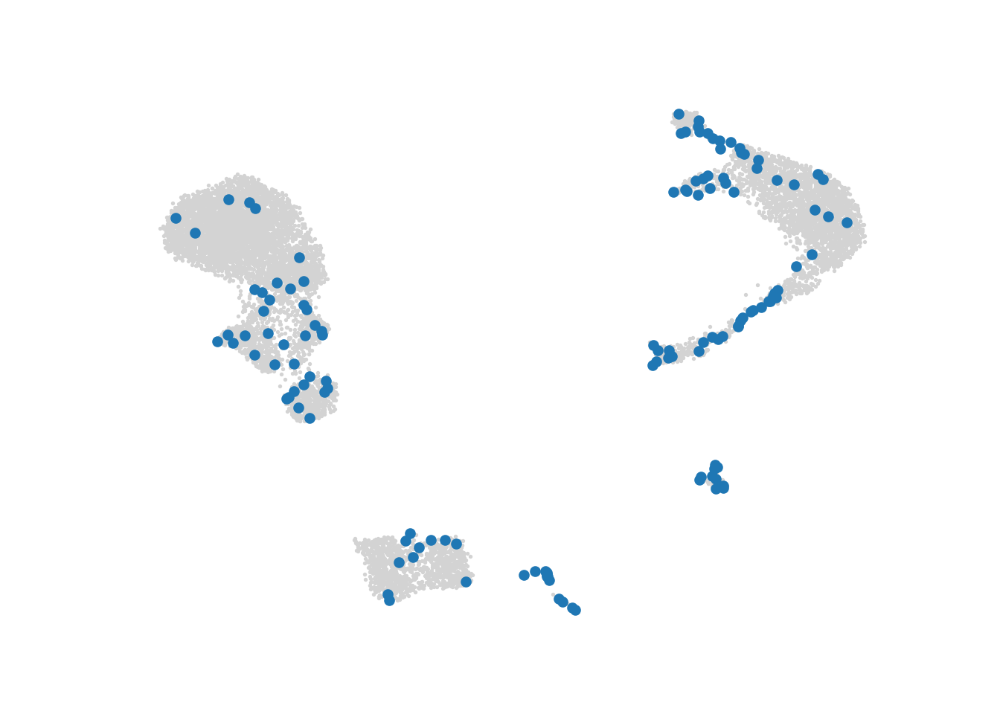

# Constructing metacells {#Metacell-construction-chapter}

In this chapter, we will demonstrate metacell construction using three different methods: SuperCell in R, MetaCell-2 (MC2) and SEACells in Pyhton. 

For this, we will first use a dataset of bone marrow cells from the SeuratData package. This dataset contains around 30K cells and is an example of a dataset with well defined cell types. 
For an example of more continuous data, see chapter \@ref(MC-continuous).


## SuperCell (R) {#SuperCell-construction}


[//]: # (Code to run mc construction with SuperCell for a discrete dataset)


In this section, we construct metacells using the R package [SuperCell](https://github.com/GfellerLab/SuperCell). 

### Method 

The SuperCell method first reduces the gene expression space using principal component analysis (PCA) and computes euclidean distances based on the reduced space. 
Using the euclidean distances, a single-cell kNN graph is built and metacells are identified by applying the walktrap community detection algorithm. 
The number of metacells obtained can be chosen by the user by defining the graining level parameter.

The code provided in this section is adapted from the [author's github documentation](https://github.com/GfellerLab/SuperCell/blob/master/README.Rmd).
For more information on the method, please refer to our review @Review and the original paper [@SuperCell].

#### Importing R packages {-}

To run SuperCell, the following R package needs to be imported:


```r
if(system.file(package='SuperCell') == ""){
  remotes::install_github("GfellerLab/SuperCell", force = TRUE, upgrade = "never")
} 
library(SuperCell)
library(Seurat)
#> The legacy packages maptools, rgdal, and rgeos, underpinning this package
#> will retire shortly. Please refer to R-spatial evolution reports on
#> https://r-spatial.org/r/2023/05/15/evolution4.html for details.
#> This package is now running under evolution status 0
#> Attaching SeuratObject
# If you have Seurat V5 installed, specify that you want to analyze Seurat V4 objects
if(packageVersion("Seurat") >= 5) {options(Seurat.object.assay.version = "v4"); print("you are using seurat v5 with assay option v4")}
```


### Data loading
We will run SuperCell on a single-cell dataset composed of around 30'000 bone marrow cells.
Please follow the section \@ref(bmcite-data) to retrieve these data from the SeuratData package and save the data in the following file: "data/bmcite/singlecell_seurat_filtered.rds".


```r
MC_tool = "SuperCell"
proj_name <- "bmcite"
annotation_label <- "celltype_simplified"
  
cell_types <- c("Prog_RBC", "Unconventional T", "Naive CD4 cell", "Non-Naive CD4 cell", 
                "CD14 Mono", "B cell", "Naive CD8 cell", "Non-Naive CD8 cell", 
                "NK", "GMP", "CD16 Mono", "pDC", "cDC2", "Prog_B 2", 
                "Prog_Mk", "Plasmablast", "HSC", "LMPP", "Prog_DC", "Prog_B 1")

celltype_colors <- c("#7E57C2", "#1E88E5", "#FFC107", "#004D40", "#9E9D24", 
                 "#F06292", "#546E7A", "#D4E157", "#76FF03", "#6D4C41", 
                 "#26A69A", "#AB47BC", "#EC407A", "#D81B60", "#42A5F5", 
                 "#2E7D32", "#FFA726", "#5E35B1", "#EF5350", "#3949AB")
names(celltype_colors) <- cell_types

sc_data = readRDS(paste0("data/", proj_name, "/singlecell_seurat_filtered.rds"))
```

### Filtering steps

In this tutorial, the data have been pre-filtered and SuperCell does not require further filtering steps.

### Building metacells

Metacells construction using SuperCell requires one main input, *i.e.* a matrix of log-normalized gene expression data which will be used to compute PCA to subsequently build a knn graph for metacells identification.
Important optional inputs are: 
(i) the graining level (`gamma` parameter), 
(ii) the number of neighbors to consider for the knn graph (`k.knn` parameter), 
(iii) the number of principal components to use to generate the knn graph (`n.pc` parameter), 
and (iv) the number of most variable genes to consider for PCA (`n.var.genes` parameter). 

#### Data pre-processing {-}

SuperCell builds its knn graph based on Euclidean distances defined in the PCA space. 
PCA computation is performed on the log-normalized gene expression data in the `SCimplify` SuperCell function. 
In the following code chunk, we use Seurat to normalize and visualize the data:


```r
sc_data <- NormalizeData(sc_data, normalization.method = "LogNormalize")
sc_data <- FindVariableFeatures(sc_data, nfeatures = 2000)
sc_data <- ScaleData(sc_data)
#> Centering and scaling data matrix
sc_data <- RunPCA(sc_data, npcs = 50, verbose = F)
sc_data <- RunUMAP(sc_data, reduction = "pca", dims = c(1:30), n.neighbors = 30, verbose = F)
#> Warning: The default method for RunUMAP has changed from calling Python UMAP via reticulate to the R-native UWOT using the cosine metric
#> To use Python UMAP via reticulate, set umap.method to 'umap-learn' and metric to 'correlation'
#> This message will be shown once per session
UMAPPlot(sc_data, group.by = annotation_label, cols = celltype_colors)
```


#### Setting up SuperCell parameters {-}

In this tutorial, we will run SuperCell using the 30 first principal components resulting from the PCA.
We chose a graining level of 25 and a number of neighbors of 15 for the knn step.


```r
gamma = 50 # the requested graining level.
k_knn = 30 # the number of neighbors considered to build the knn network.
nb_var_genes = 2000 # number of the top variable genes to use for dimensionality reduction 
nb_pc = 50 # the number of principal components to use.   
```

#### Metacells identification {-}

The metacells are identified using the `SCimplify` function from the SuperCell package.   

```r
MC <- SuperCell::SCimplify(Seurat::GetAssayData(sc_data, slot = "data"),  # single-cell log-normalized gene expression data
                           k.knn = k_knn,
                           gamma = gamma,
                           # n.var.genes = nb_var_genes,  
                           n.pc = nb_pc,
                           genes.use = Seurat::VariableFeatures(sc_data)
                           )
```

`SCimplify` returns a list containing the following main elements: 
(i) the single-cell assignments to metacells (`membership`),
(ii) the metacell sizes (`supercell_size`), 
(iii) the single-cell graph (`graph.singlecell`), 
(iv) the metacell graph (`graph.supercells`),
(v) the genes used for metacell identification (`genes.use`).

#### Retrieve aggregated metacell data {-}

The `supercell_GE()` function can be used to generate a metacell counts matrix (aggregation of gene expression across all cells belonging to each metacell). 
Two modes can be used for single-cell aggregation, *i.e.* averaging of log-normalized gene expression or summing up raw counts (using the `mode` parameter).
Note that we provide raw counts for the aggregation in this tutorial to match the aggregation steps using PC2 and SEAcells (see \@ref(MC2-construction) and \@ref(SEACells-construction)). 
Data normalization will thus be needed for downstream analyses on the metacell counts matrix.


```r
MC.GE <- supercell_GE(Seurat::GetAssayData(sc_data, slot = "counts"),
                      MC$membership,
                      mode =  "sum"
                      )
dim(MC.GE) 
#> [1] 17009   582
```

### Annotate metacells (using available annotations)


We can assign each metacell to a particular annotation using the `supercell_assign()` function. 
By default, this function assigns each metacell to a cluster with the largest Jaccard coefficient to avoid biases towards very rare or very abundant clusters. 
Alternatively, assignment can be performed using `relative` (`method = "relative"`, may cause biases towards very small populations) or `absolute` (`method = "absolute"`, may cause biases towards large populations) abundance. 


```r
print(annotation_label)
#> [1] "celltype_simplified"
MC$annotation <- supercell_assign(clusters = sc_data@meta.data[, annotation_label], # single-cell annotation
                                  supercell_membership = MC$membership, # single-cell assignment to metacells
                                  method = "absolute"
                                  )

head(MC$annotation)
#>                    1                    2                    3 
#>             "B cell"               "LMPP" "Non-Naive CD8 cell" 
#>                    4                    5                    6 
#> "Non-Naive CD4 cell" "Non-Naive CD4 cell"          "CD14 Mono"
```


The SuperCell package provides the `supercell_plot` function to visualize the metacell network (igraph object where number of nodes corresponds to number of metacells), 
which is stored in the `MC` list in `graph.supercells`.
The metacells can be colored with respect to a vector of annotation.


```r
supercell_plot(
  MC$graph.supercells, 
  group = MC$annotation, 
  seed = 1, 
  alpha = -pi/2,
  main  = "Metacells colored by cell line assignment"
)
```


### Save output 

For future downstream analyses in R (section \@ref(standard-analysis-R)), metacell counts can be saved in a Seurat object. 
Here we also save in the Seurat object the PCA components and genes used in SCimplify for future QC analysis (See \@ref(QCs)). 


```r
colnames(MC.GE) <- as.character(1:ncol(MC.GE))
MC.seurat <- CreateSeuratObject(counts = MC.GE, 
                                meta.data = data.frame(size = as.vector(table(MC$membership)))
                                )
MC.seurat[[annotation_label]] <- MC$annotation

# save single-cell membership to metacells in the MC.seurat object
MC.seurat@misc$cell_membership <- data.frame(row.names = names(MC$membership), membership = MC$membership)
MC.seurat@misc$var_features <- MC$genes.use 

# Save the PCA components and genes used in SCimplify  
PCA.res <- irlba::irlba(scale(Matrix::t(sc_data@assays$RNA@data[MC$genes.use, ])), nv = nb_pc)
pca.x <- PCA.res$u %*% diag(PCA.res$d)
rownames(pca.x) <- colnames(sc_data@assays$RNA@data)
MC.seurat@misc$sc.pca <- CreateDimReducObject(
  embeddings = pca.x,
  loadings = PCA.res$v,
  key = "PC_",
  assay = "RNA"
)
if(packageVersion("Seurat") >= 5) {
  MC.seurat[["RNA"]] <- as(object = MC.seurat[["RNA"]], Class = "Assay")
}
print(paste0("Saving metacell object for the ", proj_name, " dataset using ", MC_tool))
#> [1] "Saving metacell object for the bmcite dataset using SuperCell"
saveRDS(MC.seurat, file = paste0('./data/', proj_name, '/metacell_', MC_tool,'.rds'))
```

We can also use the `supercell_2_Seurat()` function from the SuperCell package. 
This function takes as inputs the metacell count matrix (output of the SuperCell `supercell_GE()` function) and the output of the SuperCell `SCimplify()` function
to output a Seurat object containing normalized metacells gene expression data as well as the first (`N.comp`) principal components of PCA performed internally using user defined set of genes (by default the genes used for metacells constructions).


```r
MC.seurat <- supercell_2_Seurat(
  SC.GE = MC.GE,
  SC = MC,
  fields = c("annotation", "supercell_size"), # elements of MC to save as metacell metadata 
  var.genes = MC$genes.use,
  N.comp = 10
)
if(packageVersion("Seurat") >= 5) {
  MC.seurat[["RNA"]] <- as(object = MC.seurat[["RNA"]], Class = "Assay")
}
saveRDS(MC.seurat, file = paste0('./data/', proj_name, '/metacell_', MC_tool,'.rds'))
```

For future downstream analyses in python (section \@ref(standard-analysis-Py)), metacell counts can be saved in an Anndata object: 

```r
MC.seurat.ad <- anndata::AnnData(
  X = Matrix::t(Seurat::GetAssayData(MC.seurat, slot = "counts")),
  obs = MC.seurat@meta.data
)

anndata::write_h5ad(anndata = MC.seurat.ad, filename = paste0('./data/', proj_name, '/metacell_', MC_tool,'.h5ad'))
```


```
#>             used   (Mb) gc trigger   (Mb)  max used   (Mb)
#> Ncells   3494394  186.7   11652825  622.4  14566031  778.0
#> Vcells 156633708 1195.1  478116159 3647.8 478105101 3647.7
```


## MC2 (Python) {#MC2-construction}


[//]: # (Chunk to run MC-2 metacell construction for a discrete -pbmcs- dataset)


In this section, we construct metacells using [Metacell-2 (MC2)](https://github.com/tanaylab/metacells) implemented in Python. 

### Method 
Metacell-2 (MC2) is a python tool to construct metacells and is the updated version of the MetaCell algorithm, which introduced the concept of metacell.
MC2 applies a two-phase divide-and-conquer approach. Cells are randomly divided into piles of ~10k cells and 
initial metacells are built applying a MetaCell-like approach per pile, i.e. based on a single-cell kNN graph built 
from log-normalized counts using a set of highly variable genes. 
Then, transcriptionally similar metacells are grouped into metagroup piles for the identification of final metacells and outliers identification.
Note that prior to metacell identification, the MC2 framework recommends gene filtering steps. The choice of the genes used
by the method is of high importance to assure good quality of the metacells.

The code provided in this section is adapted from the [author's tutorial](https://tanaylab.github.io/metacells-vignettes/one-pass.html). 
For more information on the method, please refer to our review @Review and the original paper [@MC2]. 

#### Importing python packages {-}

To run MC2, the following python packages need to be imported: 


```python
import os
import numpy as np
import pandas as pd
import anndata as ad
import scanpy as sc
import matplotlib.pyplot as plt
import seaborn as sns
import metacells as mc
```


If you don't have these packages installed, please refer to the section \@ref(installations).


### Data loading 
We will run Metacell-2 (MC2) on a single-cell dataset composed of around 30'000 bone marrow cells. 
Please follow the section \@ref(bmcite-data) to retrieve these data from the SeuratData package and save the data in the following file: "data/bmcite/singlecell_anndata_filtered.h5ad".


```python
MC_tool = "MC2"
proj_name = "bmcite"
annotation_label = 'celltype_simplified'
ad = sc.read(os.path.join("data", proj_name, "singlecell_anndata_filtered.h5ad"))
ad.var.index = ad.var.genes
```

We initialize the name of the anndata (in the unstructured annotations) object using the `mc.ut.set_name()` function from the MC2 package.


```python
mc.ut.set_name(ad, proj_name)
```

### Filtering steps 
MC2 requires that standard filtering steps such as doublet filtering are performed outside of the MC2 framework. 
In addition to standard data filtering steps, the MC2 package proposes functions to filter the single-cell data at the gene and at the cell level (See [author's vignette](https://tanaylab.github.io/metacells-vignettes/one-pass.html)). 
At the gene level, the filtering steps consist in excluding genes based on biological knowledge (*e.g.* mitochrondrial genes) as well as based on their expression levels. 
The latter genes include genes with zero expression or low expression levels and "bursty lonely genes" (*i.e.*, genes with high expression levels but no correlation with any other gene). 
At the cell level, filtering is performed based on cells UMI counts.

#### Gene filtering {-}

In the following code chunk, we exclude genes using the `mc.pl.exclude_genes()`function from the MC2 package. 
Based on the authors vignette, we consider a minimal list of genes to exclude, *i.e.*, sex-specific and non-coding genes as well as the mitochondrial genes. 
To complete this list of genes, an iterative approach can be used following the guidelines of the MC2 authors in a [second vignette](https://tanaylab.github.io/metacells-vignettes/iterative.html).
The `mc.pl.exclude_genes()` function will filter out: 
i) the known-to-be-excluded genes defined by the user as gene names or gene names patterns (`EXCLUDED_GENE_NAMES` and `EXCLUDED_GENE_PATTERNS` parameters respectively), 
and ii) the "bursty lonely genes". 


```python
EXCLUDED_GENE_NAMES = ["XIST", "MALAT1", "NEAT1"] 
EXCLUDED_GENE_PATTERNS = ['MT-.*']

mc.pl.exclude_genes(
    ad,
    excluded_gene_names=EXCLUDED_GENE_NAMES,
    excluded_gene_patterns=EXCLUDED_GENE_PATTERNS,
    random_seed=123456
)
#> set bmcite.var[bursty_lonely_gene]: 0 true (0%) out of 17009 bools
#> set bmcite.var[properly_sampled_gene]: 16993 true (99.91%) out of 17009 bools
#> set bmcite.var[excluded_gene]: 32 true (0.1881%) out of 17009 bools
```

#### Cell filtering based on UMIs counts {-}

In the MC2 framework, cells with very low and very high UMI content will be filtered out (`PROPERLY_SAMPLED_MIN_CELL_TOTAL`, `PROPERLY_SAMPLED_MAX_CELL_TOTAL` variables defining thresholds in the next code chunk).  
Also, cell filtering based on UMI counts in excluded genes is also performed(`PROPERLY_SAMPLED_MAX_EXCLUDED_GENES_FRACTION` variable). 
Since our dataset has been pre-filtered, very lenient cutoffs will be used in this tutorial. 
The following code chunk defines these parameters. 
To adapt them to your datasets, we advise you to explore the distributions of total UMI counts and UMI counts in excluded genes, as recommended and described in the MC2 [original vignette](https://tanaylab.github.io/metacells-vignettes/one-pass.html).


```python
PROPERLY_SAMPLED_MIN_CELL_TOTAL = 200 
PROPERLY_SAMPLED_MAX_CELL_TOTAL = 10000 
PROPERLY_SAMPLED_MAX_EXCLUDED_GENES_FRACTION = 0.25
```

The number of UMIs in excluded genes is computed using the `mc.tl.compute_excluded_gene_umis()` function and cells are filtered out using the `mc.pl.exclude_cells()` function.
Additional cells can be filtered out by adding a cell description columns in the `obs` data frame in the anndata oject. This annotation should be a boolean indicating whether the cell should filtered out or not. 
The name of this column should be provided to the `mc.pl.exclude_cells()` function via the `additional_cells_masks` parameter. 


```python
mc.tl.compute_excluded_gene_umis(ad)

mc.pl.exclude_cells(
    ad,
    properly_sampled_min_cell_total=PROPERLY_SAMPLED_MIN_CELL_TOTAL,
    properly_sampled_max_cell_total=PROPERLY_SAMPLED_MAX_CELL_TOTAL,
    properly_sampled_max_excluded_genes_fraction=PROPERLY_SAMPLED_MAX_EXCLUDED_GENES_FRACTION # ,
    # additional_cells_masks=["|doublet_cell"]
)
#> set bmcite.obs[properly_sampled_cell]: 28694 true (98.62%) out of 29096 bools
#> set bmcite.obs[excluded_cell]: 402 true (1.382%) out of 29096 bools
```

After performing the two-step filtering (genes and cells), the "cleaned" data can be extracted using the `mc.pl.extract_clean_data()` function.


```python
# Extract clean dataset (with filtered cells and genes)
ad = mc.pl.extract_clean_data(ad)
#> set bmcite.clean.obs[full_cell_index]: 28694 int32s
#> set bmcite.clean.var[full_gene_index]: 16977 int32s
```


### Building metacells

#### Defining lateral genes {-}

To build metacells, we need to define lateral genes, which are genes with strong biological signal which is independent of cell-state, *e.g.* cell-cycle genes. 
These genes will be ignored for computing cells similarity and building metacells 
but will be considered to define outlier cells (*i.e.*, expression levels of lateral genes should be consistent within metacells).
In the following chunk, we consider a minimal list of lateral genes (provided by the MC2 authors) including cell-cycle and ribosomal genes and 
mark them in the MC2 object using the `mc.pl.mark_lateral_genes()` function.


```python

LATERAL_GENE_NAMES = [
    "ACSM3", "ANP32B", "APOE", "AURKA", "B2M", "BIRC5", "BTG2", "CALM1", "CD63", "CD69", "CDK4",
    "CENPF", "CENPU", "CENPW", "CH17-373J23.1", "CKS1B", "CKS2", "COX4I1", "CXCR4", "DNAJB1",
    "DONSON", "DUSP1", "DUT", "EEF1A1", "EEF1B2", "EIF3E", "EMP3", "FKBP4", "FOS", "FOSB", "FTH1",
    "G0S2", "GGH", "GLTSCR2", "GMNN", "GNB2L1", "GPR183", "H2AFZ", "H3F3B", "HBM", "HIST1H1C",
    "HIST1H2AC", "HIST1H2BG", "HIST1H4C", "HLA-A", "HLA-B", "HLA-C", "HLA-DMA", "HLA-DMB",
    "HLA-DPA1", "HLA-DPB1", "HLA-DQA1", "HLA-DQB1", "HLA-DRA", "HLA-DRB1", "HLA-E", "HLA-F", "HMGA1",
    "HMGB1", "HMGB2", "HMGB3", "HMGN2", "HNRNPAB", "HSP90AA1", "HSP90AB1", "HSPA1A", "HSPA1B",
    "HSPA6", "HSPD1", "HSPE1", "HSPH1", "ID2", "IER2", "IGHA1", "IGHA2", "IGHD", "IGHG1", "IGHG2",
    "IGHG3", "IGHG4", "IGHM", "IGKC", "IGKV1-12", "IGKV1-39", "IGKV1-5", "IGKV3-15", "IGKV4-1",
    "IGLC2", "IGLC3", "IGLC6", "IGLC7", "IGLL1", "IGLL5", "IGLV2-34", "JUN", "JUNB", "KIAA0101",
    "LEPROTL1", "LGALS1", "LINC01206", "LTB", "MCM3", "MCM4", "MCM7", "MKI67", "MT2A", "MYL12A",
    "MYL6", "NASP", "NFKBIA", "NUSAP1", "PA2G4", "PCNA", "PDLIM1", "PLK3", "PPP1R15A", "PTMA",
    "PTTG1", "RAN", "RANBP1", "RGCC", "RGS1", "RGS2", "RGS3", "RP11-1143G9.4", "RP11-160E2.6",
    "RP11-53B5.1", "RP11-620J15.3", "RP5-1025A1.3", "RP5-1171I10.5", "RPS10", "RPS10-NUDT3", "RPS11",
    "RPS12", "RPS13", "RPS14", "RPS15", "RPS15A", "RPS16", "RPS17", "RPS18", "RPS19", "RPS19BP1",
    "RPS2", "RPS20", "RPS21", "RPS23", "RPS24", "RPS25", "RPS26", "RPS27", "RPS27A", "RPS27L",
    "RPS28", "RPS29", "RPS3", "RPS3A", "RPS4X", "RPS4Y1", "RPS4Y2", "RPS5", "RPS6", "RPS6KA1",
    "RPS6KA2", "RPS6KA2-AS1", "RPS6KA3", "RPS6KA4", "RPS6KA5", "RPS6KA6", "RPS6KB1", "RPS6KB2",
    "RPS6KC1", "RPS6KL1", "RPS7", "RPS8", "RPS9", "RPSA", "RRM2", "SMC4", "SRGN", "SRSF7", "STMN1",
    "TK1", "TMSB4X", "TOP2A", "TPX2", "TSC22D3", "TUBA1A", "TUBA1B", "TUBB", "TUBB4B", "TXN", "TYMS",
    "UBA52", "UBC", "UBE2C", "UHRF1", "YBX1", "YPEL5", "ZFP36", "ZWINT"
]
LATERAL_GENE_PATTERNS = ["RP[LS].*"]  # Ribosomal

# This will mark as "lateral_gene" any genes that match the above, if they exist in the clean dataset.
mc.pl.mark_lateral_genes(
    ad,
    lateral_gene_names=LATERAL_GENE_NAMES,
    lateral_gene_patterns=LATERAL_GENE_PATTERNS,
)
#> set bmcite.clean.var[lateral_gene]: 245 true (1.443%) out of 16977 bools
```

Some genes have higher variances than expected which could lead to false positive outlier identification.
Users can mark those genes as *noisy genes* using the `mc.pl.mark_noisy_genes()` function. 

```python

NOISY_GENE_NAMES = [
    "CCL3", "CCL4", "CCL5", "CXCL8", "DUSP1", "FOS", "G0S2", "HBB", "HIST1H4C", "IER2", "IGKC",
    "IGLC2", "JUN", "JUNB", "KLRB1", "MT2A", "RPS26", "RPS4Y1", "TRBC1", "TUBA1B", "TUBB"
]
# This will mark as "noisy_gene" any genes that match the above, if they exist in the clean dataset.
mc.pl.mark_noisy_genes(ad, noisy_gene_names=NOISY_GENE_NAMES)
#> set bmcite.clean.var[noisy_gene]: 20 true (0.1178%) out of 16977 bools
```

To extend this list of lateral genes, users can use the `relate_to_lateral_genes` function to identify genes that are highly correlated with the predefined lateral genes.
The use of this function is described in [the vignette from the MC2 authors](https://tanaylab.github.io/metacells-vignettes/iterative.html).

#### Define target_metacell_size (graining level) {-}

By default, MC2 will build metacells with a size of 96 cells per metacells. 
Users can vary the `target_metacell_size` parameter to reach a desired graining level. 


```python
gamma = 75
target_metacell_size = gamma
```

#### Metacells identification using the divide and conquer approach {-}

The construction of metacells by MC2 is performed using the `mc.pl.divide_and_conquer_pipeline()` function.
Note that by default all cores of the system will be used for the metacells construction. 
To change this behavior and adapt the number of cores the MC2 authors propose to use the `mc.pl.guess_max_parallel_piles()` and `mc.pl.set_max_parallel_piles()` functions 
to adapt the number of processed in parallel depending on the available memory.

The `mc.pl.divide_and_conquer_pipeline()` function associates each cell to a metacell or defines the cell as outlier. 
These assignments are found in the `obs` layer of the anndata object.


```python
max_parallel_piles = mc.pl.guess_max_parallel_piles(ad)
mc.pl.set_max_parallel_piles(max_parallel_piles)
mc.pl.divide_and_conquer_pipeline(
    ad,
    target_metacell_size = target_metacell_size,
    random_seed = 123456)
#> set bmcite.clean.var[selected_gene]: * -> False
#> set bmcite.clean.var[rare_gene]: 0 true (0%) out of 16977 bools
#> set bmcite.clean.var[rare_gene_module]: 16977 int32 elements with all outliers (100%)
#> set bmcite.clean.obs[cells_rare_gene_module]: 28694 int32 elements with all outliers (100%)
#> set bmcite.clean.obs[rare_cell]: 0 true (0%) out of 28694 bools
#> set bmcite.clean.var[selected_gene]: 1666 true (9.813%) out of 16977 bools
#> set bmcite.clean.obs[metacell]: 28694 int32s
#> set bmcite.clean.obs[dissolved]: 0 true (0%) out of 28694 bools
#> set bmcite.clean.obs[metacell_level]: 28694 int32s

ad.obs.metacell.head
#> <bound method NDFrame.head of a_AAACCTGAGGTGGGTT-1     73
#> a_AAACCTGAGTACATGA-1    365
#> a_AAACCTGCAAACCTAC-1     88
#> a_AAACCTGCAAGGTGTG-1    287
#> a_AAACCTGCACGGTAGA-1    244
#>                        ... 
#> b_TTTGTCATCCGAGCCA-1     65
#> b_TTTGTCATCCGTAGGC-1    187
#> b_TTTGTCATCCTCGCAT-1    327
#> b_TTTGTCATCGCCGTGA-1    107
#> b_TTTGTCATCGTTTGCC-1    263
#> Name: metacell, Length: 28694, dtype: int32>
```


The following code chunk adds a columns (named `membership`) containing the single_cell assignments to the obs attribute in the single-cell anndata object. 
The membership information is required to compute metacells quality metrics as shown in chapter \@ref(QCs). 


```python
# make a membership -- index of metacells to which single cells belong to 
ad.obs['membership'] = [int(i)+1 if i >= 0 else np.nan for i in ad.obs.metacell] 
```

#### Retrieve aggregated metacell data {-}

The function `mc.pl.collect_metacells()` should be used to subsequently retrieve an anndata object containing the data at the metacells level instead of the single-cell level. 
This function will store in the `X` data matrix of the anndata object a matrix of gene fraction (*i.e.*, the sum of all gene levels in a metacell sums to 1)
and it will store the total UMIs per gene per metacell in the layer `total_umis`. 


```python

mc_ad = mc.pl.collect_metacells(ad, name='metacells', random_seed = 123456)
#> set metacells.obs[grouped]: 388 int64s
#> set metacells.obs[total_umis]: 388 float64s
#> set metacells.layers[total_umis]: ndarray 388 X 16977 float32s
#> set metacells.obs[__zeros_downsample_umis]: 388 int64s
#> set metacells.layers[zeros]: ndarray 388 X 16977 int32s
#> set bmcite.clean.obs[metacell_name]: 28694 <U8s
#> set metacells.var[genes]: 16977 objects
#> set metacells.var[bursty_lonely_gene]: 0 true (0%) out of 16977 bools
#> set metacells.var[properly_sampled_gene]: 16977 true (100%) out of 16977 bools
#> set metacells.var[excluded_gene]: 0 true (0%) out of 16977 bools
#> set metacells.var[full_gene_index]: 16977 int32s
#> set metacells.var[lateral_gene]: 245 true (1.443%) out of 16977 bools
#> set metacells.var[noisy_gene]: 20 true (0.1178%) out of 16977 bools
#> set metacells.var[selected_gene]: 1666 true (9.813%) out of 16977 bools
#> set metacells.var[rare_gene]: 0 true (0%) out of 16977 bools
#> set metacells.var[rare_gene_module]: 16977 int32s
#> set metacells.obs[metacells_rare_gene_module]: 388 int32s
#> set metacells.obs[rare_metacell]: 0 true (0%) out of 388 bools
#> set metacells.uns[outliers]: 2
#> set metacells.uns[metacells_algorithm]: metacells.0.9.0
mc_ad.shape
#> (388, 16977)
mc_ad.X.sum(axis=1)[:5] 
#> matrix([[0.99999994],
#>         [1.        ],
#>         [1.0000001 ],
#>         [1.        ],
#>         [1.        ]], dtype=float32)
mc_ad.layers['total_umis']
#> array([[3., 1., 0., ..., 0., 0., 0.],
#>        [6., 0., 0., ..., 0., 0., 0.],
#>        [7., 3., 0., ..., 0., 0., 0.],
#>        ...,
#>        [3., 0., 0., ..., 0., 0., 0.],
#>        [4., 2., 0., ..., 0., 0., 0.],
#>        [0., 1., 0., ..., 0., 0., 0.]], dtype=float32)
```

### Annotate metacells (using available annotations)

If single-cell annotations are available in the original single-cell anndata object. We can transfer these annotations to the metacell anndata object
using the `mc.tl.convey_obs_to_group()` function which will associate each metacell to the most frequent annotation (categorical) or 
averaged annotation (continuous) across the single-cells composing the metacell 
(use of the `mc.ut.most_frequent` and `np.mean` respectively in the `mode` paratemer). 
 

```python
# Assign a single value for each metacell based on the cells.
mc.tl.convey_obs_to_group(
    adata=ad, gdata=mc_ad,
    property_name=annotation_label, to_property_name=annotation_label,
    method=mc.ut.most_frequent  # This is the default, for categorical data
)
#> set metacells.obs[celltype_simplified]: 388 <U18s

# Compute the fraction of cells with each possible value in each metacell:
mc.tl.convey_obs_fractions_to_group(  
    adata=ad, gdata=mc_ad,
    property_name=annotation_label, to_property_name=annotation_label
)
#> set metacells.obs[celltype_simplified_fraction_of_B cell]: 388 float64s
#> set metacells.obs[celltype_simplified_fraction_of_CD14 Mono]: 388 float64s
#> set metacells.obs[celltype_simplified_fraction_of_CD16 Mono]: 388 float64s
#> set metacells.obs[celltype_simplified_fraction_of_GMP]: 388 float64s
#> set metacells.obs[celltype_simplified_fraction_of_HSC]: 388 float64s
#> set metacells.obs[celltype_simplified_fraction_of_LMPP]: 388 float64s
#> set metacells.obs[celltype_simplified_fraction_of_NK]: 388 float64s
#> set metacells.obs[celltype_simplified_fraction_of_Naive CD4 cell]: 388 float64s
#> set metacells.obs[celltype_simplified_fraction_of_Naive CD8 cell]: 388 float64s
#> set metacells.obs[celltype_simplified_fraction_of_Non-Naive CD4 cell]: 388 float64s
#> set metacells.obs[celltype_simplified_fraction_of_Non-Naive CD8 cell]: 388 float64s
#> set metacells.obs[celltype_simplified_fraction_of_Plasmablast]: 388 float64s
#> set metacells.obs[celltype_simplified_fraction_of_Unconventional T]: 388 float64s
#> set metacells.obs[celltype_simplified_fraction_of_cDC2]: 388 float64s
#> set metacells.obs[celltype_simplified_fraction_of_pDC]: 388 float64s
```
 
### Save output 

For future downstream analyses in python (section \@ref(standard-analysis-Py)), we save the metacell counts in an Anndata object: 


```python
## Save single-cell metadata (i.e., `raw.obs` dataframe) in the metacell adata object
mc_ad.uns = ad.uns.copy()
mc_ad.uns['sc.obs'] = ad.obs.copy()

# save the requested gamma
mc_ad.uns['gamma'] = gamma

# save metacell size
mc_ad.obs.rename(columns={'grouped':'size'}, inplace = True)

print("Saving metacell object for the "+ proj_name+ " dataset using "+ MC_tool)
#> Saving metacell object for the bmcite dataset using MC2
mc_ad.write_h5ad(os.path.join('./data', proj_name, f'metacell_{MC_tool}.h5ad'))
```

For future QCs and downstream analyses in R (section \@ref(standard-analysis-R)), we save the metacell counts in a Seurat object: 

```r
library(Seurat)
# If you have Seurat V5 installed, specify that you want to analyze Seurat V4 objects
if(packageVersion("Seurat") >= 5) {options(Seurat.object.assay.version = "v4"); print("you are using seurat v5 with assay option v4")}
library(anndata)
library(reticulate)

adata_mc <- read_h5ad(paste0("data/", py$proj_name, "/metacell_MC2.h5ad"))

# Save counts and metadata in a Seurat object
countMatrix <-  Matrix::t(adata_mc$X)
colnames(countMatrix) <- adata_mc$obs_names
rownames(countMatrix) <- adata_mc$var_names
MC.seurat <- CreateSeuratObject(counts = as(countMatrix, 'CsparseMatrix'), meta.data = as.data.frame(adata_mc$obs))
#> Warning: Invalid name supplied, making object name syntactically valid. New
#> object name is
#> sizetotal_umisX__zeros_downsample_umismetacells_rare_gene_modulerare_metacellcelltype_simplifiedcelltype_simplified_fraction_of_B.cellcelltype_simplified_fraction_of_CD14.Monocelltype_simplified_fraction_of_CD16.Monocelltype_simplified_fraction_of_GMPcelltype_simplified_fraction_of_HSCcelltype_simplified_fraction_of_LMPPcelltype_simplified_fraction_of_NKcelltype_simplified_fraction_of_Naive.CD4.cellcelltype_simplified_fraction_of_Naive.CD8.cellcelltype_simplified_fraction_of_Non.Naive.CD4.cellcelltype_simplified_fraction_of_Non.Naive.CD8.cellcelltype_simplified_fraction_of_Plasmablastcelltype_simplified_fraction_of_Unconventional.Tcelltype_simplified_fraction_of_cDC2celltype_simplified_fraction_of_pDC;
#> see ?make.names for more details on syntax validity
MC.seurat@misc[["var_features"]] <- rownames(adata_mc$var)[which(adata_mc$var$selected_gene == T)] 

# Save membership in misc
MC.seurat@misc$cell_membership <- py$ad$obs['membership']
if(packageVersion("Seurat") >= 5) {
  MC.seurat[["RNA"]] <- as(object = MC.seurat[["RNA"]], Class = "Assay")
}
saveRDS(MC.seurat, file = paste0('./data/', py$proj_name, '/metacell_MC2.rds'))
```


## SEACells (Python) {#SEACells-construction}


[//]: # (Code to run mc construction with SEACells for a discrete dataset)


In this section, we construct metacells using [SEACells](https://github.com/dpeerlab/SEACells). 

### Method 
The SEAcells method builds a single-cell kNN graph from the Euclidean distance in the principal component space (SVD for scATAC-seq) space. 
Distances in the graph are transformed to affinity by applying an adaptive Gaussian kernel. 
The affinity matrix is then decomposed into archetypes (linear combination of cells) and membership matrices (cells as a linear combination of archetypes).
Single cells are assigned to a given metacell based on the maximum membership value of the corresponding archetype.


The code provided in this section is adapted from the [author's jupyter notebook](https://github.com/dpeerlab/SEACells/blob/main/notebooks/SEACell_computation.ipynb). 
For more information on the method, please refer to our review @Review and the original paper [@SEACells]. 

#### Importing python packages {-}

To run the SEACells, the following python packages need to be imported: 


```python
import os
import pandas as pd
import scanpy as sc
import SEACells
import random
```


If you don't have these packages installed, please refer to the section \@ref(installations).


### Data loading 
Similarly to SuperCell and MC2, we will run SEACells on the single-cell dataset composed of around 30'000 bone marrow cells. 
Please follow the section \@ref(bmcite-data) to retrieve these data from the SeuratData package and save the data in the following file: "data/bmcite/singlecell_anndata_filtered.h5ad".


```python
MC_tool = "SEACells"
proj_name = "bmcite"
annotation_label = 'celltype_simplified'

ad = sc.read(os.path.join("data", proj_name, "singlecell_anndata_filtered.h5ad"))
ad.var.index = ad.var.genes
ad = sc.pp.subsample(ad, n_obs=10000, copy=True)
```

Note that since SEACells can take a substential amount of time to run we downsampled the data to 10'000 cells,
you can comment the last line of the previous code chunk to run SEACells on all the cells.

### Filtering steps 
In this tutorial, the data have been pre-filterd and SEACells does not perform additionnal filtering.

### Building metacells

Metacells construction using SEACells requires 2 main inputs: i) an anndata object (`build_kernel_on` parameter), and
ii) a key indicating which matrix in the `obsm` attribute of the anndata object should be considered to compute the kernel needed for archetypal analysis (`build_kernel_on` parameter).
Important optional inputs are: the number of metacells to identify (`n_SEACells` parameter), which is used as input of the archetypal analysis, 
ii) the number of neighbors to consider for the knn graph (`n_neighbors` parameter).

#### Data pre-processing {-}

The following code chunk saves the raw counts of the filtered data in the raw attribute of the anndata object.
The raw counts will be used later for metacells aggregation.


```python
raw_ad = sc.AnnData(ad.X)
raw_ad.obs_names, raw_ad.var_names = ad.obs_names, ad.var_names
ad.raw = raw_ad
```

To build the kernel for archetypal analysis, SEACells requires a lower-dimensionnal embedding of the data (for example using PCA for scRNA-Seq data or SVD for scATAC-Seq data). 
In the next code chunk, we follow standard pre-processing steps prior to PCA computation, *i.e.*, data normalization, log transformation, identification of highly variable genes.
PCA components are saved in the `obsm` attribute of the anndata object.


```python
# Normalize cells, log transform and compute highly variable genes
sc.pp.normalize_per_cell(ad, 10000)
sc.pp.log1p(ad)
sc.pp.highly_variable_genes(ad, n_top_genes=2000)

# Compute principal components  
n_comp    = 30
sc.tl.pca(ad, n_comps=n_comp, use_highly_variable=True)

# Run UMAP for visualization
sc.pp.neighbors(ad)
sc.tl.umap(ad)
```

#### Setting up SEACells parameters {-}

In this tutorial, we will use in the SEACells model the 30 first principal components resulting from the PCA to build the knn graph which will be used to compute the kernel. 
The number of neighbors to considered for the knn graph can be fixed using the `n_neighbors` parameter (here 15).  
As mentioned previously, users should provide as input the number of metacells required (`n_SEACells` parameter). This number can be defined as the ratio between the number of single cells and the desired graining level (`gamma` parameter in the following code chunk). 
In this example, we choose a graining level of 25.  


```python
build_kernel_on = 'X_pca' # key in ad.obsm to use for computing metacells
n_waypoint_eigs = 10      # Number of eigenvalues to consider when initializing metacells
n_neighbors = 15 # Number of neighbors used for graph construction 
gamma = 75   # the requested graining level
n_SEACells = int(ad.shape[0]/gamma) # the requested number of metacells  
```

#### Initializing the SEACells model {-}

The SEACells model is initialized with the previously defined parameters using the `SEACells.core.SEACells` function.


```python
model = SEACells.core.SEACells(ad,
                  build_kernel_on = build_kernel_on,
                  n_SEACells = n_SEACells,
                  n_waypoint_eigs = n_waypoint_eigs,
                  n_neighbors = n_neighbors,
                  convergence_epsilon = 1e-3,
                  verbose = True)
```

Kernel computation is performed using the `mconstruct_kernel_matrix` function.


```python
model.construct_kernel_matrix()
M = model.kernel_matrix
```

Metacells are initialized using the `initialize_archetypes` function.  
The SEACells archetypes initialization is based on cells sampling and thus is stochastic. User can fix a seed for reproducible results.
To check that the archetypes are evenly spread, users can visualize them using the `plot.plot_initialization` function.   


```python
# set seed for reproducibility
# random.seed(123)

# Initialize archetypes
model.initialize_archetypes()
# Visualize the initialization 
SEACells.plot.plot_initialization(ad, model, plot_basis='X_umap') 
```



#### Fitting the SEACells model to identify metacells {-}

The identification of the archetypes is an iterative process. In this example, we fixed the minimum and maximum number of iteration to 10 and 50 respectively. 
We then check the model convergence using the `plot_convergence` function.  


```python
model.fit(min_iter = 10, max_iter = 100)
model.plot_convergence()
```


Once the final archetypes have been identified, we can assign each single-cell to one metacell (hard assignments). 
These assignments (`membership`) can be retrieved using the `get_hard_assignments` function or extracted from the anndata object using `ad.obs["SEACell"]`. 
In this tutorial, we will only consider hard assignments. However, the SEACells package also provides the option to retrieve soft assignments (multiple weighted assignments for each cell) using the `get_soft_assignments` function. 
For more details on the soft assignments, please refer to the [SEACell paper](https://www.nature.com/articles/s41587-023-01716-9#Sec11) and the original [author's jupyter notebook](https://github.com/dpeerlab/SEACells/blob/main/notebooks/SEACell_computation.ipynb).


```python
membership = model.get_hard_assignments()
membership.head
#> <bound method NDFrame.head of                           SEACell
#> index                            
#> a_GTCACAATCATCATTC-1   SEACell-66
#> b_CTCACACCAGCCTTGG-1  SEACell-100
#> a_CTTAGGATCTTAGCCC-1   SEACell-20
#> a_TTAGTTCAGGTACTCT-1   SEACell-61
#> b_TAGACCAAGGGATGGG-1   SEACell-90
#> ...                           ...
#> b_AGTCTTTCATTTGCTT-1   SEACell-43
#> a_CGATGGCAGTACGCCC-1   SEACell-37
#> a_CTGAAGTCAATCCGAT-1   SEACell-86
#> a_CAGTAACAGGGTTCCC-1   SEACell-42
#> b_GGAATAATCTTGTTTG-1   SEACell-54
#> 
#> [10000 rows x 1 columns]>
ad.obs["SEACell"].head
#> <bound method NDFrame.head of index
#> a_GTCACAATCATCATTC-1     SEACell-66
#> b_CTCACACCAGCCTTGG-1    SEACell-100
#> a_CTTAGGATCTTAGCCC-1     SEACell-20
#> a_TTAGTTCAGGTACTCT-1     SEACell-61
#> b_TAGACCAAGGGATGGG-1     SEACell-90
#>                            ...     
#> b_AGTCTTTCATTTGCTT-1     SEACell-43
#> a_CGATGGCAGTACGCCC-1     SEACell-37
#> a_CTGAAGTCAATCCGAT-1     SEACell-86
#> a_CAGTAACAGGGTTCCC-1     SEACell-42
#> b_GGAATAATCTTGTTTG-1     SEACell-54
#> Name: SEACell, Length: 10000, dtype: object>
```

#### Retrieve aggregated metacell data {-}

The `core.summarize_by_SEACell` function can be used to generate a metacell count matrix (aggregation of counts across all cells belonging to each metacell).  

```python
mc_ad = SEACells.core.summarize_by_SEACell(ad, SEACells_label='SEACell', summarize_layer='raw', celltype_label=annotation_label)
#> 
  0%|          | 0/133 [00:00<?, ?it/s]
  4%|3         | 5/133 [00:00<00:02, 46.51it/s]
  8%|7         | 10/133 [00:00<00:02, 45.13it/s]
 11%|#1        | 15/133 [00:00<00:02, 44.69it/s]
 15%|#5        | 20/133 [00:00<00:02, 43.51it/s]
 19%|#8        | 25/133 [00:00<00:02, 43.61it/s]
 23%|##2       | 30/133 [00:00<00:02, 43.73it/s]
 26%|##6       | 35/133 [00:00<00:02, 43.83it/s]
 30%|###       | 40/133 [00:00<00:02, 44.02it/s]
 34%|###3      | 45/133 [00:01<00:01, 44.35it/s]
 38%|###7      | 50/133 [00:01<00:01, 44.95it/s]
 41%|####1     | 55/133 [00:01<00:01, 45.30it/s]
 45%|####5     | 60/133 [00:01<00:01, 45.18it/s]
 49%|####8     | 65/133 [00:01<00:01, 43.15it/s]
 53%|#####2    | 70/133 [00:01<00:01, 44.03it/s]
 56%|#####6    | 75/133 [00:01<00:01, 43.97it/s]
 60%|######    | 80/133 [00:01<00:01, 44.23it/s]
 64%|######3   | 85/133 [00:01<00:01, 45.21it/s]
 68%|######7   | 90/133 [00:02<00:00, 45.65it/s]
 71%|#######1  | 95/133 [00:02<00:00, 46.80it/s]
 75%|#######5  | 100/133 [00:02<00:00, 47.26it/s]
 79%|#######8  | 105/133 [00:02<00:00, 47.82it/s]
 83%|########2 | 110/133 [00:02<00:00, 48.19it/s]
 86%|########6 | 115/133 [00:02<00:00, 47.93it/s]
 90%|######### | 120/133 [00:02<00:00, 48.13it/s]
 95%|#########4| 126/133 [00:02<00:00, 49.05it/s]
 99%|#########9| 132/133 [00:02<00:00, 49.36it/s]
100%|##########| 133/133 [00:02<00:00, 45.99it/s]
```
#### Annotate metacells {-}
Note that providing an annotation to the `celltype_label` parameter in the `SEACells.core.summarize_by_SEACell` function 
allowed us to annotate the metacells to the most common cell type in each metacell.

### Visualize metacells

To visualize the metacells, we can project the metacells on the single-cell UMAP representation using the `plot.plot_2D` included in the SEACells package.


```python
SEACells.plot.plot_2D(ad, key='X_umap', colour_metacells=True)
```


### Save output {-}
For future downstream analyses in python (section \@ref(standard-analysis-Py)), we save the metacell counts in an Anndata object: 


```python
print("Saving metacell object for the "+ proj_name+ " dataset using "+ MC_tool)
#> Saving metacell object for the bmcite dataset using SEACells

# Save metacell sizes 
label_df = ad.obs[['SEACell']].reset_index()
mc_ad.obs = mc_ad.obs.join(pd.DataFrame(label_df.groupby('SEACell').count().iloc[:, 0]).rename(columns={'index':'size'}))

# save pca used to compute metacells
mc_ad.uns['var_features']=ad.var_names[ad.var.highly_variable].tolist()
mc_ad.uns['sc.pca']=ad.obsm['X_pca'] 
mc_ad.uns['sc.umap']=ad.obsm['X_umap'] 
mc_ad.write_h5ad(os.path.join('./data', proj_name, f'metacell_{MC_tool}.h5ad'))
```

For future downstream analyses in R (section \@ref(standard-analysis-R)), we save the metacell counts in a Seurat object: 

```r
library(Seurat)
library(Seurat)
# If you have Seurat V5 installed, specify that you want to analyze Seurat V4 objects
if(packageVersion("Seurat") >= 5) {options(Seurat.object.assay.version = "v4"); print("you are using seurat v5 with assay option v4")}
library(anndata)
library(reticulate)

adata_mc <- read_h5ad(paste0("data/", py$proj_name, "/metacell_SEACells.h5ad"))

# Save counts and metadata in a Seurat object
countMatrix <-  Matrix::t(adata_mc$X)
colnames(countMatrix) <- adata_mc$obs_names
rownames(countMatrix) <- adata_mc$var_names
MC.seurat <- CreateSeuratObject(counts = as(countMatrix, 'CsparseMatrix'), meta.data = as.data.frame(adata_mc$obs))
# MC.seurat@misc[["sc.pca"]] <- adata_mc$uns$sc.pca
# MC.seurat@misc[["sc.umap"]] <- adata_mc$uns$sc.umap
MC.seurat@misc[["var_features"]] <- adata_mc$uns$var_features 
pca.res <- adata_mc$uns$sc.pca
rownames(pca.res) <- rownames(py$ad$obs)
MC.seurat@misc$sc.pca <- CreateDimReducObject(
  embeddings = pca.res,
  key = "PC_",
  assay = "RNA"
)
#> Warning: No columnames present in cell embeddings, setting to 'PC_1:30'
# Save membership in misc
MC.seurat@misc$cell_membership <- data.frame(row.names = rownames(py$membership), membership = py$membership$SEACell)
if(packageVersion("Seurat") >= 5) {
  MC.seurat[["RNA"]] <- as(object = MC.seurat[["RNA"]], Class = "Assay")
}
saveRDS(MC.seurat, file = paste0('./data/', py$proj_name, '/metacell_SEACells.rds'))
```


