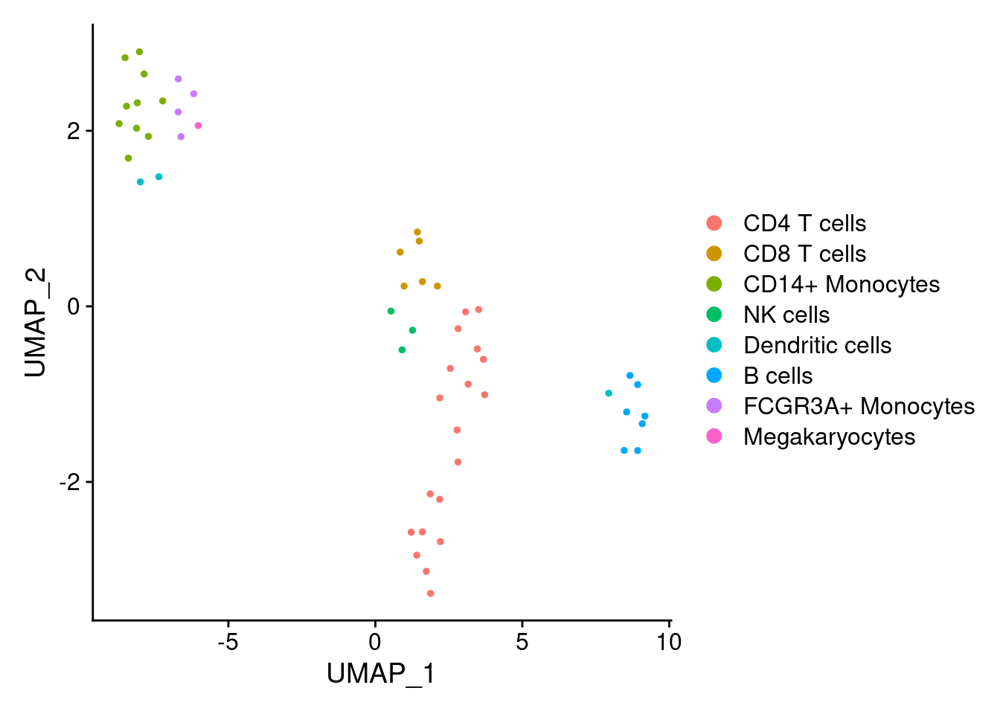
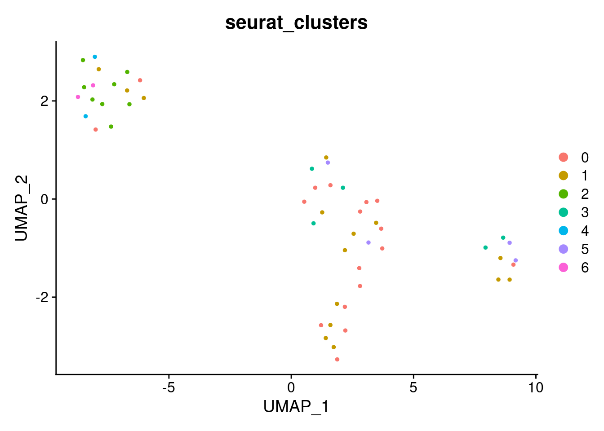
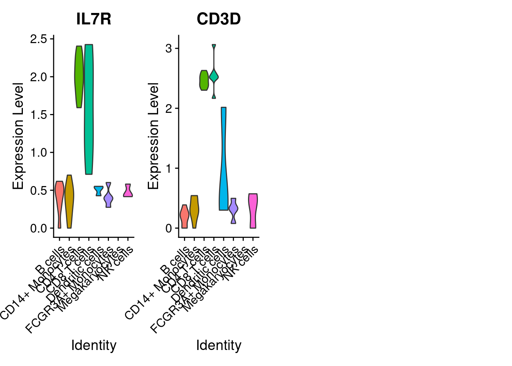

# Downstream analysis of metacells (for a discrete dataset)

Here we use the obtained metacell to run the downstream analysis on them instead of single-cell data. In this analysis, we treat metacell as single cell, neglecting information about their size (i.e., number of containing single cells). If you are interested in sample-weighted analysis, where metacell size is taken into account, see section \@ref(weighted-analysis).

## Standard analysis (R)
Standard analysis includes dimensionality reduction, clustering, differential expression etc using Seurat [ref] framework.


[//]: # (Standard downstream analysis of metacells using R (Seurat))


### Load metacell Seurat object

We will use Seurat objects containing the metacells counts data and their annotation (QC metrics and *e.g.* cell-type annotation) and proceed with standard Seurat downstream analyses.
Seurat objects containing metacells counts data and their annotation were generated at the end of sections .....
These objects can also be generated using the command line described in chapter ...


```r
MC_tool = "SuperCell"
proj_name = "3k_pbmc"
MC.seurat = readRDS(paste0('./data/', proj_name, '/metacell_', MC_tool,'.rds'))
```


### Dimensionality reduction

As for single-cells, to visualize the metacells we identify the most variable features in the metacells gene expression data.
Based on these features, we run PCA and use the first principal components to obtain a two dimensionnal representtion of the data using UMAP.


```r
library(Seurat) 
#> Attaching SeuratObject

Idents(MC.seurat) <- "annotation"
MC.seurat <- NormalizeData(MC.seurat, normalization.method = "LogNormalize")
MC.seurat <- FindVariableFeatures(MC.seurat, nfeatures = 1000)
MC.seurat <- ScaleData(MC.seurat)
#> Centering and scaling data matrix
MC.seurat <- RunPCA(MC.seurat, npcs = 10)
#> PC_ 1 
#> Positive:  IFI30, FTL, FTH1, NPC2, TYMP, SPI1, CST3, LST1, CFD, CD68 
#> 	   SERPINA1, FCN1, SLC7A7, BRI3, CTSS, AIF1, MPEG1, NCF2, CFP, MNDA 
#> 	   TKT, MAFB, CPPED1, MTMR11, PSAP, HCK, SMCO4, C19orf38, IFITM3, LYZ 
#> Negative:  ACAP1, RHOH, LCK, CD3E, IL32, CD69, SIT1, CD3G, SPOCK2, CD2 
#> 	   LDHB, CD7, LTB, ETS1, LAT, CXCR4, CD27, PIK3IP1, CD3D, PRKCQ-AS1 
#> 	   PPP2R5C, PIM1, IL7R, ITM2A, BEX2, BCL11B, OXNAD1, TRAT1, OPTN, RIC3 
#> PC_ 2 
#> Positive:  CD79A, SPIB, AC079767.4, LINC00926, VPREB3, HLA-DOB, MS4A1, TCL1A, CD72, FCRLA 
#> 	   CD19, KIAA0125, TSPAN13, QRSL1, EAF2, CD40, BANK1, IGLL5, FCER2, PKIG 
#> 	   TLR10, CYB561A3, P2RX5, BLK, PPAPDC1B, FCRL1, STRBP, CDCA7L, SNX29P2, HLA-DQB1 
#> Negative:  S100A4, GZMM, CD247, ZAP70, GIMAP5, CD7, CTSW, IL32, CTSC, GZMA 
#> 	   PLA2G16, SH2D2A, NKG7, LYAR, CD300A, IL2RB, LAT, KLRD1, MATK, CCL4 
#> 	   BCL11B, ASCL2, SAMD3, GTF3C1, KLRB1, CDC42EP3, S100A6, PRF1, PIM1, RORA 
#> PC_ 3 
#> Positive:  FGFBP2, GZMB, CCL4, C1orf21, SH2D1B, CLIC3, PRSS23, TTC38, XCL2, SPON2 
#> 	   KLRD1, TBX21, GNLY, S1PR5, CD160, AKR1C3, PRF1, GPR56, NMUR1, CD38 
#> 	   LGALS9B, XCL1, FASLG, NCR1, MMP23B, RAMP1, PLEKHF1, KIR2DL3, IGFBP7, KLRF1 
#> Negative:  RGCC, SUSD3, MAL, NELL2, LEF1, EPHX2, RP11-664D1.1, SOCS3, TSHZ2, CD40LG 
#> 	   SCGB3A1, LINC00176, ADTRP, FLT3LG, IL7R, PCSK1N, TRABD2A, RP11-18H21.1, CD5, FHIT 
#> 	   AC013264.2, TCF7, TRAT1, PLEKHB1, C14orf64, CCR7, LGALS3BP, HAPLN3, PASK, ICOS 
#> PC_ 4 
#> Positive:  SAT2, NOSIP, SOCS3, TCF7, TMEM208, ID1, CRTAP, ARRB2, CSF3R, CASP1 
#> 	   EMB, CTSH, ALDH2, OSM, NRG1, BLVRA, DUSP2, MIR24-2, GPR183, QPCT 
#> 	   TNFSF10, MYCL, NUP214, FLT3LG, ODF3B, ASGR2, IL13RA1, FOLR3, HN1, TREM1 
#> Negative:  SPOCD1, ENKUR, LGALSL, LCN2, AP001189.4, CLEC1B, CLDN5, SCGB1C1, PTCRA, GP9 
#> 	   TUBA8, CMTM5, TREML1, HIST1H2BJ, GATA2, SEPT5, GNG11, CTTN, AC147651.3, SDPR 
#> 	   C6orf25, TMEM40, HIST1H2AC, RP11-367G6.3, TAL1, ACRBP, TUBB1, TSC22D1, MMD, SPARC 
#> PC_ 5 
#> Positive:  CATSPER1, IER3, ID1, MGST1, FOLR3, NRG1, QPCT, C19orf59, ASGR2, CLEC4E 
#> 	   S100A12, VCAN, AP003774.6, RNASE6, FXYD6, EREG, RNASE2, CD14, MS4A6A, RNASE4 
#> 	   MARC1, FCGR1A, IL13RA1, ANG, LINC00937, SYNGR1, ALDH1A1, PLA2G7, LGALS2, IL1B 
#> Negative:  NEURL1, VMO1, CKB, CDKN1C, HES4, ICAM4, MS4A4A, LYPD2, PPM1N, SIGLEC10 
#> 	   PTP4A3, IFITM2, LILRB1, ARHGAP29, C1QA, ADA, CTSL, HES1, BATF3, GSTA4 
#> 	   TBC1D8, TCF7L2, KCNMA1, EMR1, HMOX1, CASP5, FAM110A, CTD-2006K23.1, FCGR3A, RHOC
MC.seurat <- RunUMAP(MC.seurat, dims = 1:10)
#> Warning: The default method for RunUMAP has changed from calling Python UMAP via reticulate to the R-native UWOT using the cosine metric
#> To use Python UMAP via reticulate, set umap.method to 'umap-learn' and metric to 'correlation'
#> This message will be shown once per session
#> 16:53:54 UMAP embedding parameters a = 0.9922 b = 1.112
#> 16:53:55 Read 53 rows and found 10 numeric columns
#> 16:53:55 Using Annoy for neighbor search, n_neighbors = 30
#> 16:53:55 Building Annoy index with metric = cosine, n_trees = 50
#> 0%   10   20   30   40   50   60   70   80   90   100%
#> [----|----|----|----|----|----|----|----|----|----|
#> **************************************************|
#> 16:53:55 Writing NN index file to temp file /tmp/RtmpJUgJbz/file1188490f1a4
#> 16:53:55 Searching Annoy index using 1 thread, search_k = 3000
#> 16:53:55 Annoy recall = 100%
#> 16:53:55 Commencing smooth kNN distance calibration using 1 thread with target n_neighbors = 30
#> 16:53:55 Initializing from normalized Laplacian + noise (using irlba)
#> 16:53:55 Commencing optimization for 500 epochs, with 1228 positive edges
#> 16:53:55 Optimization finished
DimPlot(MC.seurat, reduction = "umap")
```



### Clustering


```r
MC.seurat <- FindClusters(MC.seurat, resolution = 2)
#> Modularity Optimizer version 1.3.0 by Ludo Waltman and Nees Jan van Eck
#> 
#> Number of nodes: 53
#> Number of edges: 1109
#> 
#> Running Louvain algorithm...
#> Maximum modularity in 10 random starts: 0.0562
#> Number of communities: 11
#> Elapsed time: 0 seconds
#> 4 singletons identified. 7 final clusters.
DimPlot(MC.seurat, reduction = "umap", group.by = "seurat_clusters")
```



### Differential expression analysis


```r
# Set idents to cell annotation 
Idents(MC.seurat) <- "annotation"
levels(MC.seurat) <- sort(levels(Idents(MC.seurat)))

# Compute upregulated genes in each cell line (versus other cells)
MC.seurat.all.markers <-  FindAllMarkers(
  MC.seurat,
  only.pos = TRUE,
  min.pct = 0.25,
  logfc.threshold = 0.25,
  test.use = "t"
)
#> Calculating cluster B cells
#> Calculating cluster CD14+ Monocytes
#> Calculating cluster CD4 T cells
#> Calculating cluster CD8 T cells
#> Calculating cluster Dendritic cells
#> Calculating cluster FCGR3A+ Monocytes
#> Calculating cluster Megakaryocytes
#> Calculating cluster NK cells
```


```r
library(dplyr)
#> 
#> Attaching package: 'dplyr'
#> The following objects are masked from 'package:stats':
#> 
#>     filter, lag
#> The following objects are masked from 'package:base':
#> 
#>     intersect, setdiff, setequal, union
# Top markers (select top markers of each cell population)
MC.seurat.top.markers <- MC.seurat.all.markers %>%
   group_by(cluster) %>%
    slice_max(n = 2, order_by = avg_log2FC)

MC.seurat.top.markers
#> # A tibble: 14 × 7
#> # Groups:   cluster [7]
#>       p_val avg_log2FC pct.1 pct.2 p_val_adj cluster           gene   
#>       <dbl>      <dbl> <dbl> <dbl>     <dbl> <fct>             <chr>  
#>  1 1.71e-29       4.06     1 0.826  5.61e-25 B cells           CD79A  
#>  2 3.21e- 5       3.62     1 0.674  1   e+ 0 B cells           TCL1A  
#>  3 1.72e-12       4.53     1 0.977  5.62e- 8 CD14+ Monocytes   S100A9 
#>  4 9.76e- 9       4.51     1 0.953  3.20e- 4 CD14+ Monocytes   S100A8 
#>  5 6.27e-17       1.74     1 0.941  2.05e-12 CD4 T cells       IL7R   
#>  6 1.66e-12       1.69     1 0.853  5.44e- 8 CD4 T cells       CD3D   
#>  7 9.88e- 4       2.77     1 0.723  1   e+ 0 CD8 T cells       GZMK   
#>  8 4.29e-17       2.74     1 1      1.40e-12 CD8 T cells       CCL5   
#>  9 1.80e- 3       1.21     1 0.92   1   e+ 0 Dendritic cells   HLA-DMA
#> 10 3.26e- 3       1.07     1 1      1   e+ 0 Dendritic cells   VIM    
#> 11 6.97e- 5       3.07     1 0.918  1   e+ 0 FCGR3A+ Monocytes FCGR3A 
#> 12 2.65e-21       2.85     1 1      8.66e-17 FCGR3A+ Monocytes LST1   
#> 13 9.37e-37       4.77     1 0.84   3.07e-32 NK cells          GZMB   
#> 14 1.81e-15       4.53     1 0.92   5.92e-11 NK cells          GNLY
```

### Plot the expression of some markers

We visualize the top 5 markers for the XX cells.

```r
genes.to.plot <- MC.seurat.top.markers$gene[MC.seurat.top.markers$cluster == unique(MC.seurat$annotation)[1]]
VlnPlot(MC.seurat, features = genes.to.plot, ncol = 5, pt.size = 0.0)
#> Warning: Groups with fewer than two data points have been dropped.
#> Groups with fewer than two data points have been dropped.
```



### Plot gene-gene correlation at single-cell and metacell levels


```r
# Idents(sc_data) <- "louvain"
# VlnPlot(sc_data, features = genes.to.plot, ncol = 5, pt.size = 0.0)

# marker_naive <- c("IGHM", "IGHD", "CD79A", "IL4R", "MS4A1", "CXCR4", "BTG1", "TCL1A", "CD79B", "YBX3")
# marker_memory <- c("MS4A1", "COCH", "AIM2", "BANK1", "SSPN", "CD79A", "TEX9", "RALGPS2", "TNFRSF13C", "LINC01781")
# p1 <-VlnPlot(pbmc.rna, features = marker_naive, same.y.lims = T, stack = T, flip = T, fill.by = 'ident', group.by = "seurat_annotations") + NoLegend() + ggtitle("Naive B cell marker gene expression")
# p2 <-VlnPlot(pbmc.rna, features = marker_memory, same.y.lims = T, stack = T, flip = T, fill.by = 'ident', group.by = "seurat_annotations") + NoLegend() + ggtitle("Memory B cell marker gene expression")
# p1 | p2
```


## Standard analysis (Python) {#standard-analysis-Py}


[//]: # (Standard downstream analysis of metacells using Py (Scanpy))

Standard analysis includes dimensionality reduction, clustering, differential expression etc using [Scanpy](https://scanpy-tutorials.readthedocs.io/en/latest/#) framework.

# MC_tool = "MC2"
# proj_name = "CD34"
# ad = sc.read(os.path.join("data", "CD34", "cd34_multiome_rna.h5ad"))


```python
import numpy as np
import pandas as pd
import scanpy as sc
```

### Dimensionality reduction 

### Clustering 

### Differential expression analysis 


## Sample-weighted analysis {#weighted-analysis}


[//]: # (Sample-weighted analysis of metacell using SuperCell framework)


One of the features of metacells are their size, which is a number of single cell it contains. Since metacells aggregate different number of cells, they also carry different amount of information. And thus, to better reproduce single-cell analysis, bigger metacells should have larger impact on the results than smaller metacells. For this, a sample-weighted analysis can be applied. Sample-weighted analysis is impleented in the SuperCell package. 


## Advanced analysis

### GRN


[//]: # (GRN for metacells)

Gene correlation analysis suffers from large dropout rate of single-cell data and at the same time is very time and memory demanding. Metacells simultaneously adress both issues and thus are beneficial for gene co-expression and gene regulation analysis. Here we demonstrate usage of metacells for GRN analysis using SCENIC [ref]. 

### Integration of metacells

Under construction....


