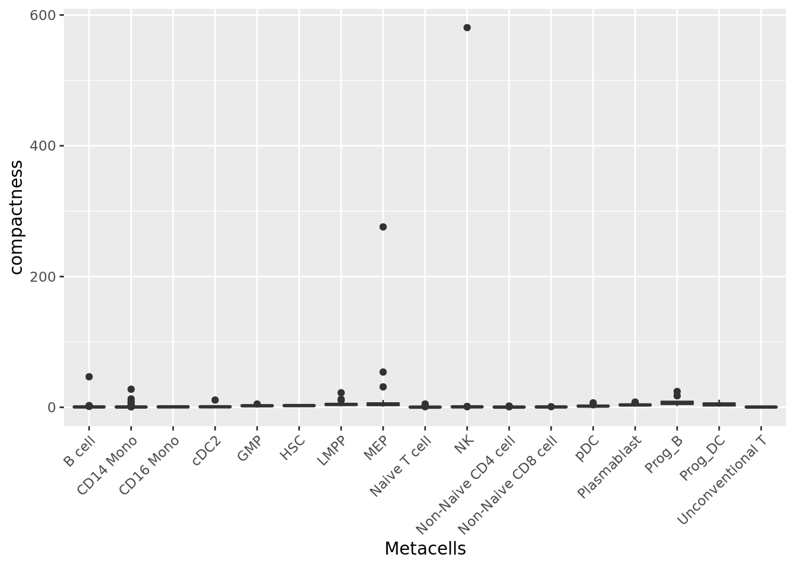
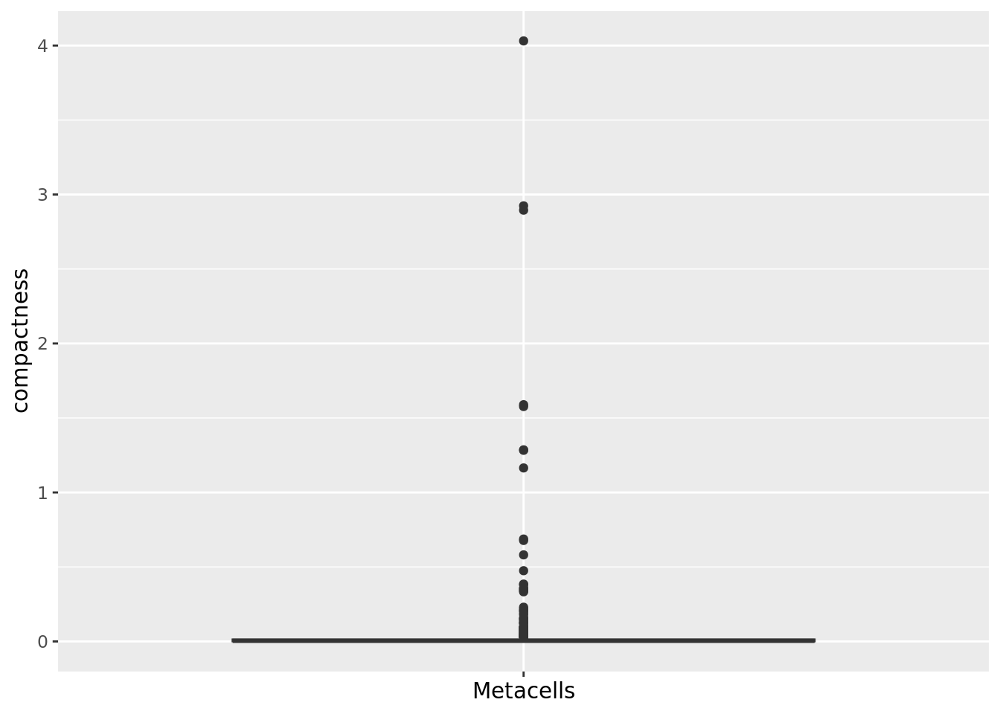
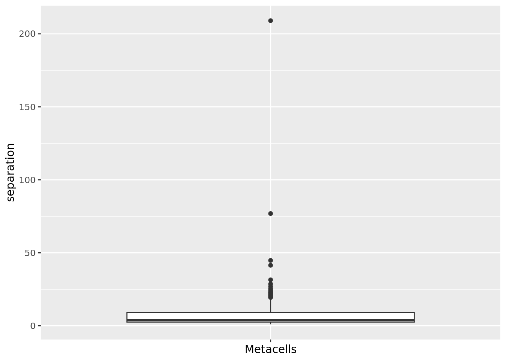
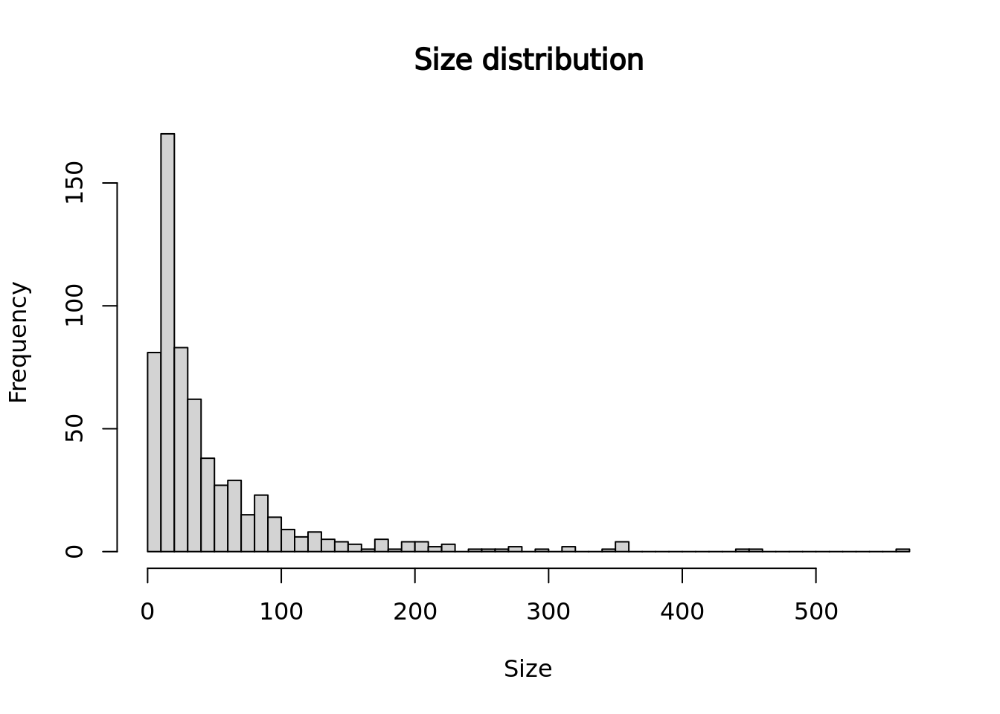
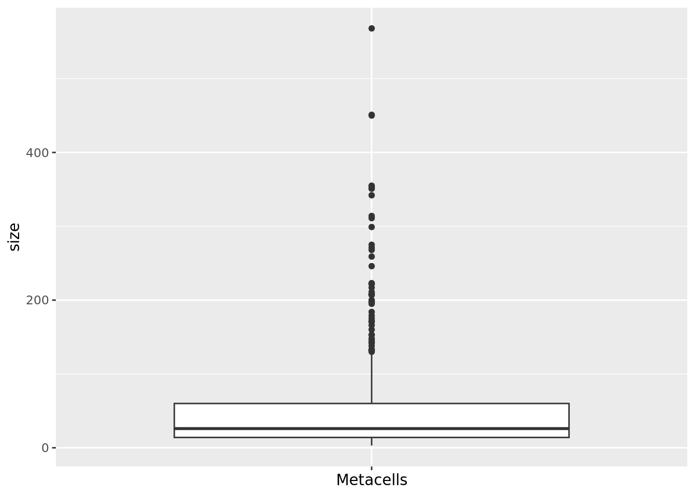

# Metacells' QCs {#QCs}


Different metrics have been proposed in previous metacell studies to evaluate the quality of metacells.
We propose a R package called *MetacellAnalysisToolkit*, to compute and visualize these metrics. 
The package also provides a function to visualize metacells projected in the single-cell space.

Import packages:


```r
library(MetacellAnalysisToolkit)
library(Seurat)
# If you have Seurat V5 installed, specify that you want to analyze Seurat V4 objects
if(packageVersion("Seurat") >= 5){options(Seurat.object.assay.version = "v4"); print("you are using seurat v5 with assay option v4")}
```

To explore metacells QCs, we need to load: 
(i) the single-cell data used to build the metacells and 
(ii) the metacell data saved in a Seurat object (see chapter \@ref(Metacell-construction-chapter)).


```r
MC_tool = "SuperCell"
proj_name = "bmcite"
annotation_label = "celltype_simplified"

cell_types <- c("Prog_RBC", "Unconventional T", "Naive CD4 cell", "Non-Naive CD4 cell", 
                "CD14 Mono", "B cell", "Naive CD8 cell", "Non-Naive CD8 cell", 
                "NK", "GMP", "CD16 Mono", "pDC", "cDC2", "Prog_B 2", 
                "Prog_Mk", "Plasmablast", "HSC", "LMPP", "Prog_DC", "Prog_B 1")

celltype_colors <- c("#7E57C2", "#1E88E5", "#FFC107", "#004D40", "#9E9D24", 
                 "#F06292", "#546E7A", "#D4E157", "#76FF03", "#6D4C41", 
                 "#26A69A", "#AB47BC", "#EC407A", "#D81B60", "#42A5F5", 
                 "#2E7D32", "#FFA726", "#5E35B1", "#EF5350", "#3949AB")
names(celltype_colors) <-cell_types

# Load the single-cell data 
sc_data = readRDS(paste0("data/", proj_name, "/singlecell_seurat_filtered.rds"))
# Load the metacell data 
mc_data = readRDS(paste0('data/', proj_name, '/metacell_', MC_tool,'.rds'))
```

## Quantitative metrics

### Purity
When available, cell annotations can be used to annotate each metacell to the most abundant cell category (*e.g.* cell type) composing the metacell (see chapter \@ref(Metacell-construction-chapter)). 
This also allows us to compute metacell purity. If the annotation considered is the cell type, the **purity** of a metacell is the proportion of the most abundant 
cell type within the metacell [@SuperCell].

```r
membership_df <- mc_data@misc$cell_membership
mc_data$purity <- mc_purity(membership = membership_df$membership, annotation = sc_data@meta.data[, annotation_label])
qc_boxplot(mc.obj = mc_data, qc.metrics = "purity")
```


```r
qc_boxplot(mc.obj = mc_data, qc.metrics = "purity", split.by = annotation_label)
```


### Compactness
The **compactness** of a metacell is the variance of the components within the metacell [@SEACells].
The lower the compactness value the better.

This metric as well as the separation metric are computed based on a low embedding of the single-cell data (e.g., PCA). 
Note that it is important to use the embedding used initially to construct the metacells.
In the next chunk, we retrieve the principal components computed for metacell construction 
(in chapter \@ref(Metacell-construction-chapter) these principal components were saved in the Seurat objects containing the metacell data) 
and run UMAP for visualization.


```r
sc_data@reductions[["pca"]] <- mc_data@misc$sc.pca
sc_data <- RunUMAP(sc_data, reduction = "pca", dims = c(1:30), n.neighbors = 15, verbose = F, min.dist = 0.5)
#> Warning: The default method for RunUMAP has changed from calling Python UMAP via reticulate to the R-native UWOT using the cosine metric
#> To use Python UMAP via reticulate, set umap.method to 'umap-learn' and metric to 'correlation'
#> This message will be shown once per session
UMAPPlot(sc_data, group.by = annotation_label, reduction = "umap", cols=celltype_colors)
```


We can compute the compactness of each metacell using the PCA components.

```r
mc_data$compactness <- mc_compactness(cell.membership = membership_df, 
                                      sc.obj = sc_data,
                                      sc.reduction = "pca", 
                                      dims = 1:30)
qc_boxplot(mc.obj = mc_data, qc.metrics = "compactness")
```


```r
qc_boxplot(mc.obj = mc_data, qc.metrics = "compactness", split.by = annotation_label)
```



We can also compute the compactness of each metacell using diffusion map components computed based on the PCA axes, as suggested in [@SEACells].
To compute the diffusion map components, you can use the function `get_dim_reduc()` from the MetacellAnalysisTookit R package.

```r
# we run diffufion maps on the pca axes saved in the seurat object. Note that a matrix containing the PCA components can be provided as well
diffusion_comp <- get_diffusion_comp(sc.obj = sc_data, sc.reduction = "pca", dims = 1:30)
#> Error in python_config_impl(python) : 
#>   Error running '/users/agabrie4/.virtualenvs/r-reticulate/bin/python': No such file.
#> The Python installation used to create the virtualenv has been moved or removed:
#>   '/usr/bin'
#> Warning: The following arguments are not used: layer
#> Computing diffusion maps ...
mc_data$compactness <- mc_compactness(cell.membership = membership_df, 
                                      sc.obj = sc_data,
                                      sc.reduction = diffusion_comp, 
                                      dims = 1:ncol(diffusion_comp))
qc_boxplot(mc.obj = mc_data, qc.metrics = "compactness")
```



```r
qc_boxplot(mc.obj = mc_data, qc.metrics = "compactness", split.by = annotation_label)
```


### Separation
The **separation** of a metacell is the distance to the closest metacell [@SEACells]. 
The higher the separation value the better.


```r
mc_data$separation <- mc_separation(cell.membership = membership_df, 
                                    sc.obj = sc_data, 
                                    sc.reduction = "pca")
qc_boxplot(mc.obj = mc_data, qc.metrics = "separation")
```



```r
qc_boxplot(mc.obj = mc_data, qc.metrics = "separation", split.by = annotation_label)
```


```r
mc_data$separation <- mc_separation(cell.membership = membership_df, 
                                    sc.obj = sc_data, 
                                    sc.reduction = diffusion_comp)
qc_boxplot(mc.obj = mc_data, qc.metrics = "separation")
```


```r
qc_boxplot(mc.obj = mc_data, qc.metrics = "separation", split.by = annotation_label)
```


Note that compactness and separation metrics are correlated, better compactness results in worse separation and vice versa. 
Metacells from dense regions will have better compactness but worse separation, 
while metacells from sparse regions will have better separation but worse compactness. 

```r
library(ggplot2)
ggplot(data.frame(compactness = log(mc_data$compactness), separation = log(mc_data$separation)), 
       aes(x=compactness, y=separation)) + 
  geom_point()+
  geom_smooth(method=lm) + ggpubr::stat_cor(method = "pearson")
#> `geom_smooth()` using formula = 'y ~ x'
```


### INV
The **inner normalized variance (INV)** of a metacell is the mean-normalized variance of gene expression within the metacell [@MC2].  
The lower the INV value the better. 
Note that it is the only metric that is latent-space independent.


```r
mc_data$INV <- mc_INV(cell.membership = membership_df, sc.obj = sc_data, group.label = "membership")
#> Computing INV ...
#> Warning in asMethod(object): sparse->dense coercion: allocating vector of size
#> 3.7 GiB
qc_boxplot(mc.obj = mc_data, qc.metrics = "INV")
```


```r
qc_boxplot(mc.obj = mc_data, qc.metrics = "INV", split.by = annotation_label)
```


## Size distribution

The size of a metacell corresponds to the number of single cells it contains.
Having a homogeneous metacell size distribution is ideal for downstream analyses, since larger metacells will express more genes,
which could confound analyses. When heterogeneous size distributions are obtained we recommend weighted downstream analyses as described in section \@ref(weighted-analysis).  


```r
# Seurat::VlnPlot(mc_data, features = "size", pt.size = 2)
# Seurat::VlnPlot(mc_data, features = "size", pt.size = 2, group.by = annotation_label)
hist(mc_data$size, main = "Size distribution", xlab = "Size", breaks = 30)
```



```r
qc_boxplot(mc.obj = mc_data, qc.metrics = "size")
```



```r
qc_boxplot(mc.obj = mc_data, qc.metrics = "size", split.by = annotation_label) 
```


## Representativeness of metacells 
To visualize the metacells, we can project the metacells on the single-cell UMAP representation using the `mc_projection()` function (adapted from the `plot.plot_2D()` from the SEACells package).
A good metacell partition should reproduce the overall structure of the single-cell data by uniformly representing the latent space.
To use this function we need the data at the single-cell level (or at least a low-dimensional embedding of the data) and the single-cell membership to each the metacell.


```r

mc_projection(
  sc.obj = sc_data, 
  mc.obj = mc_data,
  cell.membership = membership_df,
  sc.reduction = "umap", 
  sc.label = unlist(annotation_label), # single cells will be colored according the sc.label  
  metacell.label = unlist(annotation_label) # metacells cell will be colored according the metacell.label
  )
```


By default the size of the metacells dots is proportionnal to the size of the metacells.
Metacells can also be colored by a continuous variable such as one of the QC metrics computed in the previous chunks:


```r
mc_projection(
  sc.obj = sc_data, 
  mc.obj = mc_data, 
  cell.membership = membership_df,
  sc.reduction = "umap", 
  sc.label = unlist(annotation_label), # single cells will be colored according the sc.label  
  continuous_metric = TRUE,
  metric = "compactness"
  )
```


