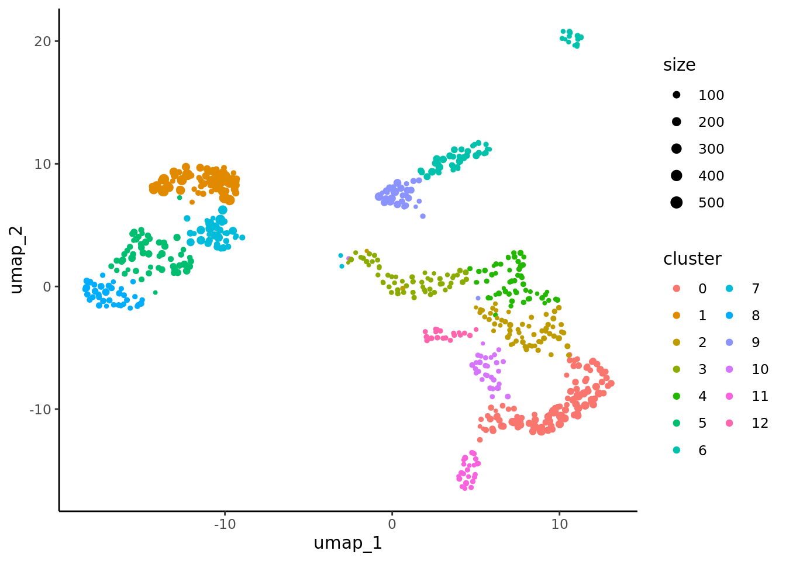
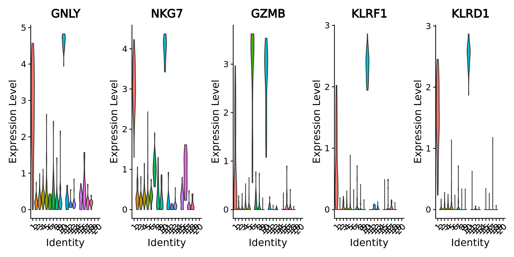

# Downstream analysis of metacells 

In this chapter, we run standard and advanced downstream analyses on metacells instead of single-cell data. 
In this analysis, we treat each metacell as a single cell, neglecting information about the size of the metacell (i.e., number of containing single cells). 
If you are interested in sample-weighted analysis, where metacell size is taken into account, see section \@ref(weighted-analysis).

## Standard analysis (R) {#standard-analysis-R}


[//]: # (Standard downstream analysis of metacells using R (Seurat))


In this tutorial, standard analysis includes dimensionality reduction, clustering and differential expression using the [Seurat](https://satijalab.org/seurat/) framework.


```r
library(Seurat) 
#> Attaching SeuratObject
library(dplyr)
#> 
#> Attaching package: 'dplyr'
#> The following objects are masked from 'package:stats':
#> 
#>     filter, lag
#> The following objects are masked from 'package:base':
#> 
#>     intersect, setdiff, setequal, union
library(ggplot2)
```

### Load metacell Seurat object

We will use Seurat objects containing the metacells counts data and their annotation (*e.g.* and cell-type annotation) and
proceed with standard Seurat downstream analyses.
Seurat objects containing metacells counts data and their annotation were generated at the end of sections .....
These objects can also be generated using the command line described in chapter ...


```r
MC_tool = "SuperCell"
proj_name = "3k_pbmc"
annotation_column = "louvain"
MC.seurat = readRDS(paste0('./data/', proj_name, '/metacell_', MC_tool,'.rds'))
```


### Dimensionality reduction

As for single-cells, we normalize the raw counts (here aggregated raw counts) and we identify the most variable features in the metacells gene expression data.
Based on these features, we run PCA and use the first principal components to obtain a two dimensionnal representation of the data using UMAP.


```r
Idents(MC.seurat) <- annotation_column
MC.seurat <- NormalizeData(MC.seurat, normalization.method = "LogNormalize")
MC.seurat <- FindVariableFeatures(MC.seurat, nfeatures = 2000)
MC.seurat <- ScaleData(MC.seurat)
#> Centering and scaling data matrix
MC.seurat <- RunPCA(MC.seurat, verbose = F)
MC.seurat <- RunUMAP(MC.seurat, dims = 1:30, verbose = F)
#> Warning: The default method for RunUMAP has changed from calling Python UMAP via reticulate to the R-native UWOT using the cosine metric
#> To use Python UMAP via reticulate, set umap.method to 'umap-learn' and metric to 'correlation'
#> This message will be shown once per session
DimPlot(MC.seurat, reduction = "umap")
```


### Clustering

We cluster the metacells using Seurat clustering steps and visualize these clusters using UMAP:

```r
MC.seurat <- FindNeighbors(MC.seurat, dims = 1:30)
#> Computing nearest neighbor graph
#> Computing SNN
MC.seurat <- FindClusters(MC.seurat, resolution = 2)
#> Modularity Optimizer version 1.3.0 by Ludo Waltman and Nees Jan van Eck
#> 
#> Number of nodes: 106
#> Number of edges: 2637
#> 
#> Running Louvain algorithm...
#> Maximum modularity in 10 random starts: 0.1672
#> Number of communities: 6
#> Elapsed time: 0 seconds
#> 1 singletons identified. 5 final clusters.
DimPlot(MC.seurat, reduction = "umap", group.by = "seurat_clusters")
```



### Differential expression analysis


```r
# Set idents to metacell annotation 
Idents(MC.seurat) <- annotation_column
levels(MC.seurat) <- sort(levels(Idents(MC.seurat)))

# Compute upregulated genes in group of metacells (versus other metacells)
MC.seurat.all.markers <-  FindAllMarkers(
  MC.seurat,
  only.pos = TRUE,
  min.pct = 0.25,
  logfc.threshold = 0.25,
  test.use = "t"
)
#> Calculating cluster B cells
#> Calculating cluster CD14+ Monocytes
#> Calculating cluster CD4 T cells
#> Calculating cluster CD8 T cells
#> Calculating cluster Dendritic cells
#> Calculating cluster FCGR3A+ Monocytes
#> Calculating cluster Megakaryocytes
#> Calculating cluster NK cells
```

We select the top markers for each cell-type: 

```r
# Top markers (select top markers of each metacell population)
MC.seurat.top.markers <- MC.seurat.all.markers %>%
   group_by(cluster) %>%
    slice_max(n = 5, order_by = avg_log2FC)

MC.seurat.top.markers
#> # A tibble: 35 × 7
#> # Groups:   cluster [7]
#>       p_val avg_log2FC pct.1 pct.2 p_val_adj cluster         gene  
#>       <dbl>      <dbl> <dbl> <dbl>     <dbl> <fct>           <chr> 
#>  1 6.34e-11       4.09     1 0.543  2.08e- 6 B cells         CD79A 
#>  2 3.56e- 5       3.70     1 0.223  1   e+ 0 B cells         IGLL5 
#>  3 1.60e-12       3.40     1 0.755  5.24e- 8 B cells         CD79B 
#>  4 3.70e-19       3.36     1 0.606  1.21e-14 B cells         MS4A1 
#>  5 2.16e- 6       3.12     1 0.383  7.08e- 2 B cells         TCL1A 
#>  6 1.28e-23       4.79     1 0.79   4.20e-19 CD14+ Monocytes S100A8
#>  7 4.10e-36       4.51     1 0.926  1.34e-31 CD14+ Monocytes S100A9
#>  8 4.35e-42       3.38     1 1      1.42e-37 CD14+ Monocytes LYZ   
#>  9 2.36e-38       2.90     1 0.58   7.72e-34 CD14+ Monocytes LGALS2
#> 10 2.26e-19       2.79     1 0.395  7.39e-15 CD14+ Monocytes CD14  
#> # ℹ 25 more rows
```


We visualize the top 5 markers for the XX cells.

```r
# genes.to.plot <- MC.seurat.top.markers$gene[MC.seurat.top.markers$cluster == unique(MC.seurat@meta.data[,annotation_column])[1]]
genes.to.plot <- MC.seurat.top.markers$gene[c(seq(1, 20, 5))]
VlnPlot(MC.seurat, features = genes.to.plot, ncol = 4, pt.size = 0.0)  
```


### Visualize gene-gene correlation 

We can use the `supercell_GeneGenePlot` function from the SuperCell package to visualize the correlation between marker genes of a cell-type: 
(i) at the single-cell level and
(ii) at the metacell level.

For that, we load the single-cell data from which the metacells were derived.

```r
print(proj_name)
#> [1] "3k_pbmc"
sc_data = readRDS(paste0("data/", proj_name, "/singlecell_seurat_filtered.rds"))
sc_data <- NormalizeData(sc_data, normalization.method = "LogNormalize")
```


```r
library(SuperCell)
cell_type_markers <- MC.seurat.top.markers[MC.seurat.top.markers$cluster == "CD8 T cells", ]
gene_x <- cell_type_markers$gene[1:2]  
gene_y <- cell_type_markers$gene[3:4] 

alpha <- 0.7

p.sc <- supercell_GeneGenePlot(
  GetAssayData(sc_data, slot = "data"),
  gene_x = gene_x,
  gene_y = gene_y,
  clusters = sc_data@meta.data[, annotation_column],
  sort.by.corr = F,
  alpha = alpha
)
p.sc$p
```


```r

p.MC <- supercell_GeneGenePlot(GetAssayData(MC.seurat, slot = "data"), 
                               gene_x = gene_x, 
                               gene_y = gene_y, 
                               clusters = MC.seurat@meta.data[ ,annotation_column],  
                               sort.by.corr = F, 
                               alpha = alpha)
p.MC$p
```


## Standard analysis (Python) {#standard-analysis-Py}


[//]: # (Standard downstream analysis of metacells using Py (Scanpy))


In this section, standard analysis includes dimensionality reduction, clustering, differential expression etc using [Scanpy](https://scanpy-tutorials.readthedocs.io/en/latest/#) framework.


```python
import numpy as np
import pandas as pd
import scanpy as sc
sc.settings.verbosity = 1 
```


```python
MC_tool = "SEACells"
proj_name = "3k_pbmc"
annotation_column = "louvain"
adata = sc.read(os.path.join('./data', proj_name, f'metacell_{MC_tool}.h5ad'))
```

### Dimensionality reduction

```python
adata.var_names_make_unique()  # this is unnecessary if using `var_names='gene_ids'` in `sc.read_10x_mtx`

sc.pp.normalize_per_cell(adata)
sc.pp.log1p(adata)
sc.pp.highly_variable_genes(adata, n_top_genes=2000)

# Freeze the state of the AnnData object for later use in differential testing and visualizations of gene expression
adata.raw = adata # step needd only if I use regress_out steps

# Compute PCA (highly variable genes will be used)
sc.tl.pca(adata, svd_solver='arpack')

# Compute the neighbor graph
sc.pp.neighbors(adata, n_neighbors=15, n_pcs=30)
#> /mnt/c/Aurelie/postdoc_UNIL/Metacell_review/tuto/Metacell_tutorial/my_env/lib/python3.8/site-packages/umap/distances.py:1063: NumbaDeprecationWarning: The 'nopython' keyword argument was not supplied to the 'numba.jit' decorator. The implicit default value for this argument is currently False, but it will be changed to True in Numba 0.59.0. See https://numba.readthedocs.io/en/stable/reference/deprecation.html#deprecation-of-object-mode-fall-back-behaviour-when-using-jit for details.
#>   @numba.jit()
#> /mnt/c/Aurelie/postdoc_UNIL/Metacell_review/tuto/Metacell_tutorial/my_env/lib/python3.8/site-packages/umap/distances.py:1071: NumbaDeprecationWarning: The 'nopython' keyword argument was not supplied to the 'numba.jit' decorator. The implicit default value for this argument is currently False, but it will be changed to True in Numba 0.59.0. See https://numba.readthedocs.io/en/stable/reference/deprecation.html#deprecation-of-object-mode-fall-back-behaviour-when-using-jit for details.
#>   @numba.jit()
#> /mnt/c/Aurelie/postdoc_UNIL/Metacell_review/tuto/Metacell_tutorial/my_env/lib/python3.8/site-packages/umap/distances.py:1086: NumbaDeprecationWarning: The 'nopython' keyword argument was not supplied to the 'numba.jit' decorator. The implicit default value for this argument is currently False, but it will be changed to True in Numba 0.59.0. See https://numba.readthedocs.io/en/stable/reference/deprecation.html#deprecation-of-object-mode-fall-back-behaviour-when-using-jit for details.
#>   @numba.jit()
#> /mnt/c/Aurelie/postdoc_UNIL/Metacell_review/tuto/Metacell_tutorial/my_env/lib/python3.8/site-packages/umap/umap_.py:660: NumbaDeprecationWarning: The 'nopython' keyword argument was not supplied to the 'numba.jit' decorator. The implicit default value for this argument is currently False, but it will be changed to True in Numba 0.59.0. See https://numba.readthedocs.io/en/stable/reference/deprecation.html#deprecation-of-object-mode-fall-back-behaviour-when-using-jit for details.
#>   @numba.jit()

# Run umap
sc.tl.umap(adata)

# Plot metacells in the UMAP space
sc.pl.umap(adata, color=[annotation_column], size = 100)
#> /mnt/c/Aurelie/postdoc_UNIL/Metacell_review/tuto/Metacell_tutorial/my_env/lib/python3.8/site-packages/scanpy/plotting/_tools/scatterplots.py:392: UserWarning: No data for colormapping provided via 'c'. Parameters 'cmap' will be ignored
#>   cax = scatter(
```


### Clustering

Perform clustering on the metacell data.

```python
# run laiden graph-clustering
sc.tl.leiden(adata, neighbors_key = "neighbors", resolution = 2)

# plot the metacells in the UMAP space and color by cluster
sc.pl.umap(adata, color=['leiden'], size = 100)
#> /mnt/c/Aurelie/postdoc_UNIL/Metacell_review/tuto/Metacell_tutorial/my_env/lib/python3.8/site-packages/scanpy/plotting/_tools/scatterplots.py:392: UserWarning: No data for colormapping provided via 'c'. Parameters 'cmap' will be ignored
#>   cax = scatter(
```


### Differential expression analysis

Identify marker genes for each group of metacells. 
Note that here we use the clusters since the Megakaryocytes contain only one metacells.
We visualize the top 3 markers for CD8 Tcells.

```python
# Identify marker genes
sc.tl.rank_genes_groups(adata, 'leiden', method='wilcoxon')
sc.pl.rank_genes_groups(adata, n_genes=25, sharey=False)
#> /mnt/c/Aurelie/postdoc_UNIL/Metacell_review/tuto/Metacell_tutorial/my_env/lib/python3.8/site-packages/scanpy/plotting/_tools/__init__.py:397: UserWarning: Attempting to set identical low and high ylims makes transformation singular; automatically expanding.
#>   ax.set_ylim(ymin, ymax)
```


```python

# Show the top marker genes
print(pd.DataFrame(adata.uns['rank_genes_groups']['names']).head(5))
#>        0       1      2        3         4       5      6          7
#> 0  RPL31   FOLR3   CD8A      LTB      CST3  STXBP2   XCL2  TNFRSF13C
#> 1  RPL32  S100A9   CCL5  TNFRSF4  HLA-DRB5  MS4A4A  KLRF1      CD79A
#> 2   CCR7  S100A8   LYAR     AQP3  HLA-DRB1    RHOC  RAMP1       GNG7
#> 3   RPS6    BST1   CD8B   CD40LG  HLA-DPA1  CDKN1C  CLIC3   PPAPDC1B
#> 4  RPS27   MGST1  KLRG1      CD2    TMSB10  FCER1G   PRF1    HLA-DOB

# Visualize marker genes
sc.pl.violin(adata, ['CD8A', 'CCL5', 'LYAR'], groupby=annotation_column, size = 2, rotation = 90)
```


## Sample-weighted analysis {#weighted-analysis}


[//]: # (Weighted downstream analysis of metacells using R (Seurat))


Code has been modified but text should be updated in this section!

```r
library(Seurat) 
library(dplyr)
library(ggplot2)
library(SuperCell)
```

### Load metacell Seurat object

We will use Seurat objects containing the metacells counts data and their annotation (*e.g.* and cell-type annotation) and
proceed with standard Seurat downstream analyses.
Seurat objects containing metacells counts data and their annotation were generated at the end of sections .....
These objects can also be generated using the command line described in chapter ...


```r
MC_tool = "SuperCell"
proj_name = "3k_pbmc"
annotation_column = "louvain"
MC.seurat = readRDS(paste0('./data/', proj_name, '/metacell_', MC_tool,'.rds'))
```


### Dimensionality reduction

As for single-cells, we normalize the raw counts (here aggregated raw counts) and we identify the most variable features in the metacells gene expression data.
Based on these features, we run PCA and use the first principal components to obtain a two dimensionnal representation of the data using UMAP.


```r
MC.seurat <- NormalizeData(MC.seurat, normalization.method = "LogNormalize")

MC_list <- list(N.SC = ncol(MC.seurat),
                supercell_size = MC.seurat$size)
MC_list$PCA <- supercell_prcomp(
  Matrix::t(GetAssayData(MC.seurat, slot = "data")),
  genes.use = MC.seurat@misc$var_features,  # or a new set of HVG can be computed
  supercell_size = MC_list$supercell_size, # provide this parameter to run sample-weighted version of PCA,
  k = 10
)

MC_list$UMAP <- supercell_UMAP(
  SC = MC_list,
  PCA_name = "PCA",
  n_neighbors = 50 # large number to repel cells 
)

supercell_DimPlot(SC = MC_list, 
  groups = MC.seurat@meta.data[, annotation_column],
  dim.name = "UMAP", 
  title = paste0("UMAP of metacells colored by cell type assignment")
)
```


### Clustering

We cluster the metacells using Seurat clustering steps and visualize these clusters using UMAP:

```r
# compute distance among metacells
D  <- dist(MC_list$PCA$x)

# cluster metacells
MC_list$clustering  <- supercell_cluster(D = D, k = 8, supercell_size = MC_list$supercell_size)

# Plot clustering result
supercell_DimPlot(
  MC_list, 
  groups = factor(MC_list$clustering$clustering),
  dim.name = "UMAP", 
  title = paste0("UMAP of metacells colored by metacell clustering")
)
```


### Differential expression analysis


```r
# Compute upregulated genes in each cell line (versus other cells)
MC.all.markers <- supercell_FindAllMarkers(
  ge = GetAssayData(MC.seurat, slot = "data"), 
  clusters = MC.seurat@meta.data[, annotation_column], 
  supercell_size = MC_list$supercell_size,
  only.pos = TRUE, 
  min.pct = 0, 
  logfc.threshold = 0.2
)

```

We select the top markers for each cell-type: 

```r
# Transform the output of `supercell_FindAllMarkers()` to be in the format of the `Seurat::FindAllMarkers()`
MC.all.markers.df <- data.frame()
for(cl in names(MC.all.markers)){
  cur <- MC.all.markers[[cl]]
  
  if(is.data.frame(cur)){
    cur$cluster <- cl
    cur$gene <- rownames(cur)
    cur$avg_log2FC <- cur$logFC
    MC.all.markers.df <- rbind(MC.all.markers.df, cur)
  } 
}

# Top markers (select top markers of each cell line)
MC.top.markers <- MC.all.markers.df %>%
   group_by(cluster) %>%
    slice_max(n = 2, order_by = avg_log2FC)
```


We visualize the top 5 markers for the XX cells.

```r
Idents(MC.seurat) <- annotation_column
# genes.to.plot <- MC.seurat.top.markers$gene[MC.seurat.top.markers$cluster == unique(MC.seurat@meta.data[,annotation_column])[1]]
genes.to.plot <- MC.top.markers$gene[c(seq(1, 20, 5))]
VlnPlot(MC.seurat, features = genes.to.plot, ncol = 4, pt.size = 0.0)  
```




## Advanced analysis

### GRN {#GRN-analysis}

<!-- ```{r, child='./sub_pages/30-GRN.Rmd'} -->
<!-- ``` -->

### Integration of metacells {#integration}

<!-- Under construction.... -->


