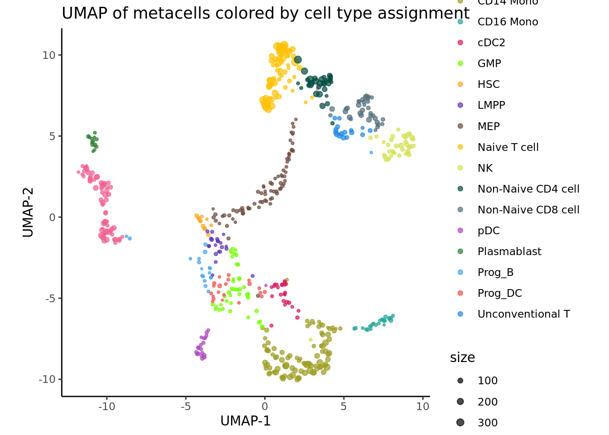

# Downstream analysis of metacells 

In this chapter, we run standard and advanced downstream analyses on metacells instead of single-cell data. 
In this analysis, we treat each metacell as a single cell, neglecting information about the size of the metacell (i.e., number of containing single cells). 
If you are interested in sample-weighted analysis, where metacell size is taken into account, see section \@ref(weighted-analysis).

## Standard analysis (R) {#standard-analysis-R}


[//]: # (Standard downstream analysis of metacells using R (Seurat))


In this tutorial, standard analyses include dimensionality reduction, clustering and differential expression using the [Seurat](https://satijalab.org/seurat/) framework.


```r
library(Seurat) 
#> The legacy packages maptools, rgdal, and rgeos, underpinning this package
#> will retire shortly. Please refer to R-spatial evolution reports on
#> https://r-spatial.org/r/2023/05/15/evolution4.html for details.
#> This package is now running under evolution status 0
#> Attaching SeuratObject
library(dplyr)
#> 
#> Attaching package: 'dplyr'
#> The following objects are masked from 'package:stats':
#> 
#>     filter, lag
#> The following objects are masked from 'package:base':
#> 
#>     intersect, setdiff, setequal, union
library(ggplot2)
```

### Load metacell Seurat object

We will use Seurat objects containing the metacells counts data and their annotation (*e.g.* cell-type annotation) and
proceed with standard Seurat downstream analyses.
Seurat objects containing metacells counts data and their annotation were generated at the end of sections \@ref(SuperCell-construction)
These objects can also be generated using the command line described in chapter \@ref(command-line)


```r
MC_tool = "SuperCell"
proj_name = "3k_pbmc"
annotation_column = "louvain"
celltype_colors <- c(
  "CD14+ Monocytes"    = "#E69F00",  # orange
  "B cells"            = "#56B4E9",  # sky blue
  "CD4 T cells"        = "#009E73",  # bluish green
  "NK cells"           = "#F0E442",  # yellow
  "CD8 T cells"        = "#0072B2",  # blue
  "FCGR3A+ Monocytes"  = "#D55E00",  # vermillion
  "Dendritic cells"    = "#CC79A7",  # reddish purple
  "Megakaryocytes"     = "#000000"   # black
)

MC.seurat = readRDS(paste0('./data/', proj_name, '/metacell_', MC_tool,'.rds'))
```


### Dimensionality reduction

As for single-cells, we normalize the raw counts (here aggregated raw counts) and we identify the most variable features in the metacells gene expression data.
Based on these features, we run PCA and use the first principal components to obtain a two dimensionnal representation of the data using UMAP.


```r
Idents(MC.seurat) <- annotation_column
MC.seurat <- NormalizeData(MC.seurat)
MC.seurat <- FindVariableFeatures(MC.seurat, selection.method = "vst", nfeatures = 2000)
MC.seurat <- ScaleData(MC.seurat)
#> Centering and scaling data matrix
MC.seurat <- RunPCA(MC.seurat, verbose = F)
MC.seurat <- RunUMAP(MC.seurat, dims = 1:30, verbose = F)
#> Warning: The default method for RunUMAP has changed from calling Python UMAP via reticulate to the R-native UWOT using the cosine metric
#> To use Python UMAP via reticulate, set umap.method to 'umap-learn' and metric to 'correlation'
#> This message will be shown once per session
DimPlot(MC.seurat, reduction = "umap", cols = celltype_colors)
```


### Clustering

We cluster the metacells using Seurat clustering steps and visualize these clusters using UMAP:

```r
MC.seurat$SCclustering  <- SuperCell::supercell_cluster(D = dist(MC.seurat@reductions$pca@cell.embeddings[, 1:30]  ), k = 8)$clustering
DimPlot(MC.seurat, reduction = "umap", group.by = "SCclustering")
```


### Differential expression analysis

We perform diffrential analysis to identify the markers of our cluster 3 as an example using the `FindMarkers` function. 

```r
# Set idents to metacell annotation 
Idents(MC.seurat) <- "SCclustering"

cells_markers <- FindMarkers(MC.seurat, ident.1 = "4", only.pos = TRUE)
#> For a more efficient implementation of the Wilcoxon Rank Sum Test,
#> (default method for FindMarkers) please install the limma package
#> --------------------------------------------
#> install.packages('BiocManager')
#> BiocManager::install('limma')
#> --------------------------------------------
#> After installation of limma, Seurat will automatically use the more 
#> efficient implementation (no further action necessary).
#> This message will be shown once per session
head(cells_markers)
#>                p_val avg_log2FC pct.1 pct.2    p_val_adj
#> LIM2    1.188910e-27  0.4687254 0.467 0.000 3.892253e-23
#> FASLG   1.281776e-26  0.9488759 0.800 0.036 4.196277e-22
#> SH2D1B  2.757388e-25  1.4437575 0.933 0.072 9.027137e-21
#> KIR3DL2 1.480605e-23  1.1403146 0.867 0.068 4.847204e-19
#> KIR3DL1 3.907898e-23  0.5023381 0.533 0.012 1.279368e-18
#> PRSS23  6.410015e-22  1.7388849 0.933 0.092 2.098511e-17
```

We see that the top marker genes for this cluster contain Killer cell immunoglobulin-like receptors (KIRs) genes coding for
transmembrane glycoproteins expressed by natural killer cells. 


```r
genes = c("KIR3DL2", "KIR3DL1")
VlnPlot(MC.seurat, genes, ncol = 2, pt.size = 0.0)
```


We can verify the identification of the NK cell cluster by comparing the metacell annotation and the metacell clustering.


```r
p_cluster <- DimPlot(MC.seurat, group.by = "SCclustering")
p_annot <- DimPlot(MC.seurat, group.by = annotation_column, cols = celltype_colors)
p_cluster + p_annot
```


### Visualize gene-gene correlation 

We can use the `supercell_GeneGenePlot` function from the SuperCell package to visualize the correlation between marker genes of a cell-type: 
(i) at the single-cell level and
(ii) at the metacell level.

For that, we load the single-cell data from which the metacells were derived from.

```r
print(proj_name)
#> [1] "3k_pbmc"
sc_data <- readRDS(paste0("data/", proj_name, "/singlecell_seurat_filtered.rds"))
sc_data <- NormalizeData(sc_data, normalization.method = "LogNormalize")
```

We visualize gene-gene correlation at the single-cell level:

```r
cells_markers <- cells_markers [order(cells_markers$avg_log2FC, decreasing = T),]
gene_x <- rownames(cells_markers)[1:5]  
gene_y <- rownames(cells_markers)[6:10]

alpha <- 0.7

p.sc <- SuperCell::supercell_GeneGenePlot(
  GetAssayData(sc_data, slot = "data"),
  gene_x = gene_x,
  gene_y = gene_y,
  clusters = sc_data@meta.data[, annotation_column],
  sort.by.corr = F, 
  alpha = alpha, 
  color.use = celltype_colors
)
p.sc$p
```


We visualize gene-gene correlation at the metacell level:

```r

p.MC <- SuperCell::supercell_GeneGenePlot(GetAssayData(MC.seurat, slot = "data"),
                                          gene_x = gene_x,
                                          gene_y = gene_y,
                                          clusters = MC.seurat@meta.data[, annotation_column],
                                          sort.by.corr = F, supercell_size = MC.seurat$size,
                                          alpha = alpha,
                                          color.use = celltype_colors)
p.MC$p
```


<!-- ## Standard analysis (Python) {#standard-analysis-Py} -->
<!-- ```{r, child='./sub_pages/30-downstream-Py.Rmd'} -->
<!-- ``` -->


## Sample-weighted analysis {#weighted-analysis}


[//]: # (Weighted downstream analysis of metacells using R (Seurat))


```r
library(Seurat) 
library(dplyr)
library(ggplot2)
library(SuperCell)
```

### Load metacell Seurat object

We will use Seurat objects containing the metacells counts data and their annotation (*e.g.* and cell-type annotation) and
proceed with downstream analyses considering the size of each metacells.
Seurat objects containing metacells counts data and their annotation were generated at the end of sections \@ref(SuperCell-construction)
These objects can also be generated using the command line described in chapter \@ref(command-line)


```r
MC_tool = "SuperCell"
proj_name = "3k_pbmc"
annotation_column = "louvain"
celltype_colors <- c(
  "CD14+ Monocytes"    = "#E69F00",  # orange
  "B cells"            = "#56B4E9",  # sky blue
  "CD4 T cells"        = "#009E73",  # bluish green
  "NK cells"           = "#F0E442",  # yellow
  "CD8 T cells"        = "#0072B2",  # blue
  "FCGR3A+ Monocytes"  = "#D55E00",  # vermillion
  "Dendritic cells"    = "#CC79A7",  # reddish purple
  "Megakaryocytes"     = "#000000"   # black
)
MC.seurat = readRDS(paste0('./data/', proj_name, '/metacell_', MC_tool,'.rds'))
```


### Dimensionality reduction

As for single-cells, we normalize the raw counts (here aggregated raw counts) and we identify the most variable features in the metacells gene expression data.
Based on these features, we run a sample weighted PCA using the function `supercell_prcomp` from the SuperCell R package
and use the first principal components to obtain a two dimensionnal representation of the data using UMAP.
Using the `supercell_DimPlot` function from the the SuperCell R package we can visualize the metacells and their sized in UMAP space.


```r
MC.seurat <- NormalizeData(MC.seurat, normalization.method = "LogNormalize")

MC_list <- list(N.SC = ncol(MC.seurat),
                supercell_size = MC.seurat$size)
MC_list$PCA <- SuperCell::supercell_prcomp(
  Matrix::t(GetAssayData(MC.seurat, slot = "data")),
  genes.use = MC.seurat@misc$var_features,  # or a new set of HVG can be computed
  supercell_size = MC_list$supercell_size, # provide this parameter to run sample-weighted version of PCA,
  k = 30
)

MC_list$UMAP <- supercell_UMAP(
  SC = MC_list,
  PCA_name = "PCA",
  n.comp = 30, n_neighbors = 15
)

supercell_DimPlot(SC = MC_list, 
  groups = MC.seurat@meta.data[, annotation_column],
  dim.name = "UMAP", 
  title = paste0("UMAP of metacells colored by cell type assignment"), color.use = celltype_colors
)
```



### Clustering

We cluster the metacells using the function `supercell_cluster` from SuperCell R package to perform the clustering step and visualize these clusters in the UMAP space:

```r
# compute distance among metacells
D  <- dist(MC_list$PCA$x)

# cluster metacells
MC_list$SCclustering  <- supercell_cluster(D = D, k = 8, supercell_size = MC_list$supercell_size)
MC.seurat$SCclustering <- MC_list$SCclustering$clustering

# Plot clustering result
supercell_DimPlot(
  MC_list, 
  groups = factor(MC_list$SCclustering$clustering),
  dim.name = "UMAP", 
  title = paste0("UMAP of metacells colored by metacell clustering")
)
```


### Differential expression analysis

We perform diffrential analysis to identify the markers of our clusters using the `supercell_FindAllMarkers` function from the SuperCell package. 

```r
# Compute upregulated genes in each cell line (versus other cells)
MC.all.markers <- supercell_FindAllMarkers(
  ge = GetAssayData(MC.seurat, slot = "data"), 
  clusters = MC_list$SCclustering$clustering, 
  supercell_size = MC_list$supercell_size,
  only.pos = TRUE, 
  min.pct = 0, 
  logfc.threshold = 0.2
)
```

We select the markers for cluster 4: 

```r
cluster4_markers <- MC.all.markers[[4]]
MC.top.markers <- cluster4_markers[order(cluster4_markers$logFC, decreasing = T),]
```

We visualize the top 5 markers for the cluster 4 and see that the top marker genes for this cluster contain marker genes of natural killer cells such as GZMB and GNLY.

```r
Idents(MC.seurat) <- "SCclustering"
# genes.to.plot <- MC.seurat.top.markers$gene[MC.seurat.top.markers$cluster == unique(MC.seurat@meta.data[,annotation_column])[1]]
# genes.to.plot <- MC.top.markers$gene[c(seq(1, 20, 5))]
genes.to.plot <- rownames(MC.top.markers)[1:5]
VlnPlot(MC.seurat, features = genes.to.plot, ncol = 5, pt.size = 0.0)  
#> Warning: Groups with fewer than two data points have been dropped.
#> Groups with fewer than two data points have been dropped.
#> Groups with fewer than two data points have been dropped.
#> Groups with fewer than two data points have been dropped.
#> Groups with fewer than two data points have been dropped.
```


