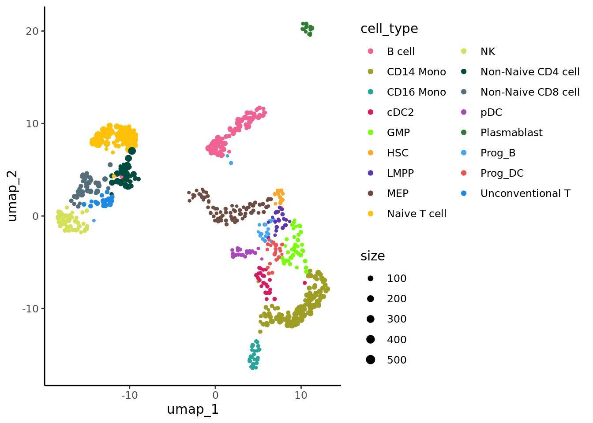
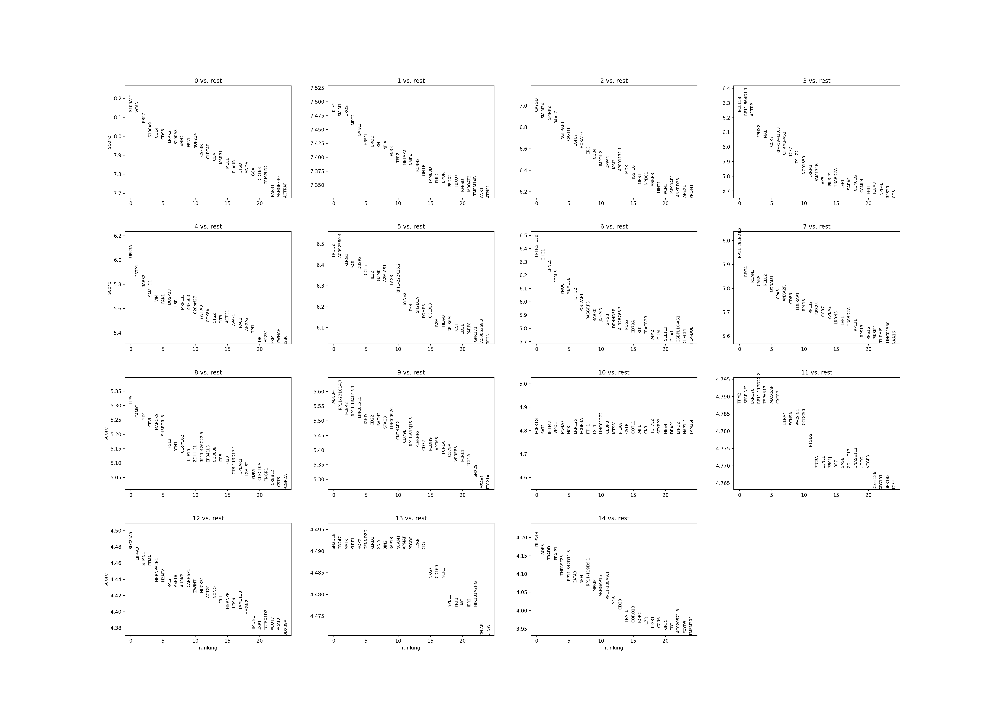
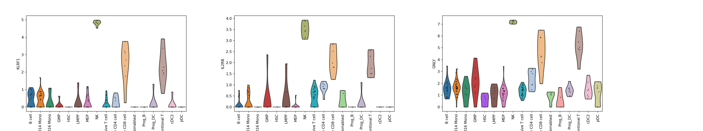
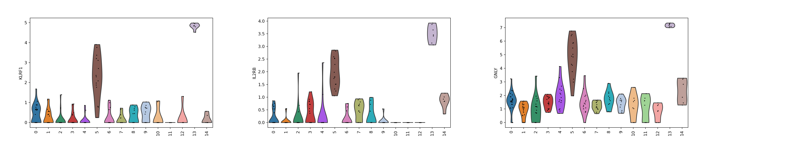
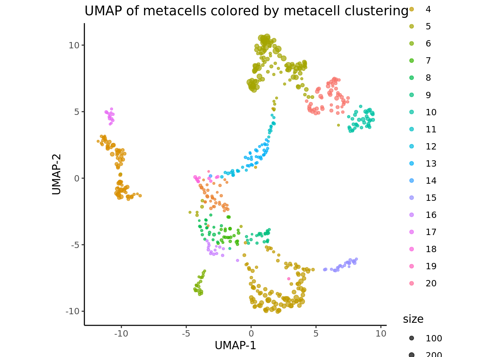

# Downstream analysis of metacells {#downstream-analysis}

In this chapter, we run standard and advanced downstream analyses on metacells instead of single-cell data. 
We will treat each metacell as a single cell, neglecting information about the size of the metacell (i.e., number of containing single cells). 
If you are interested in sample-weighted analysis, where metacell size is taken into account, see section \@ref(weighted-analysis).

## Standard analysis (R) {#standard-analysis-R}


[//]: # (Standard downstream analysis of metacells using R (Seurat))


In this tutorial, standard analyses include dimensionality reduction, clustering and differential expression using the [Seurat](https://satijalab.org/seurat/) framework.


```r
library(Seurat)
#> The legacy packages maptools, rgdal, and rgeos, underpinning this package
#> will retire shortly. Please refer to R-spatial evolution reports on
#> https://r-spatial.org/r/2023/05/15/evolution4.html for details.
#> This package is now running under evolution status 0
#> Attaching SeuratObject
# If you have Seurat V5 installed, specify that you want to analyze Seurat V4 objects
wilcox.test <- "wilcox"
if(packageVersion("Seurat") >= 5) {
  options(Seurat.object.assay.version = "v4") 
  wilcox.test <- "wilcox_limma"
  print("you are using seurat v5 with assay option v4")}
library(dplyr)
#> 
#> Attaching package: 'dplyr'
#> The following objects are masked from 'package:stats':
#> 
#>     filter, lag
#> The following objects are masked from 'package:base':
#> 
#>     intersect, setdiff, setequal, union
library(ggplot2)
```

### Load metacell Seurat object

We will use Seurat objects containing the metacells counts data and their annotation (*e.g.* cell-type annotation) and
proceed with standard Seurat downstream analyses.
Seurat objects containing metacells counts data and their annotation were generated at the end of sections \@ref(SuperCell-construction)
These objects can also be generated using the command line described in chapter \@ref(command-line)


```r
MC_tool = "SuperCell"
proj_name = "bmcite"
annotation_column = "celltype_simplified"

cell_types <- c("Unconventional T", "Naive T cell", "Non-Naive CD4 cell", "CD14 Mono", "B cell", "Non-Naive CD8 cell",
                "NK", "GMP", "CD16 Mono", "pDC", "cDC2", "Prog_B", "Plasmablast", "HSC", "LMPP", "Prog_DC", "MEP")

celltype_colors <- c("#1E88E5", "#FFC107", "#004D40", "#9E9D24",
                     "#F06292", "#546E7A", "#D4E157", "#76FF03", 
                     "#26A69A", "#AB47BC", "#D81B60", "#42A5F5",
                     "#2E7D32", "#FFA726", "#5E35B1", "#EF5350","#6D4C41")
names(celltype_colors) <- cell_types
MC.seurat = readRDS(paste0('./data/', proj_name, '/metacell_', MC_tool,'.rds'))
```


### Dimensionality reduction

As for single-cells, we normalize the raw counts (here aggregated raw counts) and we identify the most variable features in the metacells gene expression data.
Based on these features, we run PCA and use the first principal components to obtain a two dimensional representation of the data using UMAP.


```r
Idents(MC.seurat) <- annotation_column
MC.seurat <- NormalizeData(MC.seurat)
MC.seurat <- FindVariableFeatures(MC.seurat, selection.method = "vst", nfeatures = 2000)
MC.seurat <- ScaleData(MC.seurat)
#> Centering and scaling data matrix
MC.seurat <- RunPCA(MC.seurat, verbose = F)
MC.seurat <- RunUMAP(MC.seurat, dims = 1:30, verbose = F, min.dist = 1)
#> Warning: The default method for RunUMAP has changed from calling Python UMAP via reticulate to the R-native UWOT using the cosine metric
#> To use Python UMAP via reticulate, set umap.method to 'umap-learn' and metric to 'correlation'
#> This message will be shown once per session

data <- cbind(Embeddings(MC.seurat, reduction = "umap"),
              data.frame(size = MC.seurat$size,
                         cell_type = MC.seurat@meta.data[, annotation_column]))
colnames(data)[1:2] <- c("umap_1", "umap_2")
p_annot <- ggplot(data, aes(x= umap_1, y=umap_2, color = cell_type)) + geom_point(aes(size=size)) +
  ggplot2::scale_size_continuous(range = c(0.5,  0.5*max(log((data$size))))) +
   ggplot2::scale_color_manual(values = celltype_colors) +
  theme_classic() + guides(color=guide_legend(ncol=2))
p_annot
```



```r
#DimPlot(MC.seurat, reduction = "umap", cols = celltype_colors, pt.size = log1p(MC.seurat$size))
```

### Clustering

We cluster the metacells using Seurat clustering steps and visualize these clusters using UMAP:

```r
MC.seurat <- FindNeighbors(MC.seurat, reduction = "pca", dims = 1:30)
#> Computing nearest neighbor graph
#> Computing SNN
MC.seurat <- FindClusters(MC.seurat, resolution = 1)
#> Modularity Optimizer version 1.3.0 by Ludo Waltman and Nees Jan van Eck
#> 
#> Number of nodes: 613
#> Number of edges: 13076
#> 
#> Running Louvain algorithm...
#> Maximum modularity in 10 random starts: 0.8557
#> Number of communities: 13
#> Elapsed time: 0 seconds
data <- cbind(Embeddings(MC.seurat, reduction = "umap"),
              data.frame(size = MC.seurat$size,
                         cluster = MC.seurat$seurat_clusters))

colnames(data)[1:2] <- c("umap_1", "umap_2")
p_cluster <- ggplot(data, aes(x= umap_1, y=umap_2, color = cluster)) + geom_point(aes(size=size)) +
  ggplot2::scale_size_continuous(range = c(0.5, 0.5*max(log1p((data$size))))) +
  theme_classic() + guides(color=guide_legend(ncol=2))
p_cluster
```


### Differential expression analysis

We perform differential analysis to identify the markers of our cluster 8 as an example using the `FindMarkers` function. 
We see that known NK markers are part of the differentially expressed genes.

```r
# Set idents to metacell clusters
Idents(MC.seurat) <- "seurat_clusters"

cells_markers <- FindMarkers(MC.seurat, ident.1 = "8", only.pos = TRUE, logfc.threshold = 0.25, min.pct = 0.1, test.use = wilcox.test, pseudocount.use = 1)
nk_markers <- c("KLRF1", "PRF1", "IL2RB", "NKG7", "GNLY", "NCAM1")
cells_markers[nk_markers, ]
#>              p_val avg_log2FC pct.1 pct.2    p_val_adj
#> KLRF1 8.154407e-29  3.1480827 1.000 0.395 1.386983e-24
#> PRF1  3.710227e-29  2.8961725 1.000 0.360 6.310726e-25
#> IL2RB 1.988774e-29  1.8908169 0.972 0.315 3.382705e-25
#> NKG7  3.186981e-23  3.9829930 1.000 0.875 5.420736e-19
#> GNLY  9.632043e-24  4.8479611 1.000 0.891 1.638314e-19
#> NCAM1 1.612098e-61  0.5074414 0.889 0.057 2.742018e-57
```

Let's visualize some of these markers in the different clusters using vviolin plots:


```r
VlnPlot(MC.seurat, nk_markers, ncol = 3, pt.size = 0.0)
```


We can verify the identification of the NK cell cluster by comparing the metacell annotation and the metacell clustering.


```r
p_cluster + p_annot
```


### Visualize gene-gene correlation

We can use the `supercell_GeneGenePlot` function from the SuperCell package to visualize the correlation between marker genes of a cell-type:
(i) at the single-cell level and
(ii) at the metacell level.

For that, we load the single-cell data from which the metacells were derived from.

```r
print(proj_name)
#> [1] "bmcite"
sc_data <- readRDS(paste0("data/", proj_name, "/singlecell_seurat_filtered.rds"))
sc_data <- NormalizeData(sc_data, normalization.method = "LogNormalize")
```

We visualize gene-gene correlation at the single-cell level:

```r
cells_markers <- cells_markers[order(cells_markers$avg_log2FC, decreasing = T),]
gene_x <- nk_markers[1:3] 
gene_y <- nk_markers[4:6]

alpha <- 0.7

p.sc <- SuperCell::supercell_GeneGenePlot(
  GetAssayData(sc_data, slot = "data"),
  gene_x = gene_x,
  gene_y = gene_y,
  clusters = sc_data@meta.data[, annotation_column],
  sort.by.corr = F,
  alpha = alpha,
  color.use = celltype_colors
)
p.sc$p 
```


We visualize gene-gene correlation at the metacell level:

```r

p.MC <- SuperCell::supercell_GeneGenePlot(GetAssayData(MC.seurat, slot = "data"),
                                          gene_x = gene_x,
                                          gene_y = gene_y,
                                          clusters = MC.seurat@meta.data[, annotation_column],
                                          sort.by.corr = F, supercell_size = MC.seurat$size,
                                          alpha = alpha,
                                          color.use = celltype_colors)
p.MC$p 
```


## Standard analysis (Python) {#standard-analysis-Py}


[//]: # (Standard downstream analysis of metacells using Py (Scanpy))


In this section, standard analysis includes dimensionality reduction, clustering, differential expression etc using [Scanpy](https://scanpy-tutorials.readthedocs.io/en/latest/#) framework.


```python
import os
import numpy as np
import pandas as pd
import scanpy as sc
sc.settings.verbosity = 1 
```


```python
MC_tool = "SEACells"
proj_name = "bmcite"
annotation_column = "celltype_simplified"
adata = sc.read(os.path.join('./data', proj_name, f'metacell_{MC_tool}.h5ad'))
```

### Dimensionality reduction

```python
adata.var_names_make_unique()  # this is unnecessary if using `var_names='gene_ids'` in `sc.read_10x_mtx`

sc.pp.normalize_per_cell(adata)
sc.pp.log1p(adata)
sc.pp.highly_variable_genes(adata, n_top_genes=2000)

# Freeze the state of the AnnData object for later use in differential testing and visualizations of gene expression
adata.raw = adata # step needd only if I use regress_out steps

# Compute PCA (highly variable genes will be used)
sc.tl.pca(adata, svd_solver='arpack')

# Compute the neighbor graph
sc.pp.neighbors(adata, n_neighbors=15, n_pcs=30)
#> /opt/conda/envs/MetacellAnalysisToolkit/lib/python3.9/site-packages/umap/distances.py:1063: NumbaDeprecationWarning: The 'nopython' keyword argument was not supplied to the 'numba.jit' decorator. The implicit default value for this argument is currently False, but it will be changed to True in Numba 0.59.0. See https://numba.readthedocs.io/en/stable/reference/deprecation.html#deprecation-of-object-mode-fall-back-behaviour-when-using-jit for details.
#>   @numba.jit()
#> /opt/conda/envs/MetacellAnalysisToolkit/lib/python3.9/site-packages/umap/distances.py:1071: NumbaDeprecationWarning: The 'nopython' keyword argument was not supplied to the 'numba.jit' decorator. The implicit default value for this argument is currently False, but it will be changed to True in Numba 0.59.0. See https://numba.readthedocs.io/en/stable/reference/deprecation.html#deprecation-of-object-mode-fall-back-behaviour-when-using-jit for details.
#>   @numba.jit()
#> /opt/conda/envs/MetacellAnalysisToolkit/lib/python3.9/site-packages/umap/distances.py:1086: NumbaDeprecationWarning: The 'nopython' keyword argument was not supplied to the 'numba.jit' decorator. The implicit default value for this argument is currently False, but it will be changed to True in Numba 0.59.0. See https://numba.readthedocs.io/en/stable/reference/deprecation.html#deprecation-of-object-mode-fall-back-behaviour-when-using-jit for details.
#>   @numba.jit()
#> /opt/conda/envs/MetacellAnalysisToolkit/lib/python3.9/site-packages/umap/umap_.py:660: NumbaDeprecationWarning: The 'nopython' keyword argument was not supplied to the 'numba.jit' decorator. The implicit default value for this argument is currently False, but it will be changed to True in Numba 0.59.0. See https://numba.readthedocs.io/en/stable/reference/deprecation.html#deprecation-of-object-mode-fall-back-behaviour-when-using-jit for details.
#>   @numba.jit()

# Run umap
sc.tl.umap(adata)

# Plot metacells in the UMAP space
sc.pl.umap(adata, color=[annotation_column], size = 100)
#> /opt/conda/envs/MetacellAnalysisToolkit/lib/python3.9/site-packages/scanpy/plotting/_tools/scatterplots.py:392: UserWarning: No data for colormapping provided via 'c'. Parameters 'cmap' will be ignored
#>   cax = scatter(
```


### Clustering

Perform clustering on the metacell data.

```python
# run laiden graph-clustering
sc.tl.leiden(adata, neighbors_key = "neighbors", resolution = 2)

# plot the metacells in the UMAP space and color by cluster
sc.pl.umap(adata, color=['leiden'], size = 100)
#> /opt/conda/envs/MetacellAnalysisToolkit/lib/python3.9/site-packages/scanpy/plotting/_tools/scatterplots.py:392: UserWarning: No data for colormapping provided via 'c'. Parameters 'cmap' will be ignored
#>   cax = scatter(
```


### Differential expression analysis

Identify marker genes for each group of metacells. 
We visualize top markers for NK Tcells (cluster 6).

```python
# Identify marker genes
sc.tl.rank_genes_groups(adata, 'leiden', method='wilcoxon')
sc.pl.rank_genes_groups(adata, n_genes=25, sharey=False)
#> /opt/conda/envs/MetacellAnalysisToolkit/lib/python3.9/site-packages/scanpy/plotting/_tools/__init__.py:397: UserWarning: Attempting to set identical low and high ylims makes transformation singular; automatically expanding.
#>   ax.set_ylim(ymin, ymax)
```



```python

# Show the top marker genes
print(pd.DataFrame(adata.uns['rank_genes_groups']['names']).head(5))
#>          0      1        2  ...         12      13        14
#> 0  S100A12   KLF1    CRYGD  ...    SLC25A5  SH2D1B   TNFRSF4
#> 1     VCAN  SMIM1   SMIM24  ...     EIF4A3   CD247      AQP3
#> 2     RBP7   UROS   SPINK2  ...      STMN1    MATK     TRADD
#> 3   S100A9   MPC2    BAALC  ...       PTMA   KLRF1    PBXIP1
#> 4     CD14  GATA1  NGFRAP1  ...  HNRNPA2B1    HOPX  TNFRSF25
#> 
#> [5 rows x 15 columns]

# Visualize marker genes
sc.pl.violin(adata, ['KLRF1', 'IL2RB', 'GNLY'], groupby=annotation_column, size = 2, rotation = 90)
```



```python
sc.pl.violin(adata, ['KLRF1', 'IL2RB', 'GNLY'], groupby='leiden', size = 2, rotation = 90)
```




## Sample-weighted analysis {#weighted-analysis}


[//]: # (Weighted downstream analysis of metacells using R (Seurat))


```r
library(Seurat)
# If you have Seurat V5 installed, specify that you want to analyze Seurat V4 objects
if(packageVersion("Seurat") >= 5) {options(Seurat.object.assay.version = "v4"); print("you are using seurat v5 with assay option v4")}
library(dplyr)
library(ggplot2)
library(SuperCell)
```

### Load metacell Seurat object

We will use Seurat objects containing the metacells counts data and their annotation (*e.g.* and cell-type annotation) and
proceed with downstream analyses considering the size of each metacells.
Seurat objects containing metacells counts data and their annotation were generated at the end of sections \@ref(SuperCell-construction)
These objects can also be generated using the command line described in chapter \@ref(command-line)


```r
MC_tool = "SuperCell"
proj_name = "bmcite"
annotation_column = "celltype_simplified"

cell_types <- c("Unconventional T", "Naive T cell", "Non-Naive CD4 cell", "CD14 Mono", "B cell", "Non-Naive CD8 cell",
                "NK", "GMP", "CD16 Mono", "pDC", "cDC2", "Prog_B", "Plasmablast", "HSC", "LMPP", "Prog_DC", "MEP")

celltype_colors <- c("#1E88E5", "#FFC107", "#004D40", "#9E9D24",
                     "#F06292", "#546E7A", "#D4E157", "#76FF03", 
                     "#26A69A", "#AB47BC", "#D81B60", "#42A5F5",
                     "#2E7D32", "#FFA726", "#5E35B1", "#EF5350","#6D4C41")
names(celltype_colors) <-cell_types
MC.seurat = readRDS(paste0('./data/', proj_name, '/metacell_', MC_tool,'.rds'))
```


### Dimensionality reduction

As for single-cells, we normalize the raw counts (here aggregated raw counts) and we identify the most variable features in the metacells gene expression data.
Based on these features, we run a sample weighted PCA using the function `supercell_prcomp` from the SuperCell R package
and use the first principal components to obtain a two dimensionnal representation of the data using UMAP.
Using the `supercell_DimPlot` function from the the SuperCell R package we can visualize the metacells and their sized in UMAP space.


```r
MC.seurat <- NormalizeData(MC.seurat, normalization.method = "LogNormalize")
MC.seurat <- FindVariableFeatures(MC.seurat)

MC_list <- list(N.SC = ncol(MC.seurat),
                supercell_size = MC.seurat$size)
MC_list$PCA <- SuperCell::supercell_prcomp(
  Matrix::t(GetAssayData(MC.seurat, slot = "data")),
  genes.use = VariableFeatures(MC.seurat),  # or a new set of HVG can be computed
  supercell_size = MC_list$supercell_size, # provide this parameter to run sample-weighted version of PCA,
  k = 30
)

MC_list$UMAP <- supercell_UMAP(
  SC = MC_list,
  PCA_name = "PCA",
  n.comp = 30, n_neighbors = 15, min_dist=0.5
)

supercell_DimPlot(SC = MC_list,
  groups = MC.seurat@meta.data[, annotation_column],
  dim.name = "UMAP",
  title = paste0("UMAP of metacells colored by cell type assignment"), color.use = celltype_colors
) 
```


### Clustering

We cluster the metacells using the function `supercell_cluster` from SuperCell R package to perform the clustering step and visualize these clusters in the UMAP space:

```r
# compute distance among metacells
D  <- dist(MC_list$PCA$x)

# cluster metacells
MC_list$SCclustering  <- supercell_cluster(D = D, k = 20, supercell_size = MC_list$supercell_size)
MC.seurat$SCclustering <- MC_list$SCclustering$clustering

# Plot clustering result
supercell_DimPlot(
  MC_list,
  groups = factor(MC_list$SCclustering$clustering),
  dim.name = "UMAP",
  title = paste0("UMAP of metacells colored by metacell clustering")
) 
```



### Differential expression analysis

We perform diffrential analysis to identify the markers of our clusters using the `supercell_FindAllMarkers` function from the SuperCell package.

```r
# Compute upregulated genes in each cell line (versus other cells)
MC.all.markers <- supercell_FindAllMarkers(
  ge = GetAssayData(MC.seurat, slot = "data"),
  clusters = MC_list$SCclustering$clustering,
  supercell_size = MC_list$supercell_size,
  only.pos = TRUE,
  min.pct = 0,
  logfc.threshold = 0.2
)
```

We select the markers for cluster 10:

```r
cluster_markers <- MC.all.markers[[10]]
MC.top.markers <- cluster_markers[order(cluster_markers$logFC, decreasing = T),]
head(MC.top.markers)
#>       p.value adj.p.value pct.1     pct.2    logFC w.mean.1   w.mean.2
#> GNLY        0           0     1 0.9741092 3.484511 4.638771 0.52164265
#> NKG7        0           0     1 0.9633099 2.901688 4.043199 0.50527916
#> GZMB        0           0     1 0.7012332 2.561807 2.825672 0.14386314
#> KLRF1       0           0     1 0.6096614 2.241533 2.358953 0.08974488
#> KLRD1       0           0     1 0.6235607 2.209200 2.513078 0.16453203
#> CST7        0           0     1 0.7604756 2.122370 2.736890 0.29031145
```

We visualize the top 5 markers for the cluster 10 and see that the top marker genes for this cluster contain marker genes of natural killer cells such as GZMB and GNLY.

```r
Idents(MC.seurat) <- "SCclustering"
genes.to.plot <- rownames(MC.top.markers)[1:5]
VlnPlot(MC.seurat, features = genes.to.plot, ncol = 5, pt.size = 0.0)  
#> Warning: Groups with fewer than two data points have been dropped.
#> Groups with fewer than two data points have been dropped.
#> Groups with fewer than two data points have been dropped.
#> Groups with fewer than two data points have been dropped.
#> Groups with fewer than two data points have been dropped.
#> Groups with fewer than two data points have been dropped.
#> Groups with fewer than two data points have been dropped.
#> Groups with fewer than two data points have been dropped.
#> Groups with fewer than two data points have been dropped.
#> Groups with fewer than two data points have been dropped.
#> Groups with fewer than two data points have been dropped.
#> Groups with fewer than two data points have been dropped.
#> Groups with fewer than two data points have been dropped.
#> Groups with fewer than two data points have been dropped.
#> Groups with fewer than two data points have been dropped.
```


