# Metacell Analysis Toolkit (MATK) {#command-line}

We provide a command line tool allowing users to build metacells using either tool (MC2, SuperCell or SEACells) from a provided dataset.
The command line tool takes multiple parameters as input, *e.g.,* number of neighbors considered in the knn, number of components used, graining level.
which is for example required in a benchmark setting.

We will use this toolkit to analyse differentiating hematopoietic stem cells (Human CD34+).
Note that we retrieved the RNA data from a 10X multiome experiment but we won't analyse the ATAC modality. 
To retrieve this data, please refer to section \@ref(CD34-data).


## Setting up the environment
Please skip this step if you did not use conda in the requirements section.

```r
library(reticulate)
conda_env <-  conda_list()[reticulate::conda_list()$name == "MetacellAnalysisToolkit","python"]

Sys.setenv(RETICULATE_PYTHON = conda_env)
```


```r
library(SuperCell)
library(Seurat)
#> The legacy packages maptools, rgdal, and rgeos, underpinning this package
#> will retire shortly. Please refer to R-spatial evolution reports on
#> https://r-spatial.org/r/2023/05/15/evolution4.html for details.
#> This package is now running under evolution status 0
#> Attaching SeuratObject
# If you have Seurat V5 installed, specify that you want to analyze Seurat V4 objects
if(packageVersion("Seurat") >= 5) {options(Seurat.object.assay.version = "v4"); print("you are using seurat v5 with assay option v4")}
library(anndata)
library(MetacellAnalysisToolkit)
library(ggplot2)
```
## Metacell building{#MC-continuous}
Here we will use the MATK bash command line to build the metacells with MetaCell2 and SuperCell. 
To call the MATK command line, please define your path to the gihub cloned repository optained from this [github repository](https://github.com/GfellerLab/MetacellToolkit).

### Building metacell with MetaCell2 (MC2)
We use MetaCell2 (`-t MetaCell`) to identify metacells at a gamma of 50 (`-g 50`). We specify that we want a Seurat .rds object in ouput (`-s seurat`).

```bash
#git clone https://github.com/GfellerLab/MetacellAnalysisToolkit
MATK_path=MetacellAnalysisToolkit/
${MATK_path}/cli/MATK -t MetaCell -i data/CD34/cd34_multiome_rna.h5ad -o data/CD34/MC2/ -g 50 -s seurat
#> MetaCell
#> data/CD34/cd34_multiome_rna.h5ad
#> Identifying metacells...
#> /opt/conda/envs/MetacellAnalysisToolkit/lib/python3.9/site-packages/umap/distances.py:1063: NumbaDeprecationWarning: The 'nopython' keyword argument was not supplied to the 'numba.jit' decorator. The implicit default value for this argument is currently False, but it will be changed to True in Numba 0.59.0. See https://numba.readthedocs.io/en/stable/reference/deprecation.html#deprecation-of-object-mode-fall-back-behaviour-when-using-jit for details.
#>   @numba.jit()
#> /opt/conda/envs/MetacellAnalysisToolkit/lib/python3.9/site-packages/umap/distances.py:1071: NumbaDeprecationWarning: The 'nopython' keyword argument was not supplied to the 'numba.jit' decorator. The implicit default value for this argument is currently False, but it will be changed to True in Numba 0.59.0. See https://numba.readthedocs.io/en/stable/reference/deprecation.html#deprecation-of-object-mode-fall-back-behaviour-when-using-jit for details.
#>   @numba.jit()
#> /opt/conda/envs/MetacellAnalysisToolkit/lib/python3.9/site-packages/umap/distances.py:1086: NumbaDeprecationWarning: The 'nopython' keyword argument was not supplied to the 'numba.jit' decorator. The implicit default value for this argument is currently False, but it will be changed to True in Numba 0.59.0. See https://numba.readthedocs.io/en/stable/reference/deprecation.html#deprecation-of-object-mode-fall-back-behaviour-when-using-jit for details.
#>   @numba.jit()
#> /opt/conda/envs/MetacellAnalysisToolkit/lib/python3.9/site-packages/umap/umap_.py:660: NumbaDeprecationWarning: The 'nopython' keyword argument was not supplied to the 'numba.jit' decorator. The implicit default value for this argument is currently False, but it will be changed to True in Numba 0.59.0. See https://numba.readthedocs.io/en/stable/reference/deprecation.html#deprecation-of-object-mode-fall-back-behaviour-when-using-jit for details.
#>   @numba.jit()
#> set metacells.var[bursty_lonely_gene]: 0 true (0%) out of 12464 bools
#> set metacells.var[properly_sampled_gene]: 12464 true (100%) out of 12464 bools
#> set metacells.var[excluded_gene]: 2 true (0.01605%) out of 12464 bools
#> set metacells.obs[properly_sampled_cell]: 6881 true (100%) out of 6881 bools
#> set metacells.obs[excluded_cell]: 0 true (0%) out of 6881 bools
#> set hca_bm.one-pass.clean.obs[full_cell_index]: 6881 int32s
#> set hca_bm.one-pass.clean.var[full_gene_index]: 12462 int32s
#> set hca_bm.one-pass.clean.var[lateral_gene]: 215 true (1.725%) out of 12462 bools
#> set hca_bm.one-pass.clean.var[noisy_gene]: 14 true (0.1123%) out of 12462 bools
#> set hca_bm.one-pass.clean.var[selected_gene]: * -> False
#> set hca_bm.one-pass.clean.var[rare_gene]: 0 true (0%) out of 12462 bools
#> set hca_bm.one-pass.clean.var[rare_gene_module]: 12462 int32 elements with all outliers (100%)
#> set hca_bm.one-pass.clean.obs[cells_rare_gene_module]: 6881 int32 elements with all outliers (100%)
#> set hca_bm.one-pass.clean.obs[rare_cell]: 0 true (0%) out of 6881 bools
#> set hca_bm.one-pass.clean.var[selected_gene]: 1275 true (10.23%) out of 12462 bools
#> set hca_bm.one-pass.clean.obs[metacell]: 6881 int32s
#> set hca_bm.one-pass.clean.obs[dissolved]: 0 true (0%) out of 6881 bools
#> set hca_bm.one-pass.clean.obs[metacell_level]: 6881 int32s
#> input is " data/CD34/cd34_multiome_rna.h5ad
#> Output dir is " data/CD34/MC2/
#> gamma is " 50.0
#> Pre filter cells is False
#> Clean: 6881 cells, 12462 genes
#> Identify137.62metacells using MetaCell2
#> set metacells.obs[grouped]: 140 int64s
#> set metacells.obs[total_umis]: 140 float64s
#> set metacells.layers[total_umis]: ndarray 140 X 12462 float32s
#> set metacells.obs[__zeros_downsample_umis]: 140 int64s
#> set metacells.layers[zeros]: ndarray 140 X 12462 int32s
#> set hca_bm.one-pass.clean.obs[metacell_name]: 6881 <U8s
#> set metacells.var[highly_variable]: 2499 true (20.05%) out of 12462 bools
#> set metacells.var[bursty_lonely_gene]: 0 true (0%) out of 12462 bools
#> set metacells.var[properly_sampled_gene]: 12462 true (100%) out of 12462 bools
#> set metacells.var[excluded_gene]: 0 true (0%) out of 12462 bools
#> set metacells.var[full_gene_index]: 12462 int32s
#> set metacells.var[lateral_gene]: 215 true (1.725%) out of 12462 bools
#> set metacells.var[noisy_gene]: 14 true (0.1123%) out of 12462 bools
#> set metacells.var[selected_gene]: 1275 true (10.23%) out of 12462 bools
#> set metacells.var[rare_gene]: 0 true (0%) out of 12462 bools
#> set metacells.var[rare_gene_module]: 12462 int32s
#> set metacells.obs[metacells_rare_gene_module]: 140 int32s
#> set metacells.obs[rare_metacell]: 0 true (0%) out of 140 bools
#> set metacells.uns[outliers]: 4
#> set metacells.uns[metacells_algorithm]: metacells.0.9.0
#> Assign metadata to metacells and compute purities...
#> Save results as seurat...
#> 
#>     WARNING: The R package "reticulate" only fixed recently
#>     an issue that caused a segfault when used with rpy2:
#>     https://github.com/rstudio/reticulate/pull/1188
#>     Make sure that you use a version of that package that includes
#>     the fix.
#>     Done.
```

### Building metacell with SuperCell
We use SuperCell (`-t SuperCell`) to identify metacells at a gamma of 50 (`-g 50`). We specify that we want a Seurat .rds object in ouput (`-s seurat`).
We use 2000 highly variable genes (HVGs, `-f 2000`) to compute a PCA from which we use 50 components (`-n 50`) to make a k = 30 knn (`-k 30`) graph on which we identify the metacells.

```bash
MATK_path=MetacellAnalysisToolkit/
${MATK_path}/cli/MATK -t SuperCell -i data/CD34/cd34_multiome_rna.h5ad -o data/CD34/SuperCell/ -f 2000 -g 50 -n 50 -k 30 -s seurat
#> SuperCell
#> data/CD34/cd34_multiome_rna.h5ad
#> Identifying metacells...
#> The legacy packages maptools, rgdal, and rgeos, underpinning this package
#> will retire shortly. Please refer to R-spatial evolution reports on
#> https://r-spatial.org/r/2023/05/15/evolution4.html for details.
#> This package is now running under evolution status 0 
#> Attaching SeuratObject
#> $ARGS
#> character(0)
#> 
#> $input
#> [1] "data/CD34/cd34_multiome_rna.h5ad"
#> 
#> $outdir
#> [1] "data/CD34/SuperCell/"
#> 
#> $nPCs
#> [1] 50
#> 
#> $nFeatures
#> [1] 2000
#> 
#> $gamma
#> [1] 50
#> 
#> $output
#> [1] "seurat"
#> 
#> $k.knn
#> [1] 30
#> 
#> $isNorm
#> [1] FALSE
#> 
#> $cores
#> [1] 1
#> 
#> Error in python_config_impl(python) : 
#>   Error running '/users/agabrie4/.virtualenvs/r-reticulate/bin/python': No such file.
#> The Python installation used to create the virtualenv has been moved or removed:
#>   '/usr/bin'
#>            used  (Mb) gc trigger  (Mb) max used  (Mb)
#> Ncells  3026514 161.7    4680197 250.0  4680197 250.0
#> Vcells 33595099 256.4  112485812 858.2 91298259 696.6
#> Normalize data...Identify Metacells...
#> Identify 138 metacells using SuperCell...
#> 
#> Assign metadata to metacells and compute purities...
#> Done.
```

## Short downstream analysis of the metacells

### MetaCell2 metacells
We load the object obtained with MATK

```r
cd34.metacell <- readRDS("data/CD34/MC2/mc_Seurat.rds")
cd34.metacell
#> An object of class Seurat 
#> 12462 features across 140 samples within 1 assay 
#> Active assay: RNA (12462 features, 0 variable features)
```
We Normalize the metacells data, identify the HVGs, and we make a classical dimensionality reduction (first a PCA and then vizualisation with a UMAP).

```r
cd34.metacell <- NormalizeData(cd34.metacell)
cd34.metacell <- FindVariableFeatures(cd34.metacell)
cd34.metacell <- ScaleData(cd34.metacell)
#> Centering and scaling data matrix
cd34.metacell <- RunPCA(cd34.metacell)
#> PC_ 1 
#> Positive:  NUP210, MIS18BP1, LCP1, IQGAP1, P4HB, SLC2A4RG, COLGALT1, GRB2, ARHGEF18, BRI3BP 
#> 	   RBL1, AGTPBP1, GGA2, TTC7A, PTPRE, IL17RA, CLEC12A, SLC4A7, CEP128, ARHGAP26 
#> 	   LINC01572, UVRAG, LCORL, LRP8, MAP3K1, PDE3B, UBE2E2, GEN1, NSD2, SND1 
#> Negative:  RPL34, MEIS1, NKAIN2, CHRM3, LAPTM4B, RPL11, ANGPT1, PRKG1, INPP4B, NRIP1 
#> 	   RPS2, PDZD2, CRHBP, GPC5, NPR3, PRKG2, ITGA9, CASC15, BEX2, ST8SIA6 
#> 	   YES1, DAPK1, ITGA9-AS1, MSI2, MED12L, NFATC2, HMGA2, RPS18, SLC8A3, CHRM3-AS2 
#> PC_ 2 
#> Positive:  TFR2, GATA1, UROD, KLF1, DNPH1, ANK1, TIMM13, PRDX2, XACT, ADAMTS3 
#> 	   MYC, EPOR, RYR3, TMEM14C, PLIN2, CNRIP1, KEL, CSF1, PTH2R, CYTOR 
#> 	   MPST, P2RX5, SPTBN2, ELOVL6, SLC40A1, CXADR, SLC39A3, ZFPM1, NMNAT3, FADS2 
#> Negative:  AKAP13, VIM, CD74, PRKCB, STK17B, CYTH1, HLA-DQB1, DOCK10, SBF2, RASSF2 
#> 	   PRKCE, TSC22D3, PLCB1, CD44, ANKRD44, DST, HDAC9, PDE4B, HLA-DRA, TCF4 
#> 	   CALCRL, IDS, TGFBR2, SLCO3A1, POU2F2, AKNA, NEGR1, YPEL5, FYN, COL24A1 
#> PC_ 3 
#> Positive:  MYL12A, CARD11, PLP2, CCDC69, LGMN, CTSB, CST3, ARL4C, LIME1, PCED1B 
#> 	   CYTH4, CDKN2D, IQSEC1, RNASE6, IGFLR1, CYB561A3, NCF1, PCED1B-AS1, SPIB, FAM160A1 
#> 	   CCDC50, MPEG1, RUBCNL, CYBB, GABARAP, LY96, UGCG, TGFBI, IGF2R, HLA-DMA 
#> Negative:  ANKRD28, LRMDA, EREG, SNHG25, IRAK3, FNDC3B, PCBP3, CSF3R, RAB44, AZU1 
#> 	   GPI, MTUS2, SLC22A15, SLC22A4, DENND3, ATP8B4, ELANE, ERLIN1, MARC1, TENT5A 
#> 	   SLC36A4, DSTYK, IL1RAP, RFX8, MS4A3, MFSD10, PKP2, CEP170, RAB27A, HGF 
#> PC_ 4 
#> Positive:  EVI5, TET2, CPQ, FCGRT, SRGN, DENND4A, THEMIS2, RNH1, SUCLG2, PIP5K1B 
#> 	   NR4A2, S100A6, FAM102B, CD4, FGD4, EMP3, CPPED1, EHBP1L1, NID1, AOAH 
#> 	   ARHGEF12, PHTF1, GRASP, ZNF385A, PRKCA, RIPOR3, PRKAR2B, SAT1, CHD7, KCNQ1 
#> Negative:  SMIM24, IGLL1, PHGDH, SPARC, LGALS3BP, ITM2C, MZB1, CD69, IGFBP7, SPINK2 
#> 	   LAT2, TMIGD2, C1QTNF4, RPLP1, DOCK1, GYPC, ARMH1, CDK6, ADA, SDK2 
#> 	   FLT3, PIK3R1, BAALC, PLCB1, SATB1, LRRC26, ARHGAP25, CYFIP2, LNCAROD, PROM1 
#> PC_ 5 
#> Positive:  CIT, C21orf58, NUF2, KIF15, SPC25, DIAPH3, SMC4, NDC80, CDCA5, RRM2 
#> 	   ESCO2, CDC25C, DEPDC1B, RTKN2, HIST1H4C, MELK, MFGE8, SKA3, KIF20B, NUSAP1 
#> 	   NCAPG, ESPL1, EXO1, TACC3, RRM1, NCAPG2, PLK4, E2F8, KIF11, CDK1 
#> Negative:  SOX4, ACTG1, MIR181A1HG, LINC00173, MED13L, IGFBP7, IL2RG, HCST, SLC43A2, SATB1 
#> 	   ABHD17B, ARPP21, TMSB10, TRPM2, LAT2, DNTT, SLC45A3, MYO1G, S100Z, SMAD7 
#> 	   REEP5, RPLP1, LINC01934, TNFRSF21, RBMS3, WDR66, MZB1, COBL, CDK6, MOB1B
cd34.metacell <- RunUMAP(cd34.metacell,dims = c(1:50), min.dist = 0.5)
#> Warning: The default method for RunUMAP has changed from calling Python UMAP via reticulate to the R-native UWOT using the cosine metric
#> To use Python UMAP via reticulate, set umap.method to 'umap-learn' and metric to 'correlation'
#> This message will be shown once per session
#> 07:51:44 UMAP embedding parameters a = 0.583 b = 1.334
#> 07:51:44 Read 140 rows and found 50 numeric columns
#> 07:51:44 Using Annoy for neighbor search, n_neighbors = 30
#> 07:51:44 Building Annoy index with metric = cosine, n_trees = 50
#> 0%   10   20   30   40   50   60   70   80   90   100%
#> [----|----|----|----|----|----|----|----|----|----|
#> **************************************************|
#> 07:51:44 Writing NN index file to temp file /tmp/36275017/RtmpyibE7N/file219b337e833124
#> 07:51:44 Searching Annoy index using 1 thread, search_k = 3000
#> 07:51:44 Annoy recall = 100%
#> 07:51:44 Commencing smooth kNN distance calibration using 1 thread with target n_neighbors = 30
#> 07:51:45 Initializing from normalized Laplacian + noise (using irlba)
#> 07:51:45 Commencing optimization for 500 epochs, with 4956 positive edges
#> 07:51:45 Optimization finished
```

Plot the results using Seurat.

```r
umap.metacell <- UMAPPlot(cd34.metacell,group.by = "celltype",label = T)
umap.metacell
```


We correctly retrieve the two main differentiation path of CD34+ cells.
In one hand, Megakaryocyte Erythrocyte Progenitor (MEP) fate with GATA2 and then GATA1 transcription factor expression.
On the other, Lymphoid Myeloid Multipotent Progenitor (LMPP) fate with SPI1 transcription factor expression.


```r
genes <- c("CD34","GATA2","GATA1","SPI1")
marker.metacell.umaps <- lapply(genes, FUN = function(x){
  plot <- FeaturePlot(cd34.metacell, features = x)
  }
)
marker.metacell.umaps
#> [[1]]
```

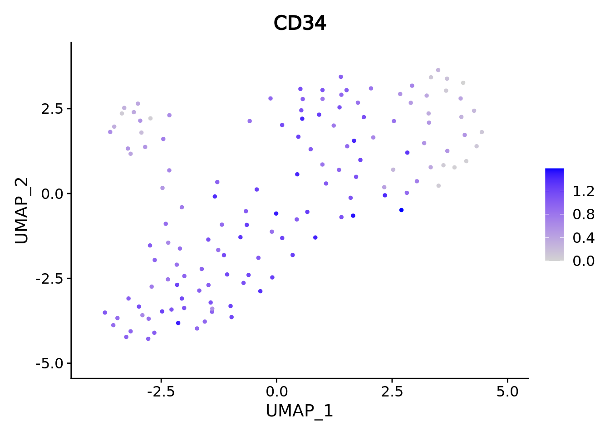

```
#> 
#> [[2]]
```


```
#> 
#> [[3]]
```

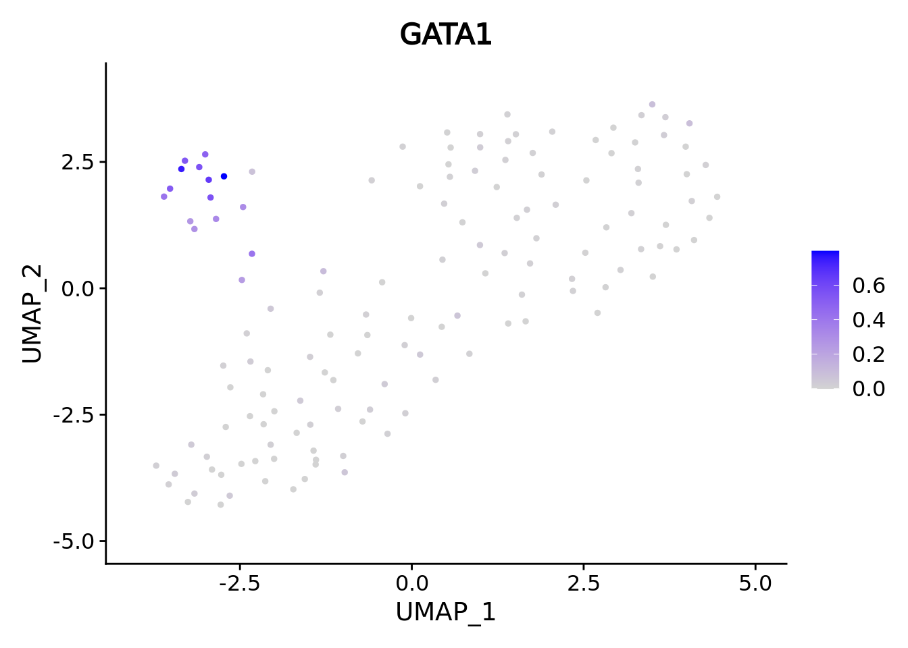

```
#> 
#> [[4]]
```


When analyzing metacells it's a good idea to plot their size on these. We can do it with ggplot.

```r
data <- cbind(umap.metacell$data, cd34.metacell$size)
colnames(data)[1:2] <- c("umap_1", "umap_2")
colnames(data)[length(colnames(data))] <- "size"
ggplot(data,aes(x = umap_1, y = umap_2, color = celltype)) + geom_point(aes(size=size)) + theme_classic()
```

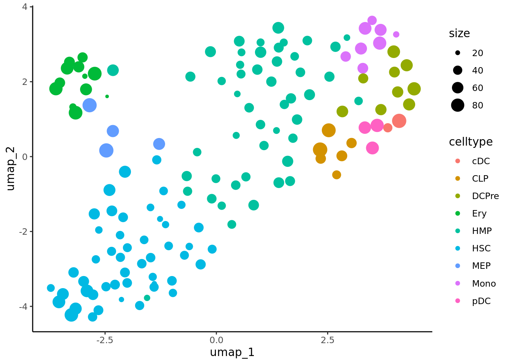

```r
lapply(marker.metacell.umaps,FUN = function(x){
  data <- cbind(x$data,cd34.metacell$size)
  colnames(data)[1:2] <- c("umap_1", "umap_2")
  colnames(data)[length(colnames(data))] <- "size"
  gene <- colnames(data)[length(colnames(data))-1]
  ggplot(data,aes(x = umap_1, y = umap_2, size=size, colour = .data[[gene]])) + geom_point() + 
    scale_color_gradientn(colors =  c("lightgrey", "blue"), 
                          guide = "colorbar")  +
  theme_classic() + ggtitle(gene)
} )
#> [[1]]
```


```
#> 
#> [[2]]
```

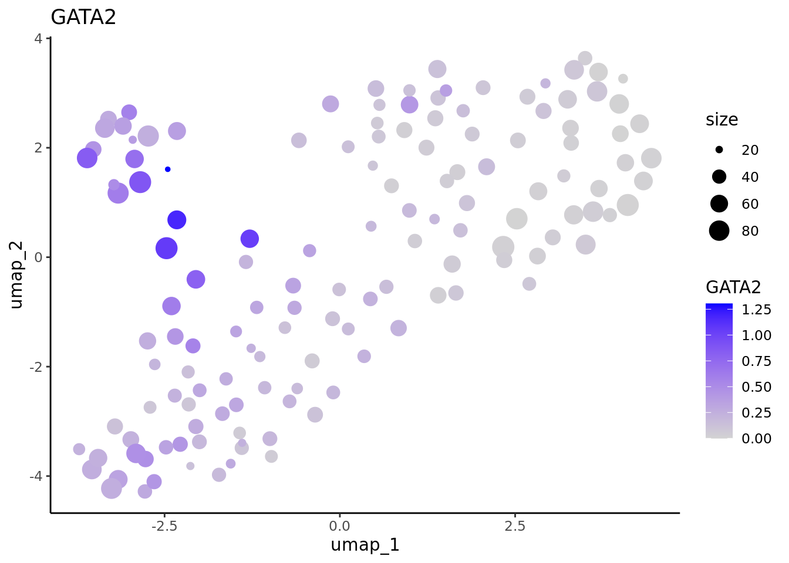

```
#> 
#> [[3]]
```

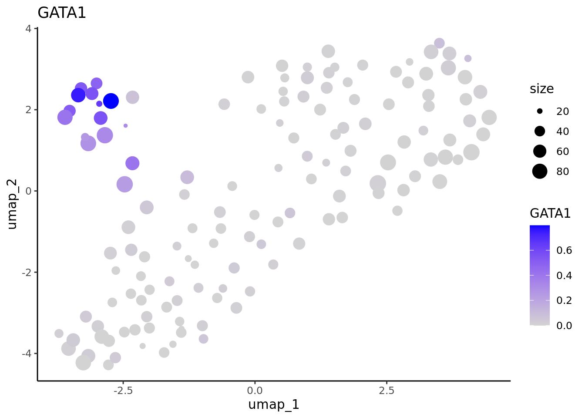

```
#> 
#> [[4]]
```


### SuperCell metacells

We can do the same with the metacells obtained with SuperCell

We load the object obtained with MATK

```r
cd34.supercell <- readRDS("data/CD34/SuperCell/mc_Seurat.rds")
cd34.supercell
#> An object of class Seurat 
#> 12464 features across 138 samples within 1 assay 
#> Active assay: RNA (12464 features, 0 variable features)
```
We Normalize the supercells data, identify the HVGs, and we make a classical dimensionality reduction (first a PCA and then vizualisation with a UMAP).

```r
cd34.supercell <- NormalizeData(cd34.supercell)
cd34.supercell <- FindVariableFeatures(cd34.supercell)
cd34.supercell <- ScaleData(cd34.supercell)
#> Centering and scaling data matrix
cd34.supercell <- RunPCA(cd34.supercell)
#> PC_ 1 
#> Positive:  TST, NECTIN1, PCLAF, BLVRB, CD36, S100A6, CCDC26, PPP1R14A, PMP22, ANK1 
#> 	   ECE1, KLF1, KEL, PLIN2, KCNH2, ADAMTS3, EPOR, CKS1B, HBD, CSF1 
#> 	   PRKAR2B, HES6, GATA1, H2AFX, CXADR, APOC1, CENPM, TFR2, APOE, CSF2RB 
#> Negative:  PRKCH, MIR99AHG, RBPMS, CD109, LINC01122, CRHBP, FAM169A, SCML4, ADGRG6, GUCY1A1 
#> 	   ABLIM1, NRIP1, MEIS1, SGCZ, NBEA, TMEM163, RORA, MAGI2, PRDM16, ROBO4 
#> 	   FGD5, RABGAP1, RNF220, L3MBTL4, ITGA9, SPTBN1, PTPRM, PROM1, MPPED2, IL12RB2 
#> PC_ 2 
#> Positive:  PRKCE, GAS7, SPNS3, HDAC9, AFF3, CRYBG1, CYTH1, NEGR1, RUNX2, LRRFIP1 
#> 	   MAP3K8, PDE4B, RASGEF1B, RAB11FIP1, FLT3, PRAG1, FAM107B, ITGAL, TIMP2, SDK2 
#> 	   HLA-DMB, PLD4, IRF8, APP, LGALS1, AHNAK, ARL4C, PAG1, ZFP36, TSPOAP1 
#> Negative:  STON2, TAL1, ZNF385D, MYH10, ALDH1A1, VPS37B, CDC42BPA, SLC40A1, DNAJC6, ST8SIA6 
#> 	   CYTL1, UROD, PHTF1, TNIK, ABO, NFIA, PIP5K1B, PDZD2, SORBS1, ZNF385D-AS2 
#> 	   TRIM58, ICAM4, XACT, ZFPM1, GATA1, HNRNPLL, ARHGEF12, TFR2, RYR3, MINPP1 
#> PC_ 3 
#> Positive:  EXT1, RGS1, CARD11, MAPRE2, P2RY14, TMEM59, LGMN, JCHAIN, CCND3, SETBP1 
#> 	   CYTH4, CD37, IGF2R, ITM2B, HLA-DMA, ADAM19, LIME1, IL18R1, PMEPA1, HLA-DRA 
#> 	   UGCG, HLA-DPA1, RASD1, LINC01226, SLC9A7, CDKN2D, HLA-DPB1, SPIB, FAM160A1, TSBP1 
#> Negative:  FNDC3B, RAB44, SLC22A4, AZU1, PLPPR3, RFX8, PLD1, RAB27A, LRMDA, ELANE 
#> 	   PCBP3, HGF, CST7, NT5DC3, C16orf74, CTSG, MTUS2, SLC22A15, YBX3, CFD 
#> 	   MPO, IL1RAP, MS4A3, SLC1A3, AFF2, PRTN3, LYST, NR6A1, IGFBP2, CSF3R 
#> PC_ 4 
#> Positive:  IGLL1, PHGDH, LGALS3BP, TSPAN7, SMIM24, PTPRD, NDC80, SKA3, MXD3, BAALC 
#> 	   SPC25, SPARC, CDKN3, FANCD2, KIF2C, FBXO43, ESCO2, RAD51AP1, CDCA5, CDK1 
#> 	   PRDX1, ARHGAP11B, ITGA6, DEPDC1B, MYLK, BAALC-AS1, TPX2, MREG, MYO5C, SPC24 
#> Negative:  KCNQ1, OSCAR, GRASP, ADAM8, ADAP1, FCGRT, FGD4, KDM7A, CTSH, CD86 
#> 	   NR4A2, CD4, ENTPD1, LYZ, VDR, NAMPT, HCK, CSTA, ITGAX, PER1 
#> 	   GABARAPL1, MNDA, FAM102B, CFP, ZNF503, TNFAIP2, PPARD, LRP1, NLRP12, RETN 
#> PC_ 5 
#> Positive:  DNTT, LINC00426, GABPB1-AS1, SCN3A, VPREB1, LTB, LINC01237, ARPP21, MME, PCAT14 
#> 	   CD79A, CD96, ERGIC1, CYGB, IL7R, EBF1, LINC00173, CD79B, LINC01934, UMODL1 
#> 	   SCAI, ATP1A3, LGALS3BP, C5orf56, RETREG1, SLC43A2, SIDT1, LINC01375, SPON1, COBL 
#> Negative:  AURKB, TOP2A, DEPDC1B, UBE2C, CDCA3, CKAP2L, ASPM, NUSAP1, KIF4A, KIF14 
#> 	   KIFC1, PRC1, GTSE1, CIT, KIF18B, NUF2, CDK1, KIF15, KIF11, FOXM1 
#> 	   BIRC5, CCNA2, CDC25C, MKI67, TUBB4B, CDCA8, TPX2, CENPE, KIF23, CDCA2
cd34.supercell <- RunUMAP(cd34.supercell,dims = c(1:50),min.dist = 0.5)
#> 07:51:51 UMAP embedding parameters a = 0.583 b = 1.334
#> 07:51:51 Read 138 rows and found 50 numeric columns
#> 07:51:51 Using Annoy for neighbor search, n_neighbors = 30
#> 07:51:51 Building Annoy index with metric = cosine, n_trees = 50
#> 0%   10   20   30   40   50   60   70   80   90   100%
#> [----|----|----|----|----|----|----|----|----|----|
#> **************************************************|
#> 07:51:51 Writing NN index file to temp file /tmp/36275017/RtmpyibE7N/file219b335a3dc8fc
#> 07:51:51 Searching Annoy index using 1 thread, search_k = 3000
#> 07:51:51 Annoy recall = 100%
#> 07:51:51 Commencing smooth kNN distance calibration using 1 thread with target n_neighbors = 30
#> 07:51:51 Initializing from normalized Laplacian + noise (using irlba)
#> 07:51:51 Commencing optimization for 500 epochs, with 4504 positive edges
#> 07:51:52 Optimization finished
```

Plot the results using Seurat.

```r
umap.supercell <- UMAPPlot(cd34.supercell,group.by = "celltype",label = T)
umap.supercell
```

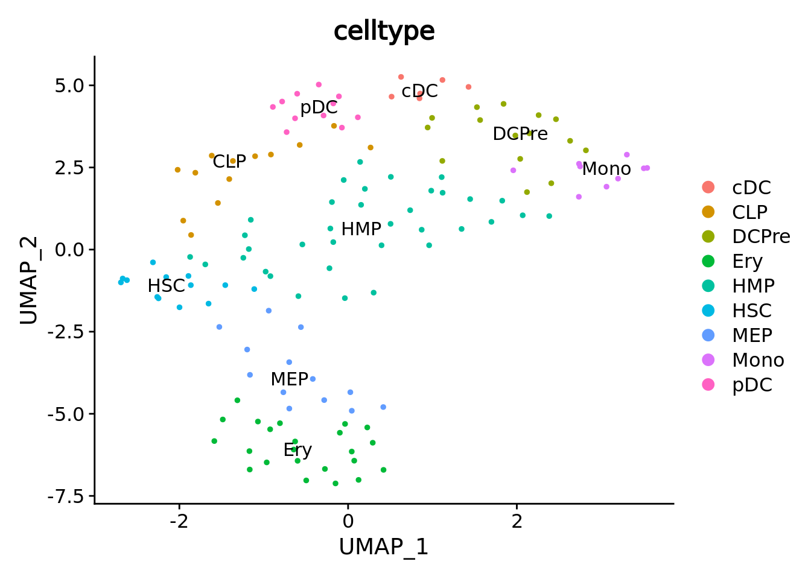
We correctly retrieve the two main differentiation path of CD34+ cells.
In one hand, Megakaryocyte Erythrocyte Progenitor (MEP) fate with GATA2 and then GATA1 transcription factor expression.
On the other, Lymphoid Myeloid Multipotent Progenitor (LMPP) fate with SPI1 transcription factor expression.

```r
genes <- c("CD34","GATA2","GATA1","SPI1")
marker.supercell.umaps <- lapply(genes, FUN = function(x){
  plot <- FeaturePlot(cd34.supercell, features = x)
  }
)
marker.supercell.umaps
#> [[1]]
```

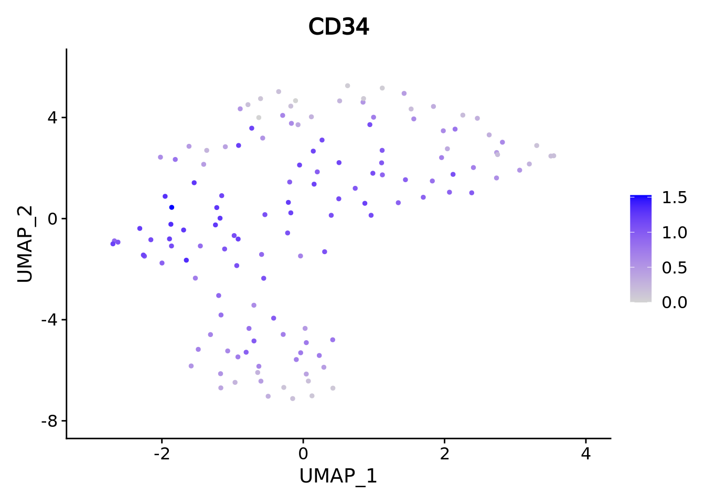

```
#> 
#> [[2]]
```

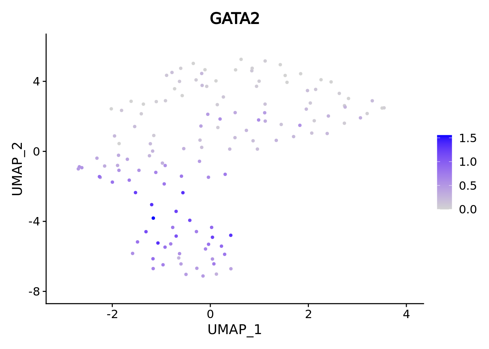

```
#> 
#> [[3]]
```


```
#> 
#> [[4]]
```

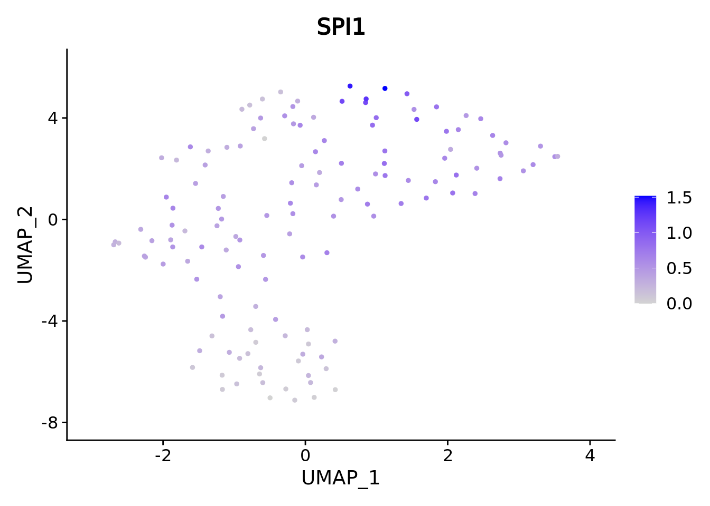
When analyzing supercells it's a good idea to plot their size on these. We can do it with ggplot.

```r
data <- cbind(umap.supercell$data,cd34.supercell$size)
colnames(data)[1:2] <- c("umap_1", "umap_2")
colnames(data)[length(colnames(data))] <- "size"
ggplot(data,aes(x = umap_1, y = umap_2, color = celltype)) + geom_point(aes(size=size)) + theme_classic()
```

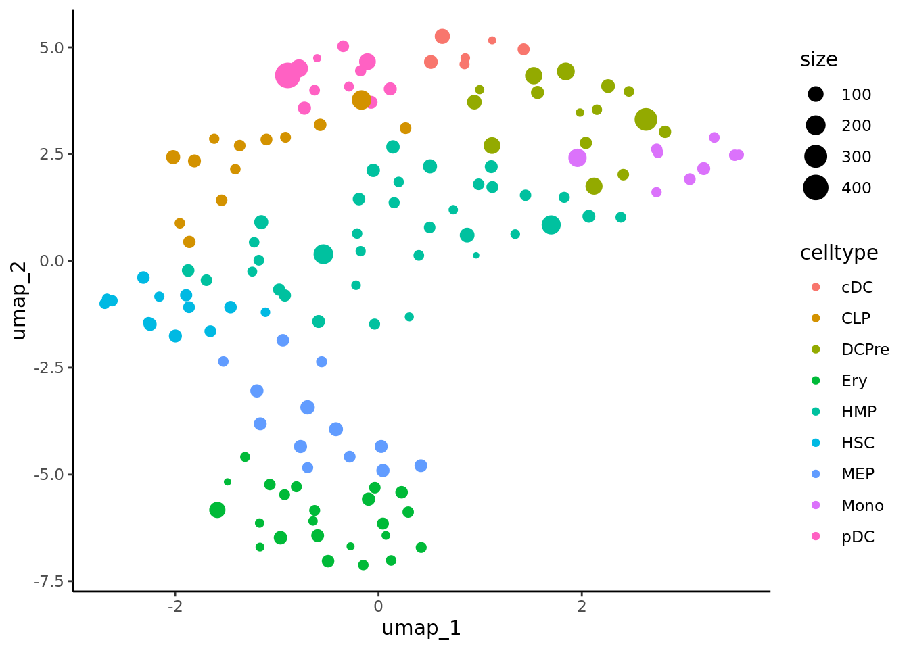


```r
lapply(marker.supercell.umaps,FUN = function(x){
  data <- cbind(x$data,cd34.supercell$size)
  colnames(data)[1:2] <- c("umap_1", "umap_2")
  colnames(data)[length(colnames(data))] <- "size"
  gene <- colnames(data)[length(colnames(data))-1]
  ggplot(data,aes(x = umap_1, y = umap_2, size=size,colour = .data[[gene]])) + geom_point() + 
    scale_color_gradientn(colors =  c("lightgrey", "blue"), 
                          guide = "colorbar")  +
  theme_classic() + ggtitle(gene)
} )
#> [[1]]
```

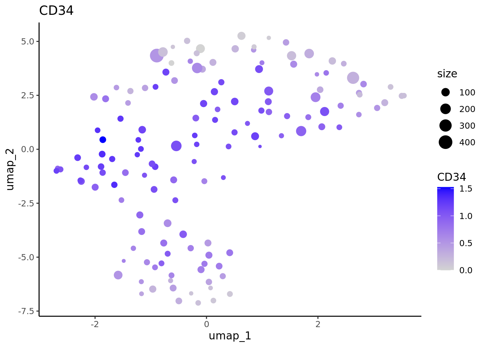

```
#> 
#> [[2]]
```

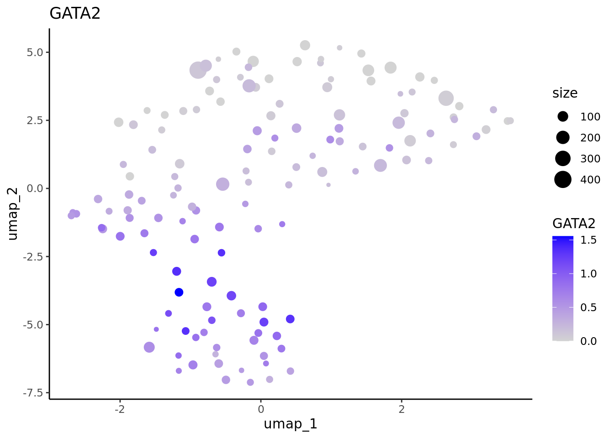

```
#> 
#> [[3]]
```


```
#> 
#> [[4]]
```


## QC with the MetacellAnalysisToolkit package
### Loading single-cell data

First we need to load the single cell data and make a classical dimentionality reduction analysis.

```r
cd34.singlecells <- read_h5ad("data/CD34/cd34_multiome_rna.h5ad")
#> Error in python_config_impl(python) : 
#>   Error running '/users/agabrie4/.virtualenvs/r-reticulate/bin/python': No such file.
#> The Python installation used to create the virtualenv has been moved or removed:
#>   '/usr/bin'
cd34.singlecells <- CreateSeuratObject(counts = Matrix::t(cd34.singlecells$X),meta.data = cd34.singlecells$obs)
cd34.singlecells <- NormalizeData(cd34.singlecells)
if(packageVersion("Seurat") >= 5) {
  cd34.singlecells[["RNA"]] <- as(object = cd34.singlecells[["RNA"]], Class = "Assay")
}
cd34.singlecells <- FindVariableFeatures(cd34.singlecells)
cd34.singlecells <- ScaleData(cd34.singlecells)
#> Centering and scaling data matrix
cd34.singlecells <- RunPCA(cd34.singlecells)
#> PC_ 1 
#> Positive:  NKAIN2, MEIS1, CRHBP, INPP4B, CALN1, CHRM3, AVP, PCDH9, GPC5, PRKG1 
#> 	   ANGPT1, MECOM, MIR99AHG, PRKG2, PBX1, PRKCH, SKAP1, PREX2, ZNF385D, THRB 
#> 	   IL12A-AS1, RBPMS, HLF, LIMCH1, LINC01122, ST8SIA6, TMEM163, MED12L, CABLES1, PDZD2 
#> Negative:  DIAPH3, POLQ, RRM2, ASPM, TUBB, MKI67, TOP2A, CIT, TUBA1B, BRIP1 
#> 	   NUSAP1, CLSPN, ATAD2, SHCBP1, H2AFZ, STMN1, TMPO, KIF15, NCAPG2, DTL 
#> 	   CENPF, GTSE1, KNL1, PCLAF, HMGN2, ACTB, UHRF1, ZNF367, MELK, AURKB 
#> PC_ 2 
#> Positive:  PLCB1, NEGR1, PRKCE, AFF3, ATP8B4, SAMHD1, CD44, UBE2E2, MPO, PTPRE 
#> 	   TTC7A, FLT3, ARHGAP26, GAS7, VIM, RELL1, AKAP13, RAB11FIP1, RUNX2, HDAC9 
#> 	   PLD4, ADGRE5, SLC8A1, KLF6, IRF8, SFMBT2, CD74, RBM47, GAB2, SDK2 
#> Negative:  ANK1, RYR3, XACT, ITGA2B, APOC1, EEF1A1, TFR2, CPB1, KLF1, RPS3 
#> 	   APOE, PTH2R, RPL7A, KCNH2, RPS6, BLVRB, FAM178B, KEL, ZNF385D, GATA1 
#> 	   ADAMTS3, SLC40A1, RPS5, EEF1B2, RPS3A, RPL13A, CSF1, RPL8, CNRIP1, HBD 
#> PC_ 3 
#> Positive:  CD74, HLA-DRA, HLA-DRB1, FAM160A1, ACTG1, JCHAIN, EEF1A1, HLA-DPA1, ARL4C, TGFBI 
#> 	   BLNK, TMSB4X, SPIB, PLXNA4, RPL13A, LGMN, CORO1A, RPS5, SCT, RPS3 
#> 	   RNASE6, RPS3A, LIME1, CUX2, ADAM19, PLD4, CST3, IRF7, CARD11, RPL28 
#> Negative:  AZU1, FNDC3B, ELANE, MPO, LRMDA, PRTN3, KCNQ5, LYST, AFF2, SLC22A15 
#> 	   F13A1, EREG, CFD, PLPPR3, ATP8B4, ZEB2, PCBP3, PDE3B, IL1RAP, ACSM3 
#> 	   ZNF804A, CSF3R, SLC39A11, PLD1, DENND4A, ANXA1, CTSG, RREB1, TFRC, DGKG 
#> PC_ 4 
#> Positive:  SPINK2, CALN1, PLCB1, INPP4B, NKAIN2, ANGPT1, ATP8B4, CHRM3, MEIS1, DIAPH3 
#> 	   PHGDH, MIR924HG, SMIM24, MDK, TOP2A, CSF3R, ASPM, C1QTNF4, KIF15, TYMS 
#> 	   PRKCH, NUSAP1, TUBA1B, RRM2, CIT, TK1, CDCA5, POLQ, NDC80, AURKB 
#> Negative:  SAMHD1, CD36, SULF2, ANK1, FAM160A1, TGFBI, CST3, RYR3, RAB11FIP1, S100A6 
#> 	   APOC1, XACT, IRF8, RNASE6, FCER1G, PLXNA4, LYZ, CPB1, APOE, UGCG 
#> 	   FAM178B, GPR183, CSF2RB, RBM47, PIK3R5, MPEG1, CUX2, MICAL2, SLC8A1, CYBB 
#> PC_ 5 
#> Positive:  MECOM, PCDH9, PRKG1, ASPM, PLXDC2, THRB, SKAP1, PHTF1, ZNF385D, PRKG2 
#> 	   SETBP1, PBX1, GPC5, LIMCH1, TOP2A, MED12L, MKI67, GTSE1, ELL2, PTK2 
#> 	   PREX2, CENPE, AURKB, CRHBP, DNM3, KIF18B, NUSAP1, HLF, CIT, DIAPH3 
#> Negative:  GAPDH, RPS19, IGLL1, RPLP0, C1QTNF4, RPL28, RPL13A, RPL18A, RPS24, EEF1A1 
#> 	   GYPC, PRSS57, RPLP2, SMIM24, RPS8, RPL35, MIR181A1HG, RPS3, RPL27A, RPL14 
#> 	   RPL7, RPS6, RPL6, RPL8, RPL32, RACK1, ACTG1, RPL29, RPS3A, RPL7A
cd34.singlecells <- RunUMAP(cd34.singlecells,dims = c(1:50))
#> 07:52:06 UMAP embedding parameters a = 0.9922 b = 1.112
#> 07:52:06 Read 6881 rows and found 50 numeric columns
#> 07:52:06 Using Annoy for neighbor search, n_neighbors = 30
#> 07:52:06 Building Annoy index with metric = cosine, n_trees = 50
#> 0%   10   20   30   40   50   60   70   80   90   100%
#> [----|----|----|----|----|----|----|----|----|----|
#> **************************************************|
#> 07:52:06 Writing NN index file to temp file /tmp/36275017/RtmpyibE7N/file219b33852f0ef
#> 07:52:06 Searching Annoy index using 1 thread, search_k = 3000
#> 07:52:08 Annoy recall = 100%
#> 07:52:08 Commencing smooth kNN distance calibration using 1 thread with target n_neighbors = 30
#> 07:52:09 Initializing from normalized Laplacian + noise (using irlba)
#> 07:52:09 Commencing optimization for 500 epochs, with 293954 positive edges
#> 07:52:17 Optimization finished
```
Plot single cell data.

```r
UMAPPlot(cd34.singlecells,group.by = "celltype",label = T)
```


### Visualization of metacells in single-cell space

Now we can plot metacells from MetaCell2 in the single-cell space.

```r
mc_projection(
  sc.obj = cd34.singlecells,
  mc.obj = cd34.metacell,
  cell.membership = cd34.metacell@misc$membership,
  sc.reduction = "umap",
  sc.label = "celltype", # single cells will be colored according the sc.label
  metacell.label = "celltype" # metacells cell will be colored according the metacell.label
  ) + theme_classic()
```


And same for metacells obtained with SuperCell.

```r
mc_projection(
  sc.obj = cd34.singlecells,
  mc.obj = cd34.supercell,
  cell.membership = cd34.supercell@misc$cell_membership,
  sc.reduction = "umap",
  sc.label = "celltype", # single cells will be colored according the sc.label
  metacell.label = "celltype" # metacells cell will be colored according the metacell.label
  ) + theme_classic()
```

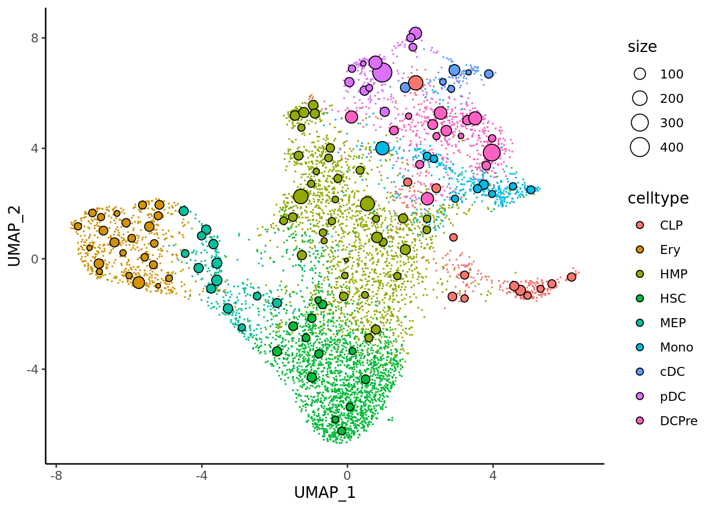
### Compactness and separation

We can compute the compactness and separation of the metacells from the single cell pca. 
We can use the approach of SEACells by computing these metrics in a diffusion map obtained from the pca using the `get_diffusion_comp` function and then
run the `mc_compactnness` and `mc_separation` functions to obtain the compactness and separation metrics.

First for MetaCell2 metacells

```r
diffusion_comp <- get_diffusion_comp(sc.obj = cd34.singlecells, sc.reduction = "pca", dims = 1:50)
#> Warning: The following arguments are not used: layer
#> Computing diffusion maps ...
cd34.metacell$compactness <- mc_compactness(cell.membership = cd34.metacell@misc$cell_membership, 
                                            sc.obj = cd34.singlecells,
                                            group.label = "metacell_name",
                                            sc.reduction = diffusion_comp,
                                            dims = 1:ncol(diffusion_comp))

qc_boxplot(mc.obj = cd34.metacell, qc.metrics = "compactness")
```


```r
cd34.metacell$separation <- mc_separation(cell.membership = cd34.metacell@misc$cell_membership,
                                          sc.obj = cd34.singlecells,
                                          group.label = "metacell_name",
                                          sc.reduction = diffusion_comp,
                                          dims =  1:ncol(diffusion_comp))

qc_boxplot(mc.obj = cd34.metacell, qc.metrics = "separation")
```


Same for metacell obtained with SuperCell.

```r
cd34.supercell$compactness <- mc_compactness(cell.membership = cd34.supercell@misc$cell_membership, 
                                            sc.obj = cd34.singlecells,
                                            sc.reduction = diffusion_comp, 
                                            dims = 1:ncol(diffusion_comp))

qc_boxplot(mc.obj = cd34.supercell, qc.metrics = "compactness")
```


```r
cd34.supercell$separation <- mc_separation(cell.membership = cd34.supercell@misc$cell_membership, 
                                          sc.obj = cd34.singlecells,
                                          sc.reduction = diffusion_comp,
                                          dims =  1:ncol(diffusion_comp))

qc_boxplot(mc.obj = cd34.supercell, qc.metrics = "separation")
```


### Inner normalized variance (INV)
We can compute the INV for the MetaCell2 and SuperCell metacells as defined in MetaCell paper.


```r
cd34.supercell$INV <- mc_INV(cell.membership = cd34.supercell@misc$cell_membership, sc.obj = cd34.singlecells)
#> Computing INV ...
cd34.metacell$INV <- mc_INV(cell.membership = cd34.metacell@misc$cell_membership, sc.obj = cd34.singlecells, group.label = "metacell_name")
#> Computing INV ...
```


Comparison of MetaCell2 and SuperCell for compactness (lower the better).


```r
cd34.metacell$tool <- "MetaCell2"
cd34.supercell$tool <- "SuperCell"
data.metrics <- rbind(cd34.metacell@meta.data[,c("tool","INV","compactness","separation")],
                      cd34.supercell@meta.data[,c("tool","INV","compactness","separation")])

ggplot(data.metrics,aes(y=compactness,x=tool,fill = tool)) + geom_boxplot()
```


Comparison of MetaCell2 and SuperCell for separation (higher the better).


```r
ggplot(data.metrics,aes(y=separation,x=tool,fill = tool)) + geom_boxplot()
```


Comparison of MetaCell2 and SuperCell for INV (lower the better).


```r
ggplot(data.metrics,aes(y=INV,x=tool,fill = tool)) + geom_boxplot()
```


