# Integration of metacells {#integration}

In this section, we will work with the Human Cell Lung Atlas core [HLCA](https://www.nature.com/articles/s41591-023-02327-2)
gathering around 580,000 cells from 107 individuals distributed in 166 samples.

The aim of this tutorial is to show how you can use metacells to analyze a very large dataset using a reasonable amount of time and memory.
For this we will use here **SuperCell** via the **MCAT** command line tool.

## Unsupervised integration {#integration_unsupervised}


In this section, we will first perform the integration in an unsupervised mode, i.e., without considering the single-cell annotation. 
For a supervised version, please refer to section \@ref(integration_supervised).

###  Data loading
Please follow the section \@ref(HLCA-data) to retrieve the HLCA atlas, divide the atlas by dataset and save the splitted data in the following folder: "data/HLCA/".

###  Setting up the environment
First we need to specify that we will work with the MetacellAnalysisToolkit conda environment (needed for anndata relying on reticulate and the MCAT tool).
To build the conda environment please follow the instructions on our MetacellAnalysisToolkit [github repository](https://github.com/GfellerLab/MetacellToolkit).


```r
library(reticulate)
conda_env <-  conda_list()[reticulate::conda_list()$name == "MetacellAnalysisToolkit","python"]

Sys.setenv(RETICULATE_PYTHON = conda_env)
```


```
#>           used (Mb) gc trigger (Mb) max used (Mb)
#> Ncells  649423 34.7    1512985 80.9   704350 37.7
#> Vcells 1196992  9.2    8388608 64.0  1814779 13.9
```


```r
library(Seurat)
#> The legacy packages maptools, rgdal, and rgeos, underpinning this package
#> will retire shortly. Please refer to R-spatial evolution reports on
#> https://r-spatial.org/r/2023/05/15/evolution4.html for details.
#> This package is now running under evolution status 0
#> Attaching SeuratObject
library(anndata)
library(SuperCell)
library(ggplot2)

color.celltypes  <- c('#E5D2DD', '#53A85F', '#F1BB72', '#F3B1A0', '#D6E7A3', '#57C3F3', '#476D87',
                      '#E95C59', '#E59CC4', '#AB3282', '#23452F', '#BD956A', '#8C549C', '#585658',
                      '#9FA3A8', '#E0D4CA', '#5F3D69', '#58A4C3', "#b20000",'#E4C755', '#F7F398',
                      '#AA9A59', '#E63863', '#E39A35', '#C1E6F3', '#6778AE', '#91D0BE', '#B53E2B',
                      '#712820', '#DCC1DD', '#CCE0F5', '#CCC9E6', '#625D9E', '#68A180', '#3A6963',
                      '#968175')
```


###  Building metacell

We build metacells with the MCAT command line using SuperCell (`-t SuperCell`).
To facilitate downstream analysis of the donors we build metacells for each sample in each dataset (`-a sample`).
Here we will use 2000 highly variable genes (`-f 2000`) to compute the PCA from which we used 50 principal components (`-m 50`) to build a k = 30 (`-k 30`) nearest neighbor graph on which the metacells are identified using a graining level of 50 (`-g 50`).
We use an adata .h5ad output format (`-s adata`) as it is faster to write and lighter to store than a Seurat .rds object.

This step takes around 20 min with multiple cores (`-l 6`). Be aware that parallel processing requires more memory (32 GB of memory required for 6 cores).

If you are limited in memory you should still be able to process the samples by reducing the number of cores (e.g. `-l 3`) or
by sequentially processing the samples (just remove the `-l`) in a slightly longer time.


```bash
start=`date +%s`
for d in data/HLCA/datasets/*;
do cli/MCAT -t SuperCell -i $d/sc_adata.h5ad -o $d -a sample -l 3 -n 50 -f 2000 -k 30 -g 50 -s adata
done
echo "Duration: $((($(date +%s)-$start)/60)) minutes"
```

###  Loading metacell objects

We load the .h5ad objects and directly convert them in Seurat objects to benefit from all the functions of this framework.
To consider the datasets in the same order as the one used in this tutorial we run the following chunk before loading the metacell objects.


```r
library(anndata)
adata <- read_h5ad("data/HLCA/local.h5ad",backed = "r")
adata$var_names <- adata$var$feature_name # We will use gene short name for downstream analyses
datasets <- unique(adata$obs$dat)
rm(adata)
gc()
```


```r

metacell.files <- sapply(datasets, FUN = function(x){paste0("data/HLCA/datasets/",x,"/mc_adata.h5ad")})

metacell.objs <- lapply(X = metacell.files, function(X){
  adata <- read_h5ad(X)
  countMatrix <- Matrix::t(adata$X)
  colnames(countMatrix) <- adata$obs_names
  rownames(countMatrix) <- adata$var_names
  sobj <- Seurat::CreateSeuratObject(counts = countMatrix,meta.data = adata$obs)
  sobj <- RenameCells(sobj, add.cell.id = unique(sobj$sample)) # we give unique name to metacells
  return(sobj)
})
```

###  Merging objects and basic quality control

Given the single-cell metadata, the MCAT tool automatically assigns annotations to metacells and computes purities for all the categorical variables present
in the metadata of the input single-cell object.

Thus, we can check the purity of our metacells at different levels of annotations, as well as their size (number of single cells they contain).

To do so we merge the object together and use the Seurat `VlnPlot` function.


```r
unintegrated.mc <- merge(metacell.objs[[1]], metacell.objs[-1])

VlnPlot(unintegrated.mc, features = c("size", "ann_level_1_purity"), group.by = 'dataset', pt.size = 0.001, ncol = 2)
```


```r
VlnPlot(unintegrated.mc, features = c("ann_level_2_purity", "ann_level_3_purity"), group.by = 'dataset', pt.size = 0.001, ncol = 2)
```


We can also use box plots.


```r
ggplot(unintegrated.mc@meta.data,aes(x = dataset, y = ann_level_2_purity, fill = dataset)) + geom_boxplot() +
  scale_x_discrete(guide = guide_axis(angle = 45))
```


```r

ggplot(unintegrated.mc@meta.data,aes(x = dataset, y = ann_level_3_purity, fill = dataset)) + geom_boxplot() +
  scale_x_discrete(guide = guide_axis(angle = 45))
```


```r

ggplot(unintegrated.mc@meta.data,aes(x = dataset, y = ann_level_4_purity, fill = dataset)) + geom_boxplot() +
  scale_x_discrete(guide = guide_axis(angle = 45))
```

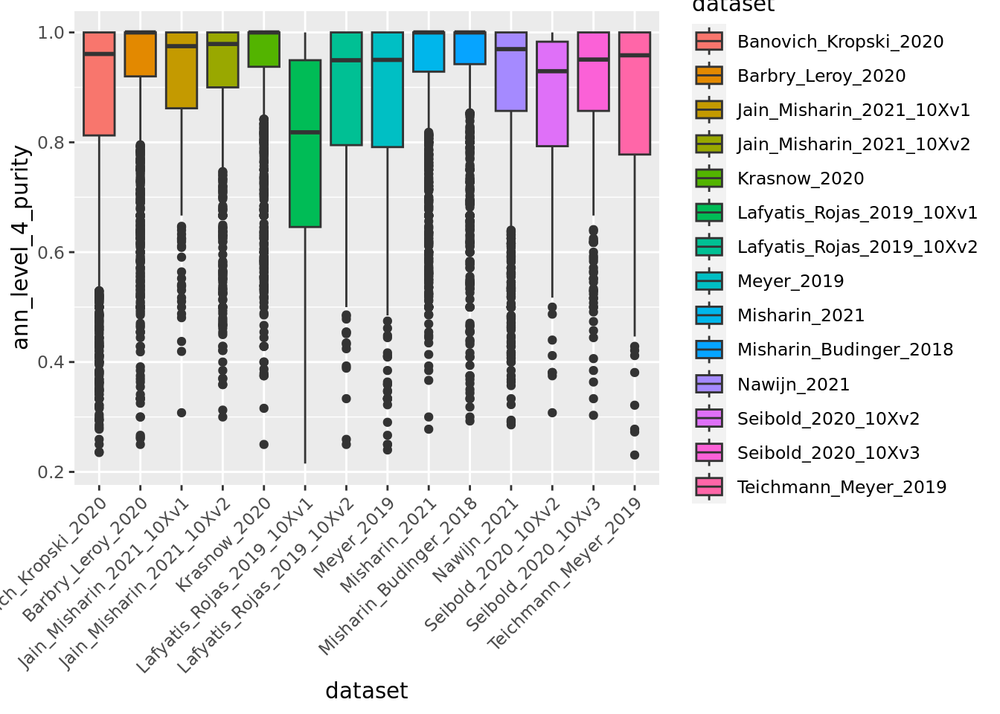

```r

ggplot(unintegrated.mc@meta.data,aes(x = dataset, y = ann_finest_level_purity, fill = dataset)) + geom_boxplot() +
  scale_x_discrete(guide = guide_axis(angle = 45))
```


Overall metacells from the different datasets present a good purity until the third level of annotation.

###  Unintegrated analysis

Let's first do a standard dimensionality reduction without batch correction.


```r
DefaultAssay(unintegrated.mc) <- "RNA"
unintegrated.mc <- NormalizeData(unintegrated.mc)
unintegrated.mc <- FindVariableFeatures(unintegrated.mc)
unintegrated.mc <- ScaleData(unintegrated.mc)
unintegrated.mc <- RunPCA(unintegrated.mc)
unintegrated.mc <- RunUMAP(unintegrated.mc, dims = 1:30)

umap.unintegrated.datasets <- DimPlot(unintegrated.mc,reduction = "umap",group.by = "dataset") + NoLegend() + ggtitle("unintegrated datasets")
umap.unintegrated.types <- DimPlot(unintegrated.mc, reduction = "umap", group.by = "ann_level_2", label = T, repel = T, cols = color.celltypes)+ NoLegend() + ggtitle("unintegrated cell types")

umap.unintegrated.datasets + umap.unintegrated.types
```


```r

remove(unintegrated.mc) # we won't use the unintegrated object anymore
gc()
```

You can see on the plots that a batch effect is clearly present at the metacell level with metacells clustering by datasets inside the major cell types.
Let's correct it.

###  Seurat integration

Here we will use the standard Seurat_v4 batch correction [workflow](https://satijalab.org/seurat/archive/v4.3/integration_rpca). As in the original study, we use the dataset rather than the donor as the batch parameter.
See method section "Data integration benchmarking" of the [original study](https://www.nature.com/articles/s41591-023-02327-2) for more details.

This should take less than 5 minutes.


```r

n.metacells <- sapply(metacell.objs, FUN = function(x){ncol(x)})
names(n.metacells) <- datasets
ref.names <- sort(n.metacells,decreasing = T)[1:5]
ref.index <- which(datasets %in% names(ref.names))

# normalize each dataset
metacell.objs <- lapply(X = metacell.objs, FUN = function(x) {
  DefaultAssay(x) <- "RNA";
  x <- RenameCells(x, add.cell.id = unique(x$sample)) # we give unique name to metacells
  x <- NormalizeData(x)
  x <- FindVariableFeatures(x, selection.method = "vst", nfeatures = 2000)
  return(x)})

features <- SelectIntegrationFeatures(object.list = metacell.objs)

metacell.objs <- lapply(X = metacell.objs, FUN = function(x) {
    x <- ScaleData(x, features = features, verbose = FALSE)
    x <- RunPCA(x, features = features, verbose = FALSE)
})

anchors <- FindIntegrationAnchors(object.list = metacell.objs,
                                       anchor.features = features,
                                       reduction = "rpca",
                                       reference = ref.index, # the 5 biggest datasets (in term of metacell number) are used as reference
                                       dims = 1:30)

remove(metacell.objs) # We don't need the object list anymore
gc()

combined.mc <- IntegrateData(anchorset = anchors,k.weight = 40) # we have to update the k.weight parameters because the smallest dataset contain less than 100 metacells
```

Check the obtained object.


```r
combined.mc
#> An object of class Seurat 
#> 30024 features across 11706 samples within 2 assays 
#> Active assay: integrated (2000 features, 2000 variable features)
#>  1 other assay present: RNA
```

We can verify that the sum of metacell sizes corresponds to the original number of single-cells


```r
sum(combined.mc$size)
#> [1] 584944
```

Seurat returns the slot `"integrated"` that we can use for the downstream analysis.


```r
DefaultAssay(combined.mc) = "integrated"
combined.mc <- ScaleData(combined.mc, verbose = FALSE)
combined.mc <- RunPCA(combined.mc, npcs = 30, verbose = FALSE)
combined.mc <- RunUMAP(combined.mc, reduction = "pca", dims = 1:30, verbose = FALSE)
combined.mc <- RunUMAP(combined.mc, dims = 1:30,reduction =  "pca",reduction.name = "umap", verbose = FALSE)
```

Now we can make the plots and visually compare the results with the unintegrated analysis.


```r
umap.integrated.datasets <- DimPlot(combined.mc,reduction = "umap",group.by = "dataset") + NoLegend() + ggtitle("integrated datasets")
umap.integrated.celltypes <- DimPlot(combined.mc,reduction = "umap",group.by = "ann_level_2",label = T,repel = T,cols = color.celltypes) + NoLegend() + ggtitle("integrated cell types")

umap.integrated.datasets + umap.integrated.celltypes + umap.unintegrated.datasets + umap.unintegrated.types
```


Seurat efficiently corrected the batch effect in the data while keeping the cell type separated, but other batch correction methods such as harmony would have also done the job.

Note that In the original study, datasets were integrated using SCANVI semi-supervised integration using partial annotation obtained for each dataset prior integration.
If you are interested in such supervised approach at the metacell level in R you can have a look to our second example in section \@ref(integration_supervised) using the [STACAS](https://github.com/carmonalab/STACAS) package.

We can navigate in the different annotation levels.


```r
library(ggplot2)

DimPlot(combined.mc,group.by = "ann_level_1",reduction = "umap",label = T,repel = T,cols= color.celltypes) + NoLegend()
```

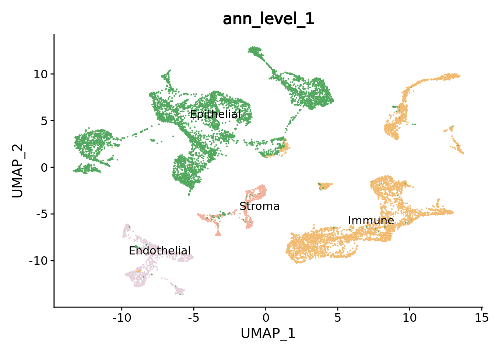

```r

DimPlot(combined.mc,group.by = "ann_level_2",reduction = "umap",label = T,repel = T,cols= color.celltypes) + NoLegend()
```

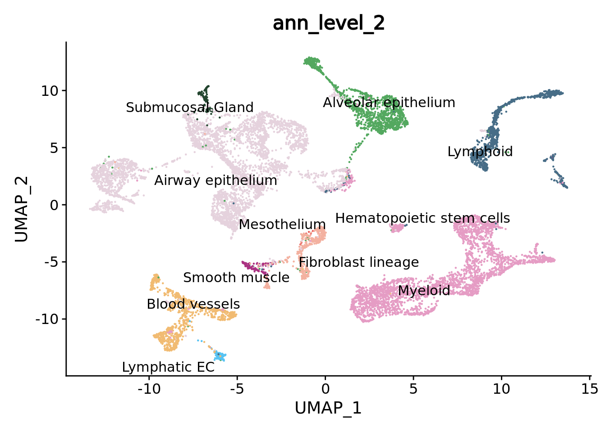

```r

DimPlot(combined.mc,group.by = "ann_level_3",reduction = "umap",label = T, repel = T,cols= color.celltypes) + NoLegend()
```


### Downstream analysis

#### Clustering

We cluster the metacells based on the corrected PCA space by Seurat.


```r
DefaultAssay(combined.mc) <- "integrated"
combined.mc <- FindNeighbors(combined.mc, reduction = "pca", dims = 1:30)
combined.mc <- FindClusters(combined.mc, resolution = 0.5)
UMAPPlot(combined.mc, label = T) + NoLegend()
```


#### Deferentially expressed gene (DEG) analysis.

Now let's found the markers of the cluster 23 we've just identified.


```r
DefaultAssay(combined.mc) <- "RNA"
markers23 <- FindMarkers(combined.mc, ident.1 = 23, only.pos = T)
#> For a more efficient implementation of the Wilcoxon Rank Sum Test,
#> (default method for FindMarkers) please install the limma package
#> --------------------------------------------
#> install.packages('BiocManager')
#> BiocManager::install('limma')
#> --------------------------------------------
#> After installation of limma, Seurat will automatically use the more 
#> efficient implementation (no further action necessary).
#> This message will be shown once per session
head(markers23)
#>       p_val avg_log2FC pct.1 pct.2 p_val_adj
#> TCL1A     0  1.3939674 0.695 0.020         0
#> FCRLA     0  1.0703400 0.962 0.022         0
#> BLK       0  1.2192942 0.990 0.058         0
#> FCRL5     0  0.7934100 0.895 0.026         0
#> PNOC      0  0.5477793 0.924 0.050         0
#> PAX5      0  0.6089985 0.886 0.024         0
```

This cluster clearly presents a B cell signature with marker genes such as CD19 and PAX5


```r
genes <-c("CD19","PAX5") # knwon B cells markers
markers23[genes,]
#>              p_val avg_log2FC pct.1 pct.2     p_val_adj
#> CD19 1.599543e-207  1.1037564 0.990 0.114 4.482558e-203
#> PAX5  0.000000e+00  0.6089985 0.886 0.024  0.000000e+00
VlnPlot(combined.mc, genes, ncol = 1)
```

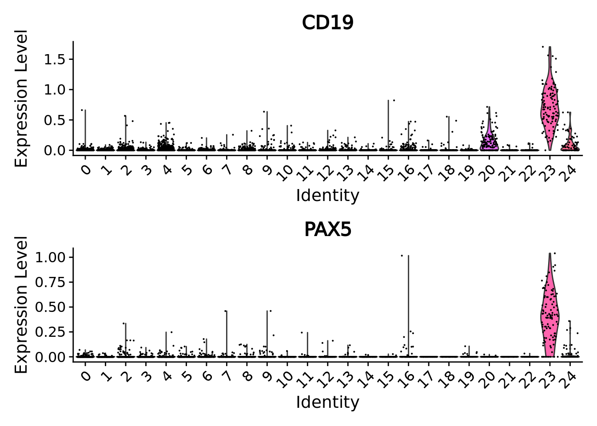

By looking at the metacell annotation (assigned from the original single-cell metadata by MCAT),
we can verify that we correctly retrieved the B cell lineage cluster.


```r
DimPlot(combined.mc[, combined.mc$integrated_snn_res.0.5 == 23],
        group.by = c("ann_level_3", "integrated_snn_res.0.5"),
        ncol = 2)
```


#### Cell type abundances analyses.

We can easily make analysis of cell type abundances for different clinical variables as we construct metacell by sample.
We have to take metacell size into account for these analyses.
For instance we can analyse the proportion of different epithelial cell types depending on the smoking status.


```r
library(reshape2)
combined.mc.epith <- combined.mc[,combined.mc$ann_level_1 == "Epithelial"]
#combined.metacells$major_type <- droplevels(combined.metacells$major_type)
smpCounts <- aggregate(combined.mc.epith$size, by=list(sample = combined.mc.epith$sample,
                                                        major_type = combined.mc.epith$ann_level_3,
                                                        smoking_status = combined.mc.epith$smoking_status),
                                                        FUN=sum)

remove(combined.mc.epith)
gc()

ggplot(smpCounts,aes(x = smoking_status,fill=major_type)) + geom_bar(position = "fill") + scale_fill_manual(values = color.celltypes) + xlab("% epithelial cells")
```


Samples from smokers seem to present more AT2 cells but this quick analysis is for illustrative purposes only.
In practice it's far more complex to draw conclusion as we should have considered the variations between samples/donors as well as many other technical
(tissue dissociation protocol, tissue sampling method, single-cell platform, ... ) and biological (BMI, sex, Age, ...) variables.

### Conclusion

Overall we made a precise simplification of the original atlas using metacells built from each sample separately.
By reducing the size of the original atlas by a factor of 50 we could load the data, make an integration to correct batch effect
and recapitulate the main different cell types using a reasonable amount of time and memory.
In contrast, simply loading the original single-cell data in R using Seurat is extremely time-consuming and challenging even for the most powerful computers.

In this first example we used a fully unsupervised workflow and did not use any prior biological knowledge.
Authors of the original study made a remarkable work annotating the hundreds of thousands cells of the atlas.
In the second example in section \@ref(integration_supervised) we propose a supervised workflow using this annotation to guide both the metacell
identification and the batch correction.

We can save the results for comparison with the second example.


```r
saveRDS(combined.mc,"data/HLCA/combined.mc.unsup.rds")
```

## Supervised integration {#integration_supervised}


As for the unsupervised integration example, we will work with the Human Cell Lung Atlas core [HLCA](%5Bhttps://www.nature.com/articles/s41591-023-02327-2)
gathering around 580,000 cells from 107 individuals distributed in 166 samples.

Taking advantage of the single-cell annotation of the original study we will build metacells for each cell type in each sample and
guide the integration with the cell type label using [STACAS](https://github.com/carmonalab/STACAS).

### Data loading
Please follow the section \@ref(HLCA-data) to retrieve the HLCA atlas, divide the atlas by dataset and save the splitted data in the following folder: "data/HLCA/".

### Setting up the environment
First we need to specify that we will work with the MetacellAnalysisToolkit conda environment (needed for anndata relying on reticulate and the MCAT tool).
To build the conda environment please follow the instructions on our MetacellAnalysisToolkit [github repository](https://github.com/GfellerLab/MetacellToolkit).


```r
library(reticulate)
conda_env <-  conda_list()[reticulate::conda_list()$name == "MetacellAnalysisToolkit","python"]

Sys.setenv(RETICULATE_PYTHON = conda_env)
```


```
#>           used  (Mb) gc trigger    (Mb)   max used    (Mb)
#> Ncells 3555047 189.9    6519942   348.3    6519942   348.3
#> Vcells 6717400  51.3 1799339657 13727.9 2245660962 17133.1
```


```r
library(Seurat)
library(anndata)
library(SuperCell)
library(ggplot2)

color.celltypes  <- c('#E5D2DD', '#53A85F', '#F1BB72', '#F3B1A0', '#D6E7A3', '#57C3F3', '#476D87',
                      '#E95C59', '#E59CC4', '#AB3282', '#23452F', '#BD956A', '#8C549C', '#585658',
                      '#9FA3A8', '#E0D4CA', '#5F3D69', '#58A4C3', "#b20000",'#E4C755', '#F7F398',
                      '#AA9A59', '#E63863', '#E39A35', '#C1E6F3', '#6778AE', '#91D0BE', '#B53E2B',
                      '#712820', '#DCC1DD', '#CCE0F5', '#CCC9E6', '#625D9E', '#68A180', '#3A6963',
                      '#968175')
```


### Constructing supervised metacell

Sikkema et al. made a remarkable job in finely annotating hundreds thousands of cells.
Within the framework of this re-analysis, let's now try to use this prior knowledge to obtain slightly better results using a supervised workflow.

We added in section \@ref(HLCA-data) a `ann_sample` column in the metadata of the single cell object.
We now can use it to build metacell for each cell type in each sample.

If you are limited in memory you should still be able to process the samples by reducing the number of cores (e.g. `-l 3`) or
by sequentially processing the samples (just remove the `-l`) in a slightly longer time

This should take around 30 minutes.


```bash
for d in data/HLCA/datasets/*;
do cli/MCAT -t SuperCell -i $d/sc_adata.h5ad -o $d/sup_mc -a ann_sample -l 3 -n 50 -f 2000 -k 30 -g 50 -s adata
done
```

### Load metacell objects

We load the .h5ad objects and directly convert them in Seurat objects to benefit from all the functions of this framework.
To consider the datasets in the same order as the one used in this tutorial we run the following chunk before loading the metacell objects.


```r
library(anndata)
adata <- read_h5ad("data/HLCA/local.h5ad",backed = "r")
adata$var_names <- adata$var$feature_name # We will use gene short name for downstream analyses
datasets <- unique(adata$obs$dat)
rm(adata)
gc()
```


```r

metacell.files <- sapply(datasets, FUN = function(x){paste0("data/HLCA/datasets/",x,"/sup_mc/mc_adata.h5ad")})

metacell.objs <- lapply(X = metacell.files, function(X){
  adata <- read_h5ad(X)
  countMatrix <- Matrix::t(adata$X)
  colnames(countMatrix) <- adata$obs_names
  rownames(countMatrix) <- adata$var_names
  sobj <- Seurat::CreateSeuratObject(counts = countMatrix,meta.data = adata$obs)
  sobj <- RenameCells(sobj, add.cell.id = unique(sobj$sample)) # we give unique name to metacells
  return(sobj)
})
```

### Merging objects and basic quality control

Given the single-cell metadata, the MCAT tool automatically assigns annotations to metacells and
computes purities for all the categorical variables present in the metadata of the input single-cell object.

Thus, let's check the purity of our metacells at different level of annotations, as well as their size (number of single cells they contain).

To do so we merge the objects together and use Seurat `VlnPlot` function.


```r
unintegrated.mc <- merge(metacell.objs[[1]], metacell.objs[-1])

VlnPlot(unintegrated.mc[, unintegrated.mc$ann_level_3 != "None"], features = c("size", "ann_level_2_purity"), group.by = 'dataset', pt.size = 0.001, ncol = 2)
#> Warning in SingleExIPlot(type = type, data = data[, x, drop = FALSE], idents =
#> idents, : All cells have the same value of ann_level_2_purity.
```


```r
VlnPlot(unintegrated.mc[, unintegrated.mc$ann_level_3 != "None"], features = c("ann_level_3_purity", "ann_level_4_purity"), group.by = 'dataset', pt.size = 0.001,  ncol=2)
#> Warning in SingleExIPlot(type = type, data = data[, x, drop = FALSE], idents =
#> idents, : All cells have the same value of ann_level_3_purity.
```


We can also use box plots.


```r
p_4 <- ggplot(unintegrated.mc@meta.data, aes(x = dataset, y = ann_level_4_purity, fill = dataset)) + geom_boxplot() +
  scale_x_discrete(guide = guide_axis(angle = 45)) + ggtitle("sup metacells level 4 purity") + NoLegend() + ylim(c(0,1))

p_finest <- ggplot(unintegrated.mc@meta.data, aes(x = dataset, y = ann_finest_level_purity, fill = dataset)) + geom_boxplot() +
  scale_x_discrete(guide = guide_axis(angle = 45))  + ggtitle("sup metacells finest level purity") + NoLegend() + ylim(c(0,1))

p_4 + p_finest
```


Overall using supervised metacells construction we obtain pure metacells until the 3rd level of annotation and
improve metacell purities for finer levels compared to the unsupervised approach (see previous section \@ref(integration_unsupervised)).


```r
meta.data.unsup <- readRDS("data/HLCA/combined.mc.unsup.rds")@meta.data

p_4_unsup <- ggplot(meta.data.unsup, aes(x = dataset, y = ann_level_4_purity, fill = dataset)) + geom_boxplot() +
    scale_x_discrete(guide = guide_axis(angle = 45)) + ggtitle("unsup metacells level 4 purity") + NoLegend() + ylim(c(0,1))

p_finest_unsup <- ggplot(meta.data.unsup, aes(x = dataset, y = ann_finest_level_purity, fill = dataset)) + geom_boxplot() +
  scale_x_discrete(guide = guide_axis(angle = 45))  + ggtitle("unsup metacells finest level purity") + NoLegend() + ylim(c(0,1))

p_4_unsup | p_4
```

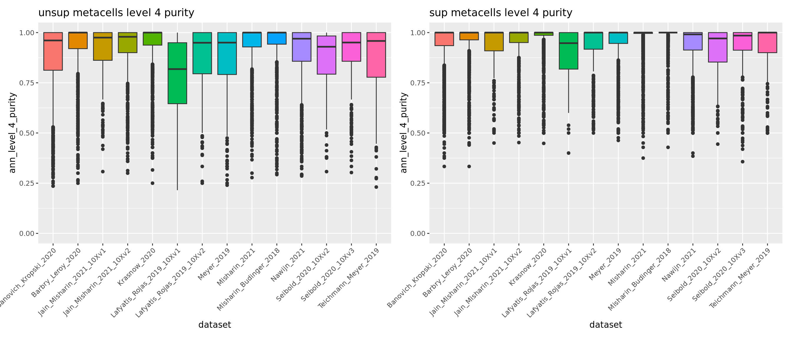

```r
p_finest_unsup + p_finest
```


### Unintegrated analysis

Let's first do a standard dimensionality reduction without batch correction.


```r
DefaultAssay(unintegrated.mc) <- "RNA"
unintegrated.mc <- NormalizeData(unintegrated.mc)
unintegrated.mc <- FindVariableFeatures(unintegrated.mc)
unintegrated.mc <- ScaleData(unintegrated.mc)
unintegrated.mc <- RunPCA(unintegrated.mc)
unintegrated.mc <- RunUMAP(unintegrated.mc,dims = 1:30)

umap.unintegrated.datasets <- DimPlot(unintegrated.mc,reduction = "umap",group.by = "dataset") + NoLegend() + ggtitle("unintegrated datasets")
umap.unintegrated.types <- DimPlot(unintegrated.mc,reduction = "umap",group.by = "ann_level_2",label = T,repel = T,cols = color.celltypes)+ NoLegend() + ggtitle("unintegrated cell types")

umap.unintegrated.datasets + umap.unintegrated.types
```

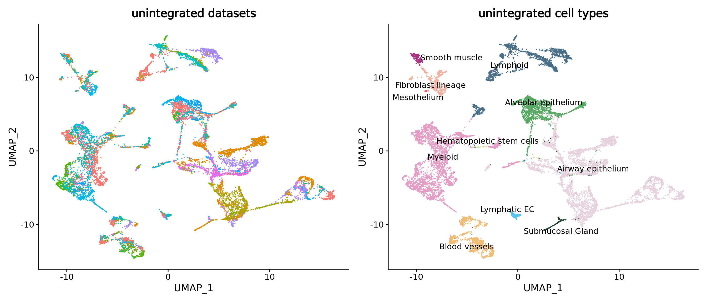

You can see on the plots that a batch effect is clearly present at the metacell level. Let's correct it using a supervised approach.

### STACAS integration

In the original study, datasets were integrated using SCANVI semi-supervised integration using partial annotation obtained for each dataset prior integration.
Here in this second example we propose to use a similar approach in R using [STACAS](https://github.com/carmonalab/STACAS). We will use the "`ann`" labels we used to construct the metacells (3rd level of annotation if available for the cell, otherwise 2nd level).

To be noted that, as in the original study, we use the dataset rather than the donor as the batch parameter. See method section [Data integration benchmarking](https://www.nature.com/articles/s41591-023-02327-2) of the original study for more details.


```r
# Install package if needed
if (!requireNamespace("STACAS")) remotes::install_github("carmonalab/STACAS", upgrade = "never")
library(STACAS)

t0_integration <- Sys.time()

n.metacells <- sapply(metacell.objs, FUN = function(x){ncol(x)})
names(n.metacells) <- datasets
ref.names <- sort(n.metacells,decreasing = T)[1:5]
ref.index <- which(datasets %in% names(ref.names))

# normalize and identify variable features for each dataset independently
metacell.objs <- lapply(X = metacell.objs, FUN = function(x) {
  DefaultAssay(x) <- "RNA";
  x <- RenameCells(x, add.cell.id = unique(x$sample)) # we give unique name to metacells
  x <- NormalizeData(x)
  return(x)})
gc()


# Perform a supervised integration of the dataset using STACAS
combined.mc <- Run.STACAS(object.list = metacell.objs,
                          anchor.features = 2000,
                          min.sample.size = 80,
                          k.weight = 80, #smallest dataset contains 86 metacells
                          cell.labels = "ann", # Note that by not you can use STACAS in its unsupervised mode
                          reference = ref.index, # the 5 biggest datasets are used as reference
                          dims = 1:30)

tf_integration <- Sys.time()

tf_integration - t0_integration

remove(metacell.objs) # We don't need the object list anymore
gc()
```

Check the obtained object:


```r
combined.mc
#> An object of class Seurat 
#> 30024 features across 12914 samples within 2 assays 
#> Active assay: integrated (2000 features, 2000 variable features)
#>  1 other assay present: RNA
#>  1 dimensional reduction calculated: pca
```

We can verify that the sum of metacell sizes correspond to the original number of single-cells


```r
sum(combined.mc$size)
#> [1] 584944
```

STACAS directly returns a pca for the slot `"integrated"` that we can use to make a UMAP of the corrected data.


```r
DefaultAssay(combined.mc) = "integrated"

combined.mc <- RunUMAP(combined.mc, dims = 1:30, reduction =  "pca", reduction.name = "umap")
```

Now we can make the plots and visually compare the results with the unintegrated analysis.


```r
umap.stacas.datasets <- DimPlot(combined.mc,reduction = "umap",group.by = "dataset") + NoLegend() + ggtitle("integrated datasets")
umap.stacas.celltypes <- DimPlot(combined.mc,reduction = "umap",group.by = "ann_level_2",label = T,repel = T,cols = color.celltypes) + NoLegend() + ggtitle("integrated cell types")

umap.stacas.datasets + umap.stacas.celltypes + umap.unintegrated.datasets + umap.unintegrated.types
```

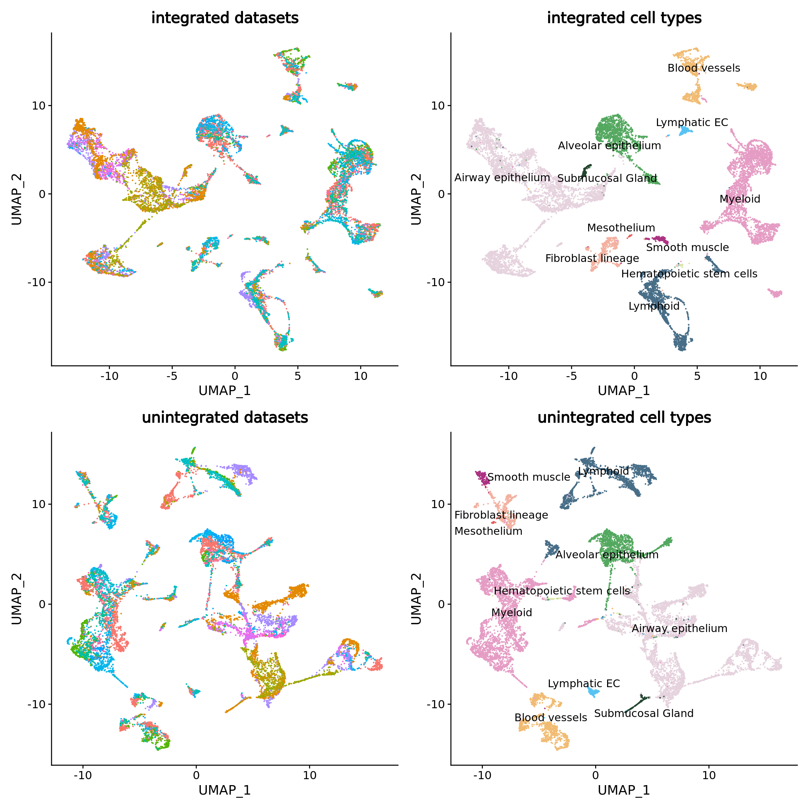

STACAS efficiently corrected the batch effect in the data while keeping the cell type separated.

We can navigate in the different annotation levels.


```r
library(ggplot2)

DimPlot(combined.mc,group.by = "ann_level_1",reduction = "umap",cols= color.celltypes)
```


```r

DimPlot(combined.mc,group.by = "ann_level_2",reduction = "umap",label = T,repel = T,cols= color.celltypes)
```


```r

DimPlot(combined.mc,group.by = "ann_level_3",reduction = "umap",label = T, repel = T,cols= color.celltypes) + NoLegend()
```

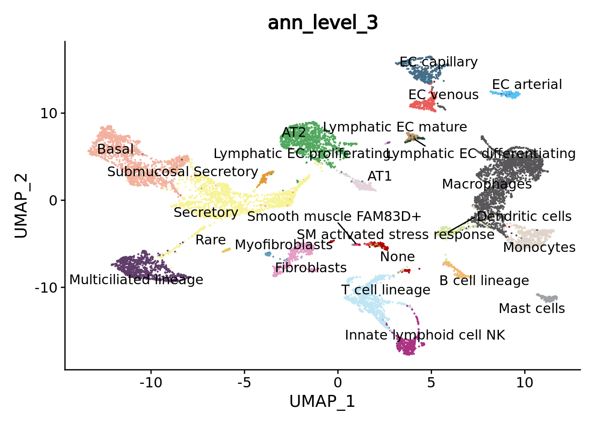

### Comparison with unsupervised analysis

we can quickly visually compare these results with the unsupervised integration obtained with Seurat:


```r
combined.mc.unsup <- readRDS("data/HLCA/combined.mc.unsup.rds")

combined.mc$ann_level_3 <- factor(combined.mc$ann_level_3)
matched.color.celltypes <- color.celltypes[1:length(levels(combined.mc$ann_level_3))]
names(matched.color.celltypes) <- levels(combined.mc$ann_level_3)

level3_sup <- DimPlot(combined.mc,group.by = "ann_level_3",reduction = "umap",label = T, repel = T,cols= matched.color.celltypes) + NoLegend() + ggtitle("Sup workflow")
level3_unsup <- DimPlot(combined.mc.unsup,group.by = "ann_level_3",reduction = "umap",label = T, repel = T,cols= matched.color.celltypes) + NoLegend() + ggtitle("Unsup workflow")

level3_sup + level3_unsup
```

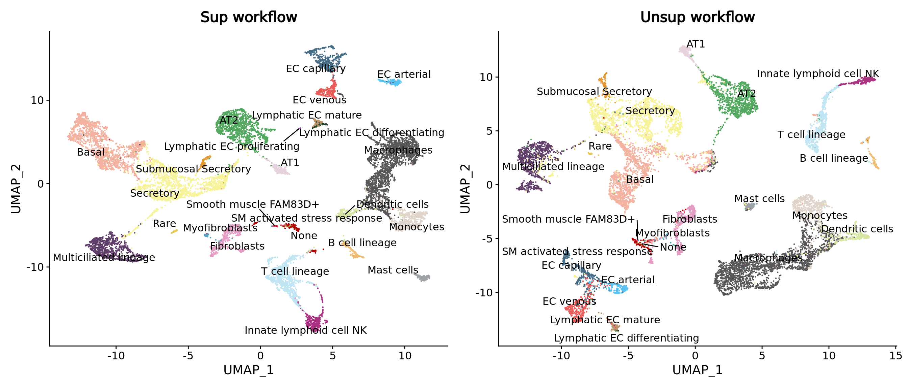

Look at epithelial cells in particular


```r
level3_sup <- DimPlot(combined.mc[,combined.mc$ann_level_1 == "Epithelial"],group.by = "ann_level_3",reduction = "umap",label = T, repel = T,cols= matched.color.celltypes) + NoLegend() + ggtitle("Sup workflow")
level3_unsup <- DimPlot(combined.mc.unsup[,combined.mc.unsup$ann_level_1 == "Epithelial"],group.by = "ann_level_3",reduction = "umap",label = T, repel = T,cols= matched.color.celltypes) + NoLegend() + ggtitle("Unsup workflow")

level3_sup + level3_unsup
```

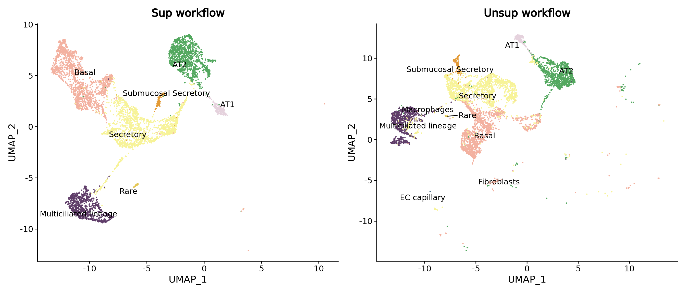

### Downstream analysis

You can try conduce the same downstream analyses as in the previous example \@ref(integration_unsupervised) (clustering, cell type abundances, DEG ...).

Here to show you the interest of supervised workflow with pure metacell we can zoom on the smooth muscle sub types. Despite the low metacell number for each cell type these different subtypes are separated on the UMAP, especially the rare FAM83D+ smooth muscles that were discovered in the original study.


```r
combined.mc$ann <- factor(combined.mc$ann)
color.celltypes.ann <- color.celltypes[c(1:length(levels(combined.mc$ann)))]
names(color.celltypes.ann) <- levels(combined.mc$ann)

DimPlot(combined.mc[,combined.mc$ann_level_2 == "Smooth muscle"],group.by = "ann",cols = color.celltypes.ann)
```


Using a DEG analysis we can check if we retrieve their markers. MYH11 and CNN1 genes are canonical smooth muscle markers while FAM83D was found uniquely and consistently expressed by this rare cell type in the original study


```r
DefaultAssay(combined.mc) <- "RNA"
Idents(combined.mc) <- "ann"
markersSmoothMuscle <- FindMarkers(combined.mc,ident.1 = "Smooth muscle FAM83D+",only.pos = T)

head(markersSmoothMuscle)
#>               p_val avg_log2FC pct.1 pct.2     p_val_adj
#> MYOCD 1.889342e-175  1.3869594 0.758 0.022 5.294693e-171
#> ASB5  1.754802e-130  0.2913375 0.303 0.004 4.917658e-126
#> NMRK2 1.103717e-129  0.4245135 0.273 0.003 3.093057e-125
#> PLN   1.568445e-124  3.1280687 0.879 0.044 4.395411e-120
#> HSPB3 7.379856e-121  1.0364463 0.545 0.016 2.068131e-116
#> CASQ2 4.376973e-117  1.1063566 0.636 0.023 1.226603e-112

markersSmoothMuscle[c("MYH11","CNN1","FAM83D"),]
#>               p_val avg_log2FC pct.1 pct.2    p_val_adj
#> MYH11  2.596787e-32   4.248525 0.970 0.287 7.277236e-28
#> CNN1   7.220235e-71   4.623065 0.970 0.106 2.023399e-66
#> FAM83D 3.561820e-11   2.186449 0.636 0.285 9.981643e-07

# Many classical smooth muscles cells are not annotated at the 3rd level of annotation (labelled None)
VlnPlot(combined.mc,features = c("MYH11","CNN1","FAM83D"),group.by = "ann",ncol = 2,cols = color.celltypes.ann)
```

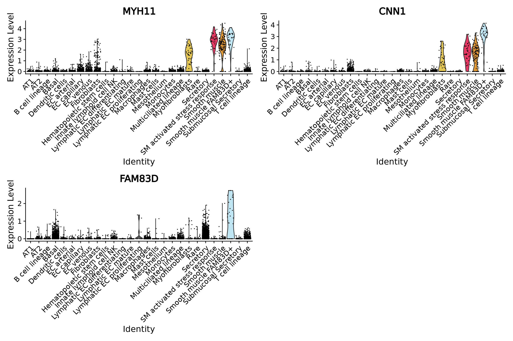

### Conclusion

Taking advantage of the single cell annotation in a supervised workflow we could improve the precision of our metacell re-analysis.
When cell annotations are given and of good quality, which is far from being the case every time, building metacells accordingly and 
use a supervised integration workflow should be preferred.

To be noted that we used an intermediary level of annotation to supervise our analysis, using a finer level for this data would have resulted 
in a longer time for metacell building. PLus, we would have obtained to few metacells per cell type in the different sample to be able to 
make an efficient supervised batch correction with STACAS.

To be more precise at the cost of computational efficiency one could also try to reduce the graining level of the analysis (using a graining level of 20 for instance),

To conclude, keep in mind that in one hand, for certain analysis such as rare cell type analysis, 
we will never achieve the same level of sensitivity with metacells compared to single-cells. 
On the other hand, you certainly won't be able to analyze so many single-cells so easily, and you may not need extremely fine cell-type resolution for many analyses.
