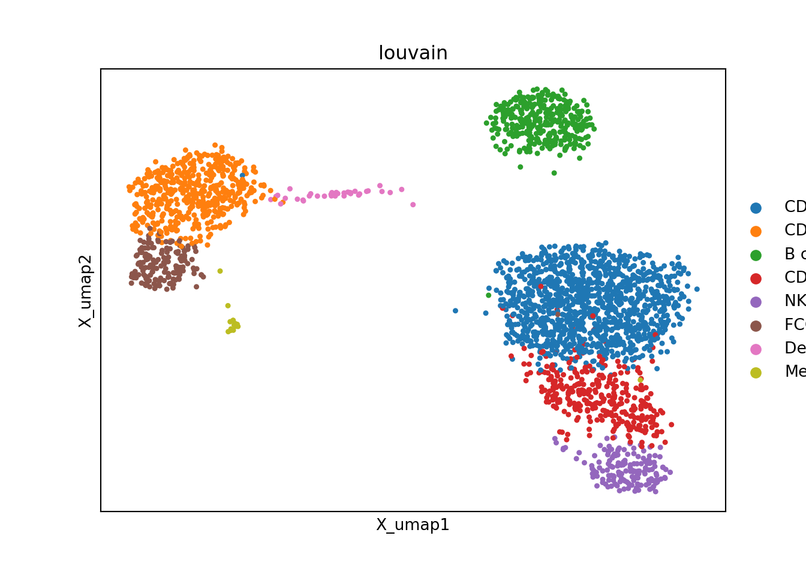

--- 
title: "Metacell Tutorial"
author: "Mariia Bilous, Léonard Hérault, Aurélie Gabriel, David Gfeller"
date: "2023-07-12"
site: bookdown::bookdown_site
documentclass: book
bibliography:
- book.bib
- packages.bib
description: |
  This is a tutorial about metacell construction and analysis.
link-citations: yes
github-repo: GfellerLab/Metacell_tutorial
---

# About

The structure of this tutorial.


## Book structure

Book consists of several Chapters (i.e., first-level headings). Each chapter is in separate .Rmd file in the root folder, with a name in XY_text.Rmd format, with `XY` being numbers.

Each Chapter consists of sections and sup-sections (i.e., second-level and lower heading), files for which are located in `./sub_pages`.  Sub-pages and chapters may also call *functional_chunks*, which are located in `./functional_chunks` and represent parts of code that can be repetitively run (e.g., `load_anndata`, `save_mc_anndata` etc). When the book is rendered, the included *sub_pages* and *functional_chunks* are basically inserted in the Chapter as inline code. The only challenge is the relative path of the files and resulting outputs, such as plots. To resolve this issue, currently, I manually set up the project folder as a knitting root directory in each sub-file (i.e., sub_pages and functional_chunks) as `knitr::opts_knit$set(root.dir = rprojroot::find_rstudio_root_file())` . Also, in my RStudio settings, I have the following setting `Tools -> Global Options... -> R Markdown -> Evaluate chunk in directory -> Project`.

**Note:** each chapters runs in a new R session and they do not share the environment, thus, we need to provide global knit options for each chapter, otherwise they are lost. I do it with a `source('./R/config.R')` in the beginning of each chapter. 


## Installation and requirements

R requirements

```r
install.packages('rprojroot') # to reset work directory to the Project root
install.packages('bookdown') # to render book
```

To run **MC2** and **SEACells** in RStudio, we need 

```r
install.packages('reticulate') # to run Python
```

Then, we need to setup virtual environment


```bash
pip install virtualenv
cd <Path_to_Metacell_tutorial>
virtualenv my_env
source my_env/bin/activate

# Installing SEACells, pip install installs old version, that does not work for me, thus install from git
git clone https://github.com/dpeerlab/SEACells.git
cd SEACells
python setup.py install

cd ..

pip install -r SEACells_requirements.txt # here some packages have wrong/non-existing vision, so I manually changed their versions 
pip install ipywidgets
pip install jupyter

pip install metacells

# in project dir
echo 'RETICULATE_PYTHON=my_env/bin/python' > '.Renviron' 

# restart RStudio and open 'Metacell_tutorial.Rproj' 

```

## Render book 

The function to render book is `bookdown::render_book()`, this will take some time, as it will execute all the chunks in the book, there is an option to cache some chunks, but we have to make sure that cached chunks do not share variables with non-cached chunks (it will raise an error anyway). 

`bookdown::preview_chapter()` renders a chapter.

## Get data

To get 3k PBMCs, use scanpy datasets af follows 

```python
import scanpy as sc 
import os

adata = sc.datasets.pbmc3k()
adata_proc = sc.datasets.pbmc3k_processed()

adata       = adata[adata_proc.obs_names].copy()
adata.obs   = adata_proc.obs.copy()
adata.uns   = adata_proc.uns.copy()
adata.obsm  = adata_proc.obsm.copy()
adata.obsp  = adata_proc.obsp.copy()

sc.pl.embedding(adata, 'X_umap', color='louvain')
#> /Users/mariiabilous/Documents/PhD/UNIL/R/Metacell_tutorial/my_env_mc2/lib/python3.8/site-packages/scanpy/plotting/_tools/scatterplots.py:392: UserWarning: No data for colormapping provided via 'c'. Parameters 'cmap' will be ignored
#>   cax = scatter(
```




```python
directory = os.path.join("data", "3k_pbmc")

if not os.path.exists(directory):
    os.makedirs(directory)
    
adata.write_h5ad(os.path.join("data", "3k_pbmc", "singlecell_anndata_filtered.h5ad"))
```

