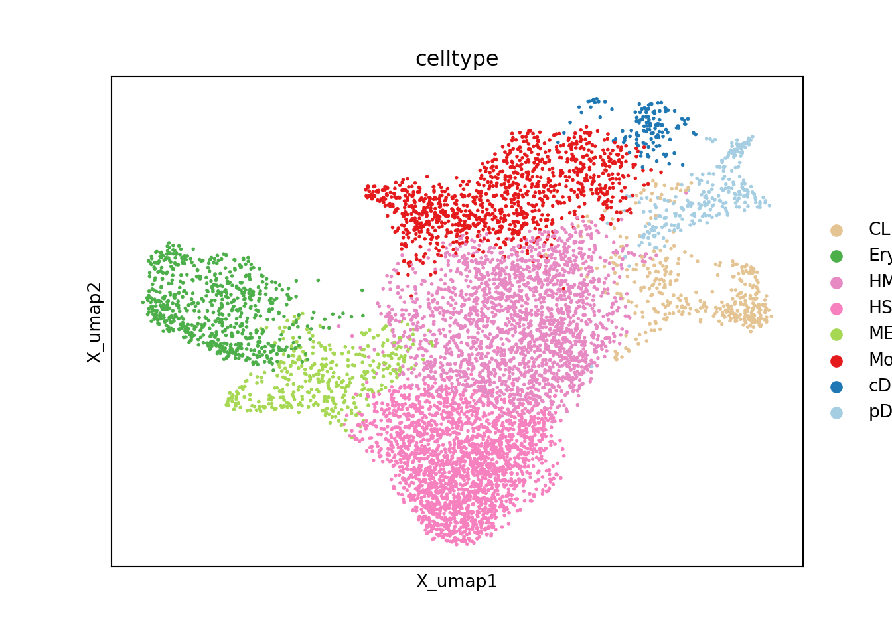

--- 
title: "Metacell Tutorial"
author: "Mariia Bilous, Léonard Hérault, Aurélie Gabriel, David Gfeller"
date: "2023-11-07"
site: bookdown::bookdown_site
documentclass: book
bibliography:
- packages.bib
- citations.bib
description: |
  This is a tutorial about metacell construction and analysis.
link-citations: yes
github-repo: GfellerLab/Metacell_tutorial
---

# This tutorial

In this tutorial, we describe the different steps that should be followed to build metacells from single-cell data using three frameworks:
SuperCell (tutorial in \@ref(SuperCell-construction)), (ii) Metacells version 2 (MC2) (tutorial in \@ref(MC2-construction)), and (iii) SEACells (tutorial in \@ref(SEACells-construction)).

We also show how to obtain metacells by running these methods using a command line tool that we provide as part of the MetaCellToolkit github repository.

This repository also contain the MetacellToolkit R package which provides R functions to compute QC metrics and visualizations to evaluate the quality of metacells.
In chapter \@ref(QCs), we describe how to use this package to evaluate the quality of the metacells.

Finally, we provide examples of downstream analyses performed at the metacell level. These analyses include clustering, differential analysis, data integration and gene regulatory network analysis.


```r
TO_CACHE <- TRUE
```

# Requirements 

This chapter describes how to obtain the packages and data needed to reproduce the analyses performed in this tutorial.

## Installations {#installations}

To run the code provided in this tutorial please follow the following instructions:


<!-- ```{r, eval = FALSE} -->
<!-- install.packages('reticulate') # to run Python -->
<!-- ``` -->

<!-- Then, we need to setup virtual environment -->

<!-- ```{bash, eval = FALSE} -->
<!-- pip install virtualenv -->
<!-- cd <Path_to_Metacell_tutorial> -->
<!-- virtualenv my_env -->
<!-- source my_env/bin/activate -->

<!-- # Installing SEACells, pip install installs old version, that does not work for me, thus install from git -->
<!-- git clone https://github.com/dpeerlab/SEACells.git -->
<!-- cd SEACells -->
<!-- python setup.py install -->
<!-- cd .. -->
<!-- pip install -r SEACells_requirements.txt  -->
<!-- pip install ipywidgets -->
<!-- pip install jupyter -->

<!-- # or pip install git+https://github.com/dpeerlab/SEACells -->

<!-- # Install MC2 -->
<!-- pip install git+https://github.com/tanaylab/metacells -->

<!-- # in project dir -->
<!-- echo 'RETICULATE_PYTHON=my_env/bin/python' > '.Renviron' -->

<!-- # restart RStudio and open 'Metacell_tutorial.Rproj' -->

<!-- ``` -->


<!-- ## Render book  -->

<!-- The function to render book is `bookdown::render_book()`, this will take some time, as it will execute all the chunks in the book, there is an option to cache some chunks, but we have to make sure that cached chunks do not share variables with non-cached chunks (it will raise an error anyway).  -->

<!-- `bookdown::preview_chapter()` renders a chapter. -->

<!-- ```{r, eval = T} -->
<!-- # library('reticulate') # to run Python -->
<!-- # use_python("/home/gabriela/miniconda3/envs/seacells/bin/python3.8") -->

<!-- ``` -->

## Retrieve the discrete dataset (PBMCs dataset) {#PBMC-data}

To test metacell construction on discrete dataset, we retrieved the 3k PBMCs from scanpy datasets as follows :

```python
import scanpy as sc 
import os

adata = sc.datasets.pbmc3k()
adata_proc = sc.datasets.pbmc3k_processed()

adata       = adata[adata_proc.obs_names].copy()
adata.obs   = adata_proc.obs.copy()
adata.uns   = adata_proc.uns.copy()
adata.obsm  = adata_proc.obsm.copy()
adata.obsp  = adata_proc.obsp.copy()

raw_ad = sc.AnnData(adata.X.copy())
raw_ad.obs_names, raw_ad.var_names = adata.obs_names, adata.var_names
adata.raw = raw_ad
```

<!-- We renormalize the data and and identify the most variable features. -->
<!-- ```{python, message = FALSE, cache = TO_CACHE} -->
<!-- # Normalize cells, log transform and compute highly variable genes -->
<!-- sc.pp.normalize_per_cell(adata) -->
<!-- sc.pp.log1p(adata) -->
<!-- sc.pp.highly_variable_genes(adata, n_top_genes=2000) -->
<!-- variable_genes=adata.var_names[adata.var.highly_variable].tolist() -->
<!-- ``` -->

<!-- We run PCA and UMAP to visualize the data. -->
<!-- Here we use 30 components to be consistent with the number of components used in the entire tutorial,  -->
<!-- but feel free to explore other number of principal components to use -->

<!-- ```{python dim-reduction, cache = TO_CACHE, message = FALSE, warning = FALSE} -->
<!-- n_comp    = 30 -->
<!-- sc.tl.pca(adata, n_comps=n_comp, use_highly_variable=True) -->

<!-- # Compute UMAP for visualization -->
<!-- sc.pp.neighbors(adata, n_neighbors=15, n_pcs=30) -->
<!-- sc.tl.umap(adata) -->
<!-- sc.pl.embedding(adata, 'X_umap', color='louvain') -->

<!-- ``` -->
The data are saved in the following file for future analyses in python (use of SEACells and MC2): "data/3k_pbmc/singlecell_anndata_filtered.h5ad".


```python
directory = os.path.join("data", "3k_pbmc")

if not os.path.exists(directory):
    os.makedirs(directory)
    
adata.write_h5ad(os.path.join("data", "3k_pbmc", "singlecell_anndata_filtered.h5ad"))
```

The data are saved in the following file for future analyses in R (use of SuperCell): "data/3k_pbmc/singlecell_seurat_filtered.rds".


```r
library(reticulate)
library(Seurat)
raw_counts <- Matrix::t(as(py$adata$raw$X, "CsparseMatrix"))
colnames(raw_counts) <- rownames(py$adata$obs)
rownames(raw_counts) <- rownames(py$adata$var)

pbmc <- CreateSeuratObject(counts = raw_counts, meta.data = py$adata$obs)
#> Warning: Feature names cannot have underscores ('_'), replacing with dashes
#> ('-')
saveRDS(pbmc, file = paste0("data/3k_pbmc/singlecell_seurat_filtered.rds"))
```

<!-- ```{r, eval = T, collapse = TO_CACHE} -->
<!-- library(reticulate) -->
<!-- library(Seurat) -->
<!-- raw_counts <- Matrix::t(as(py$adata$raw$X, "CsparseMatrix")) -->
<!-- colnames(raw_counts) <- rownames(py$adata$obs) -->
<!-- rownames(raw_counts) <- rownames(py$adata$var) -->

<!-- # norm_counts <- Matrix::t(as(py$adata$X, "CsparseMatrix")) -->
<!-- # colnames(norm_counts) <- rownames(py$adata$obs) -->
<!-- # rownames(norm_counts) <- rownames(py$adata$var) -->

<!-- pbmc <- CreateSeuratObject(counts = raw_counts, meta.data = py$adata$obs) -->
<!-- # pbmc@assays$RNA@data <- norm_counts -->
<!-- # pbmc@misc[["sc.pca"]] <- py$adata$obsm$X_pca -->
<!-- # pbmc@misc[["sc.umap"]] <- py$adata$obsm$X_umap -->
<!-- # pbmc@misc[["variable_genes"]] <- py$variable_genes -->
<!-- saveRDS(pbmc, file = paste0("data/3k_pbmc/singlecell_seurat_filtered.rds")) -->
<!-- ``` -->


<!-- ## 10k PBMC -->
<!-- ```{bash, eval = FALSE, cache = TO_CACHE} -->
<!-- # Creat data folder and download demo data from 10X genomics -->
<!-- mkdir data/10k_pbmc/ -->
<!-- wget http://cf.10xgenomics.com/samples/cell-exp/3.0.0/pbmc_10k_v3/pbmc_10k_v3_filtered_feature_bc_matrix.tar.gz -O data/10k_pbmc/pbmc_10k_v3_filtered_feature_bc_matrix.tar.gz -->
<!-- cd data/10k_pbmc/; tar -xzf pbmc_10k_v3_filtered_feature_bc_matrix.tar.gz -->
<!-- ``` -->

<!-- ```{python, eval = T, collapse = T, cache = TO_CACHE} -->
<!-- import scanpy as sc  -->
<!-- import os -->
<!-- adata = sc.read_10x_mtx(os.path.join("data", "10k_pbmc", "filtered_feature_bc_matrix")) -->
<!-- adata.var_names_make_unique() -->
<!-- adata -->
<!-- adata.X.sort_indices() -->

<!-- # # Filter cells based on min nb of genes and filter genes baased on min nb of cells -->
<!-- # sc.pp.filter_cells(adata, min_genes=200) -->
<!-- # sc.pp.filter_genes(adata, min_cells=3) -->

<!-- # Filter out doublets  -->
<!-- # sc.external.pp.scrublet(adata) #estimates doublets -->
<!-- # adata = adata[adata.obs['predicted_doublet'] == False] #do the actual filtering -->
<!-- # adata -->

<!-- raw_ad = sc.AnnData(adata.X.copy()) -->
<!-- raw_ad.obs_names, raw_ad.var_names = adata.obs_names, adata.var_names -->
<!-- adata.raw = raw_ad -->


<!-- sc.pl.embedding(adata, 'X_umap', color='celltype') -->

<!-- directory = os.path.join("data", "10k_pbmc") -->

<!-- if not os.path.exists(directory): -->
<!--     os.makedirs(directory) -->

<!-- adata.write_h5ad(os.path.join("data", "10k_pbmc", "singlecell_anndata_filtered.h5ad")) -->
<!-- ``` -->

<!-- ```{r pbmc10k, cache = TO_CACHE, message = FALSE, warning = FALSE} -->
<!-- library(SeuratData) -->
<!-- # InstallData("pbmcMultiome") -->
<!-- pbmc.rna <- LoadData("pbmcMultiome", "pbmc.rna") -->
<!-- pbmc.rna <- pbmc.rna[,pbmc.rna$seurat_annotations != "filtered"]  -->
<!-- pbmc.rna@meta.data$seurat_annotations <- plyr::revalue(pbmc.rna@meta.data$seurat_annotations , -->
<!--                                                        c("CD8 TEM_1" = "CD8", -->
<!--                                                          "CD8 TEM_2" = "CD8", -->
<!--                                                          "Intermediate B" = "B", -->
<!--                                                          "Naive B" = "B", -->
<!--                                                          "Memory B" = "B", -->
<!--                                                          "CD4 Naive" = "CD4", "CD4 TCM" = "CD4",  -->
<!--                                                          "CD4 TEM" = "CD4", "Treg" = "CD4", -->
<!--                                                          "CD8 Naive" = "CD8" -->
<!--                                                          )) -->
<!-- # library(Seurat) -->
<!-- # pbmc.rna <- NormalizeData(pbmc.rna, normalization.method = "LogNormalize") -->
<!-- # pbmc.rna <- FindVariableFeatures(pbmc.rna, nfeatures = 2000) -->
<!-- # pbmc.rna <- ScaleData(pbmc.rna) -->
<!-- # pbmc.rna <- RunPCA(pbmc.rna, npcs = 30, verbose = F) -->
<!-- # pbmc.rna <- RunUMAP(pbmc.rna, reduction = "pca", dims = c(1:30), n.neighbors = 15, verbose = F) -->
<!-- # UMAPPlot(pbmc.rna, group.by = "seurat_annotations") -->

<!-- saveRDS(pbmc.rna, file = paste0("data/10k_pbmc/singlecell_seurat_filtered.rds")) -->


<!-- # create single-cell anndata to compute separation using the python function -->
<!-- pbmc.rna.ad <- anndata::AnnData( -->
<!--   X = Matrix::t(Seurat::GetAssayData(pbmc.rna, slot = "counts")), -->
<!--   obs = pbmc.rna@meta.data  -->
<!-- ) -->

<!-- anndata::write_h5ad(anndata = pbmc.rna.ad, filename = "data/10k_pbmc/singlecell_anndata_filtered.h5ad") -->
<!-- rm(pbmc.rna, pbmc.rna.ad) -->
<!-- ``` -->


## Retrieve the continuous dataset (CD34 dataset) {#CD34-data}

To test metacell construction on discrete dataset, we retrieved the CD34 dataset provided by Persad et al. @SEACells :

```bash
mkdir data/CD34
wget -O data/CD34/cd34_multiome_rna.h5ad 'https://zenodo.org/record/6383269/files/cd34_multiome_rna.h5ad?download=1' 
```

The data are saved in the following file for future analyses in python (use of SEACells and MC2): "data/CD34/singlecell_anndata_filtered.h5ad".

```python
import scanpy as sc 
import os

adata = sc.read(os.path.join("data", "CD34", "cd34_multiome_rna.h5ad"))
adata.X.sort_indices()
raw_ad = sc.AnnData(adata.X.copy())
raw_ad.obs_names, raw_ad.var_names = adata.obs_names, adata.var_names
adata.raw = raw_ad

sc.pl.embedding(adata, 'X_umap', color='celltype')
#> /mnt/c/Aurelie/postdoc_UNIL/Metacell_review/Metacell_tutorial/my_env/lib/python3.8/site-packages/scanpy/plotting/_tools/scatterplots.py:392: UserWarning: No data for colormapping provided via 'c'. Parameters 'cmap' will be ignored
#>   cax = scatter(
```



```python

directory = os.path.join("data", "cd34_multiome")

if not os.path.exists(directory):
    os.makedirs(directory)
    
adata.write_h5ad(os.path.join("data", "CD34", "singlecell_anndata_filtered.h5ad"))
```

The data are saved in the following file for future analyses in R (use of SuperCell): "data/CD34/singlecell_seurat_filtered.rds".


```r
library(reticulate)
library(Seurat)
raw_counts <- Matrix::t(as(py$adata$raw$X, "CsparseMatrix"))
colnames(raw_counts) <- rownames(py$adata$obs)
rownames(raw_counts) <- rownames(py$adata$var)

cd34 <- CreateSeuratObject(counts = raw_counts, meta.data = py$adata$obs)
saveRDS(cd34, file = paste0("data/CD34/singlecell_seurat_filtered.rds"))
```

